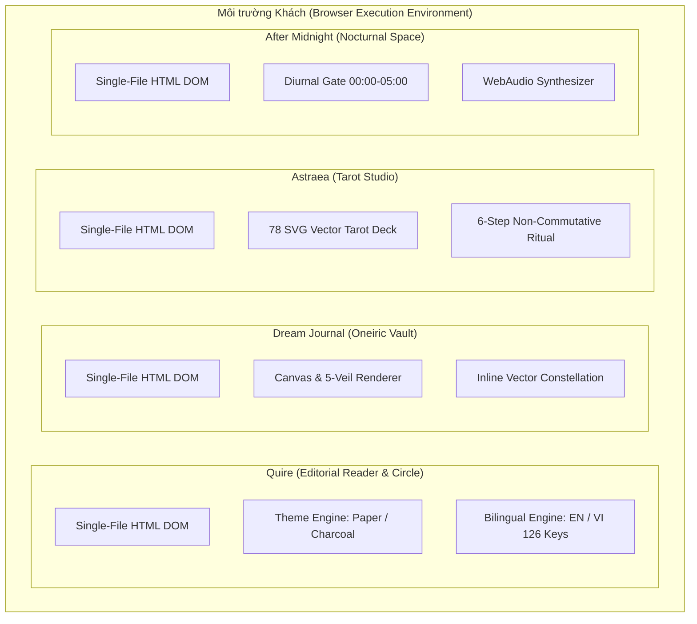

# ARCHITECTURE — Kiến trúc tổng thể hệ thống Constellation

> Tài liệu mô tả cấu trúc kiến trúc vĩ mô của bộ sưu tập 4 nguyên mẫu di động Constellation. Xác lập các bất biến hệ thống, mô hình thực thi cục bộ (Local-First), hợp đồng khung nhìn thiết bị và ranh giới chuyển giao kỹ thuật.

---

## 1. Macro System Architecture: Federated Constellation Portfolio

Hệ thống Constellation không phải là một ứng dụng đơn khối (monolith), mà là một **danh mục liên đoàn (Federated Portfolio)** gồm 4 sản phẩm di động riêng biệt:

### Nguyên lý kiến trúc cốt lõi:
- **Tự chứa hoàn toàn (Self-Contained Executable)**: Mỗi nguyên mẫu được đóng gói trọn vẹn trong tệp HTML duy nhất, không phụ thuộc vào bundler, build tool hay runtime server ngoài trình duyệt tiêu chuẩn.
- **Không chia sẻ trạng thái Runtime (Zero Shared Runtime State)**: 4 ứng dụng hoạt động hoàn toàn độc lập trong 4 không gian ngữ cảnh (sandboxes) khác nhau. Không có bất kỳ cầu nối dữ liệu, cookie dùng chung hay token authentication chéo nào.
- **Cấu trúc Submodule Độc lập**: Mỗi nguyên mẫu tương ứng với một thư mục mã nguồn tự quản trong `designs/*`. Mọi thay đổi trong tài liệu không được tác động trực tiếp vào file HTML nguồn (tuân thủ quy tắc S-01).

---

## 2. Các Bất biến Kiến trúc Toàn hệ thống (System Invariants)

Các bất biến áp dụng xuyên suốt gồm **5 nhóm**, khớp với `architecture/cross-app-invariants`:

1. **Local-First / Zero user-data backend trong prototype**: không gửi dữ liệu người dùng qua backend, không auth thật, không sync thật. Remote static asset hoặc fixture mạng chỉ là dependency quan sát được, không thuộc invariant production.
2. **Calm / Anti-Retention**: không streak, badge, leaderboard, vanity metric công khai, infinite feed hoặc retention push; mặc định quiet.
3. **Anti-Merge**: giữ riêng bốn visual language, navigation, domain, state và data identity. Chỉ abstraction trung lập được chia sẻ.
4. **Data Disposal**: mỗi app có retention/deletion contract riêng; không áp một lifecycle chung lên tất cả.
5. **Ritual Pacing**: các thao tác nghi thức giữ thứ tự và có điểm dừng; không tự thêm CTA, gamification hoặc nhảy cóc.

`390 × 844px`, vùng chạm tối thiểu `44px`, focus ring và reduced-motion là **device/accessibility contract** ở §5, không phải một invariant riêng thứ sáu. Mọi claim implementation phải gắn `OBSERVED`, `PROPOSED`, `APPROVED` hoặc `DEFERRED`.
## 3. Ma trận Phân tách 4 Domain Sản phẩm

| Khía cạnh | Quire | Dream Journal | Astraea | After Midnight |
|---|---|---|---|---|
| **Vị trí nguồn** | `designs/quire/` | `designs/dream-journal/` | `designs/astraea/` | `designs/after-midnight/` |
| **Mục đích sử dụng** | Đọc bài dài & trao đổi khoảnh khắc thân mật | Ghi nhận và chiêm nghiệm chiều sâu giấc mơ | Nghi thức rút bài Tarot & tham chiếu chiêm tinh | Kết nối và suy tư trong không gian đêm muội |
| **Đối tượng / boundary** | Vòng thân mật (không trần cứng 12; demo 11) | Cá nhân hướng nội | Người tìm kiếm định hướng nội tâm | Người thức đêm (00:00–05:00) |
| **Cơ chế thời gian** | Không giới hạn thời gian | Lịch âm & bản đồ bầu trời | Chu kỳ ngày sinh & cung hoàng đạo | Cửa thời gian 4 nấc (Ngày/Chạng vạng/Đêm/Rạng đông) |
| **Cơ chế riêng tư** | Activity log tự hủa sau 30 ngày; không tự hiểu là xóa cả dữ liệu bài/moment | 5 tầng màn che ảo ảnh | Xóa sạch dữ liệu sau 2 chạm | The Void không lưu; thư niêm phong |

Các số inventory như 15, 18, 19 hoặc 22 là **nhãn quan sát theo loại đếm**, không phải một production screen-count contract. Phân loại chuẩn là `visual panel`, `route`, `screen/state` và `fixture`; xem C-90 và app docs.
## 4. Mô hình Dữ liệu Local-First & Vòng đời Hiển thị

Prototype có bốn kiểu lifecycle quan sát được; đây là mô hình hành vi, không phải schema production:

1. **Transient**: dữ liệu tồn tại trong phiên tương tác, ví dụ bản thảo hoặc trạng thái xòe bài.
2. **Ephemeral**: dữ liệu biến mất sau chu kỳ đã công bố; Quire chỉ purge **activity log** sau 30 ngày, không tự động xóa bài hoặc moment.
3. **Sealed**: dữ liệu được niêm phong và chỉ đọc theo thời hạn quan sát được; không tự suy ra cơ chế trusted time production.
4. **The Void**: dữ liệu không được persist hoặc gửi qua mạng và bị gỡ khỏi DOM sau hiệu ứng `2100ms`. Không tuyên bố xóa được dữ liệu khỏi RAM của hệ điều hành/browser hoặc các bản sao backup ngoài tầm kiểm soát.

Mọi lifecycle production cần thêm storage owner, backup/cache expiry, recovery và deletion propagation trước khi được đánh dấu `APPROVED`.
## 5. Viewport & Device Adaptation Contract

Prototype được kiểm thử ở khung `390 × 844px`; desktop chỉ là wrapper/preview. Contract production cần giữ các mốc sau, nhưng mọi claim vẫn phải được đo độc lập:

- Target mobile viewport `390 × 844px`; frame bo góc 44px là **preview frame**, không phải yêu cầu bo góc mọi component.
- Mọi interactive target tối thiểu `44 × 44px`; nếu source prototype có 40px, ghi `observed deviation` và không hạ contract hệ thống.
- Focus ring, keyboard order, screen-reader labels, contrast và reduced-motion phải có test trước release.
- Safe area, dynamic type, landscape, text expansion và touch/keyboard alternative là acceptance criteria bắt buộc; không coi một screenshot là audit accessibility.
## 6. Handoff Boundary & Risk Ledger

Prototype chỉ cung cấp bằng chứng về UX và hành vi quan sát được. Khi chuyển sang production, từng claim phải được chuyển thành hợp đồng riêng với status và test:

| Rủi ro | Biểu hiện vi phạm | Governance bắt buộc |
|---|---|---|
| **API/schema minting** | Suy diễn schema, endpoint hoặc class từ mock | Giữ S-01; chỉ phát sinh hợp đồng mới sau ADR/Lead approval |
| **Homogenization** | Gom token, theme, navigation, domain hoặc data identity của bốn app | Giữ namespace và ownership riêng; shared chỉ ở tầng trung lập |
| **Scope bleed** | Tự thêm auth, backend, sync, AI service, schema, analytics hoặc deploy | Đối chiếu C-91; trạng thái mặc định là `DEFERRED` |
| **Clock tampering** | Dùng client clock như security boundary | Client clock chỉ là `FIXTURE`/best-effort; trusted-time contract phải được duyệt riêng |
| **Deletion overclaim** | Nói “xóa 100%” khi chưa kiểm tra storage, cache, backup hoặc sync | Chỉ ghi hành vi quan sát; effective deletion là `PROPOSED` cho đến khi có test |
## 7. Nguyên tắc SOLID & Ranh giới Module (PROPOSED)

Phần này là **PROPOSED** để chuẩn bị production; không phải layout hay interface đã được chấp nhận. Prototype HTML/JS chỉ là bằng chứng quan sát, không phải blueprint TypeScript hay Flutter.

### Ranh giới được phép chia sẻ
- **UI primitives trung lập**: button semantics, focus behavior, layout helper không mang tên, màu, typography, navigation hay data model của một app.
- **Platform adapters trung lập**: audio capability, locale formatting, clock abstraction, asset loading hoặc secure-storage capability; mỗi app vẫn sở hữu policy và context riêng.
- **Test/quality primitives**: accessibility assertions, lifecycle test harness và fixture isolation.

### Ranh giới bắt buộc riêng
- Theme, token, typography, navigation shell, state machine, storage lifecycle, social graph, user identity và seed data của từng app.
- Không dùng một abstraction chung để làm Astraea, Quire, Dream Journal và After Midnight thay thế lẫn nhau về mặt domain hoặc thị giác.
- Không tạo shared user table, shared activity log hoặc global app state để “tiện thể” hợp nhất sản phẩm.

### Nguyên tắc SOLID áp dụng
- **SRP**: presentation, domain rules, lifecycle và platform capability có trách nhiệm riêng.
- **OCP**: thêm state/ritual của một app không được sửa domain của app khác.
- **LSP**: chỉ thay thế khi giữ đúng capability; component có read receipt không thể thay component không có read receipt.
- **ISP**: interface nhỏ theo nhu cầu, không gom mọi chức năng vào một abstraction.
- **DIP**: domain không phụ thuộc Flutter platform, web API, storage engine hay provider cụ thể; adapter được chọn sau ADR.

Storage engine, provider, auth, sync và security contract vẫn `DEFERRED`; không được biến tên TypeScript/IndexedDB/WebAudio trong prototype thành quyết định production.
## 8. Quyết Định Công Nghệ Triển Khai Thực Tế: Flutter & Chiến Lược Lưu Trữ Hybrid

**Trạng thái**: `APPROVED` cho hướng Flutter/Dart + local-first; `PROPOSED/DEFERRED` cho storage, sync, auth, security và deletion contract.

### 8.1. Khung công nghệ mục tiêu

- Production target là **Flutter/Dart**, xuất bản Mobile (Android/iOS) và Web/PWA từ một codebase.
- Prototype HTML/CSS/JS, WebAudio và browser storage chỉ là implementation observation của giai đoạn prototype; không phải layout, runtime hoặc performance contract của production.
- Không tự suy ra renderer, asset pipeline, offline cache hoặc storage engine từ prototype.

### 8.2. Lưu trữ và đồng bộ

1. **Local-first là mặc định**: mọi dữ liệu được phân loại theo lifecycle riêng của từng app; ứng dụng phải hoạt động khi mạng không khả dụng.
2. **Storage engine chưa chốt**: SQLite/Hive/Isar chỉ là candidate, không phải quyết định đã duyệt. Cần ADR về ownership, migration, encryption, backup, retention và recovery.
3. **Sync là hướng tùy chọn, contract còn `DEFERRED`**: chỉ được bật bằng consent rõ ràng; phải chốt provider, dữ liệu eligible, conflict resolution, deletion propagation và retention trước khi triển khai.
4. **The Void không đồng bộ**: dữ liệu Void không persist, không telemetry và không đi qua sync/network.
5. **Không hợp nhất identity**: dù có shared infrastructure, storage/domain boundary của bốn app vẫn riêng; không dùng shared user table để làm thuận tiện.

Các chi tiết trong C-91 và boundary guide phải được cập nhật cùng ADR trước khi chuyển từ `DEFERRED` sang `APPROVED`.

### 8.3. Quyết định Backend & Đồng bộ: Supabase Self-Hosted & Version Gating (`APPROVED`)

- **Backend / Sync Platform**: Lựa chọn **Supabase Self-Hosted (Docker)** làm hạ tầng backend/sync chính thức theo quyết định người dùng ngày 2026-09-24. Toàn bộ đặc tả kiến trúc, Docker Compose và bảo mật RLS được quy định tại @doc/architecture/backend-supabase-version-gating.
- **Media & Avatar Storage**: Tận dụng Supabase Storage với chuẩn đường dẫn `avatars/{user_id}/avatar_{timestamp}.webp`, tiền xử lý nén WebP 1:1 tại client Flutter, và bucket `quire-moments` cho chia sẻ bạn bè.
- **Hợp đồng Ép Cập Nhật (Version Gating)**: Bắt buộc client kiểm tra `min_supported_version` từ bảng `app_system_configs` trên Supabase để loại bỏ triệt để rủi ro lệch schema và tình trạng kẹt cache cũ trên Web/PWA.
- **Bảo toàn bất biến**: Toàn bộ dữ liệu rơi vào *The Void* tuyệt đối không sync lên Supabase.
