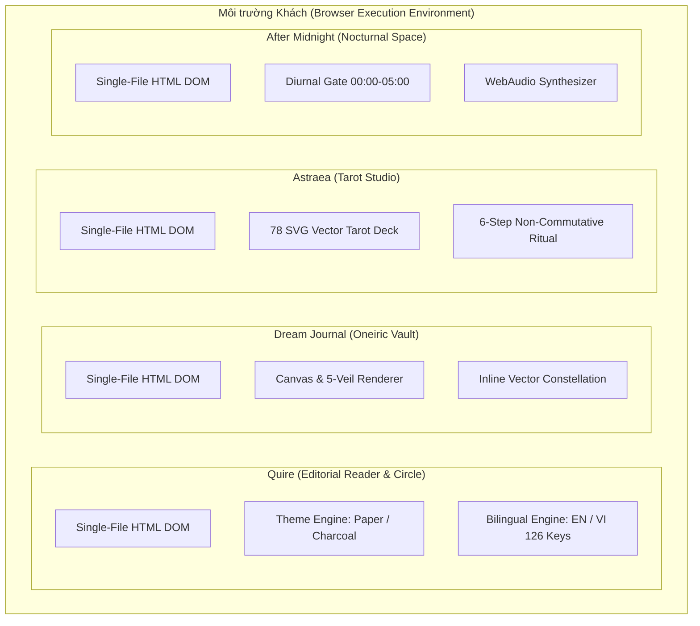
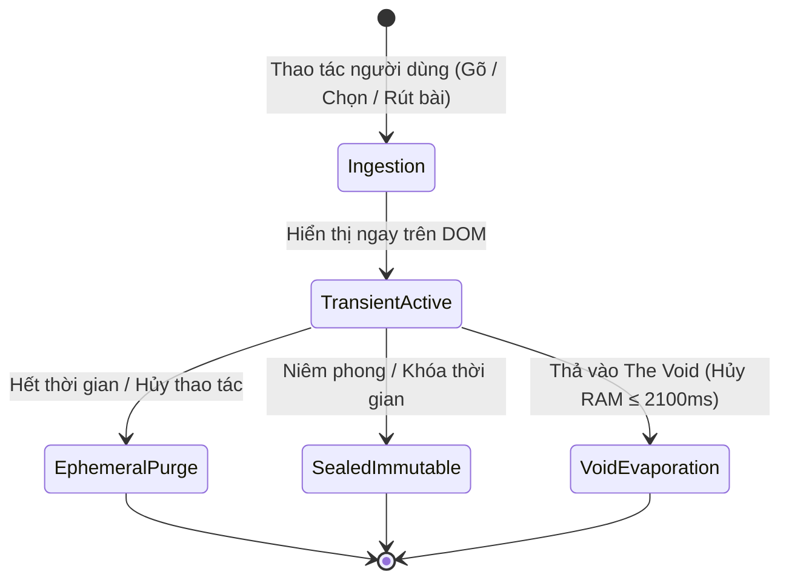
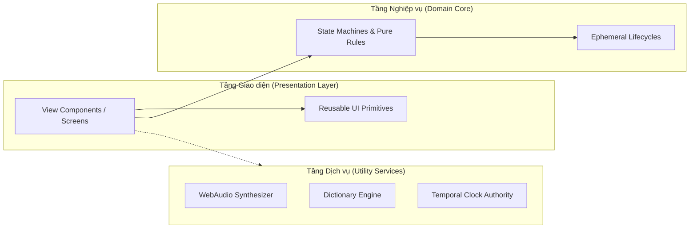
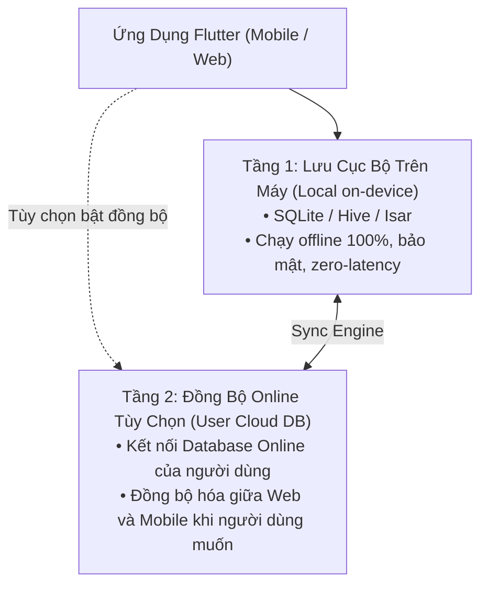

# ARCHITECTURE — Kiến trúc tổng thể hệ thống Constellation

> Tài liệu mô tả cấu trúc kiến trúc vĩ mô của bộ sưu tập 4 nguyên mẫu di động Constellation. Xác lập các bất biến hệ thống, mô hình thực thi cục bộ (Local-First), hợp đồng khung nhìn thiết bị và ranh giới chuyển giao kỹ thuật.

---

## 1. Macro System Architecture: Federated Constellation Portfolio

Hệ thống Constellation không phải là một ứng dụng đơn khối (monolith), mà là một **danh mục liên đoàn (Federated Portfolio)** gồm 4 sản phẩm di động riêng biệt:



### Nguyên lý kiến trúc cốt lõi:
- **Tự chứa hoàn toàn (Self-Contained Executable)**: Mỗi nguyên mẫu được đóng gói trọn vẹn trong tệp HTML duy nhất, không phụ thuộc vào bundler, build tool hay runtime server ngoài trình duyệt tiêu chuẩn.
- **Không chia sẻ trạng thái Runtime (Zero Shared Runtime State)**: 4 ứng dụng hoạt động hoàn toàn độc lập trong 4 không gian ngữ cảnh (sandboxes) khác nhau. Không có bất kỳ cầu nối dữ liệu, cookie dùng chung hay token authentication chéo nào.
- **Cấu trúc Submodule Độc lập**: Mỗi nguyên mẫu tương ứng với một thư mục mã nguồn tự quản trong `designs/*`. Mọi thay đổi trong tài liệu không được tác động trực tiếp vào file HTML nguồn (tuân thủ quy tắc S-01).

---

## 2. Các Bất biến Kiến trúc Toàn hệ thống (System Invariants)

Bốn ứng dụng chia sẻ chung 4 bất biến kiến trúc mang tính ràng buộc bắt buộc (Hard Constraints):

### Invariant 1: Local-First & Zero-Backend (Tại giai đoạn nguyên mẫu)
- **Không phát sinh Network I/O**: Không thực hiện bất kỳ lệnh `fetch()`, `XMLHttpRequest`, hay `WebSocket` nào tới máy chủ backend.
- **Dữ liệu hoàn toàn trong bộ nhớ (In-Memory)**: Mọi thao tác ghi chép (nhật ký, câu trả lời đêm, thông điệp tarot) chỉ tồn tại trong vòng đời của phiên DOM cục bộ, tự đặt lại khi tải lại trang hoặc theo chu kỳ định sẵn.

### Invariant 2: Calm Computing & Chống Thao túng Tương tác (Anti-Retention)
- **Zero Gamification**: Tuyệt đối không có hệ thống điểm danh (streaks), không có huy hiệu (badges), không bảng xếp hạng (leaderboards), không thanh tiến độ thúc ép hành vi.
- **Zero Vanity Metrics**: Không hiển thị số lượt thích, số người theo dõi công khai hay số lượt xem.
- **Quiet by Default**: Không có push notification tự động thúc giục người dùng mở ứng dụng. Mọi âm thanh và thông báo đều ở trạng thái tắt mặc định.

### Invariant 3: Hàng rào Chống Đồng nhất hóa Thẩm mỹ (Anti-Merge Invariant)
- **Bảo toàn 4 thế giới thị giác**: Tuyệt đối không gộp chung bảng màu (color tokens), không áp dụng chung một CSS Framework, không chia sẻ stylesheet toàn cục.
- Mỗi ứng dụng sở hữu một ngôn ngữ thiết kế riêng biệt, phản ánh đúng cảm xúc và đối tượng phục vụ.

### Invariant 4: Hợp đồng Khung nhìn Thiết bị Chuẩn (Viewport Contract)
- **Target chuẩn**: Khung nhìn gốc được tối ưu cho kích thước chuẩn di động `390px × 844px` (tương đương iPhone 13/14/15) với bo góc vật lý `44px`.
- **Responsive Wrapper**: Các chế độ mở rộng trên máy tính bảng hoặc desktop chỉ đóng vai trò khung đỡ (preview frame) hoặc canvas trình chiếu, bảo toàn trọn vẹn mật độ thông tin di động.

---

## 3. Ma trận Phân tách 4 Domain Sản phẩm

| Khía cạnh | Quire | Dream Journal | Astraea | After Midnight |
|---|---|---|---|---|
| **Vị trí nguồn** | `designs/quire/` | `designs/dream-journal/` | `designs/astraea/` | `designs/after-midnight/` |
| **Mục đích sử dụng** | Đọc bài dài & trao đổi khoảnh khắc thân mật | Ghi nhận và chiêm nghiệm chiều sâu giấc mơ | Nghi thức rút bài Tarot & tham chiếu chiêm tinh | Kết nối và suy tư trong không gian đêm muộn |
| **Đối tượng** | Bạn thân 4–12 người | Cá nhân hướng nội | Người tìm kiếm định hướng nội tâm | Người thức đêm (00:00–05:00) |
| **Cơ chế thời gian** | Không giới hạn thời gian | Lịch âm & bản đồ bầu trời | Chu kỳ ngày sinh & cung hoàng đạo | Cửa thời gian 4 nấc (Ngày/Chạng vạng/Đêm/Rạng đông) |
| **Cơ chế riêng tư** | Tự xóa sau 30 ngày; thu hồi gửi | 5 tầng màn che ảo ảnh | Xóa sạch dữ liệu sau 2 chạm | The Void không lưu; thư niêm phong |

---

## 4. Mô hình Dữ liệu Local-First & Vòng đời Hiển thị

Mọi đối tượng dữ liệu trong các nguyên mẫu được phân loại theo 4 cấp độ vòng đời hiển thị quan sát được:



1. **Transient (Thoáng qua)**: Dữ liệu tồn tại tạm thời trong luồng tương tác (như trạng thái xòe bài Tarot, bản thảo đang gõ dở).
2. **Ephemeral (Tự hủy có kiểm soát)**: Dữ liệu biến mất sau một chu kỳ quan sát (như hoạt động 30 ngày trong Quire, thông điệp biến mất khi đóng phiên).
3. **Sealed (Niêm phong)**: Dữ liệu bị đóng băng bất biến khi được kích hoạt (như thư gửi tương lai trong After Midnight).
4. **The Void (Hư vô tuyệt đối)**: Dữ liệu bị xóa sạch hoàn toàn khỏi RAM và DOM sau hiệu ứng phân rã 2100ms, không lưu vào bất kỳ bộ nhớ đệm nào.

---

## 5. Viewport & Device Adaptation Contract

Các nguyên mẫu HTML thực thi hợp đồng hiển thị 2 lớp:

```
+-----------------------------------------------------------+
| Canvas / Browser Outer Shell                              |
|   - Nền tối / Xám trung tính                              |
|   - Bộ điều khiển thời gian / Thu phóng / Đổi giao diện  |
|                                                           |
|       +-------------------------------------------+       |
|       | Mobile Viewport Frame (390 x 844 px)     |       |
|       |   - Bo góc thiết bị: 44px (border-radius) |       |
|       |   - Notch / Dynamic Island ảo             |       |
|       |   - Safe Area Insets: Top 47px, Btm 34px  |       |
|       |   - Thanh điều hướng Tab Bar chuẩn        |       |
|       +-------------------------------------------+       |
+-----------------------------------------------------------+
```

- **Màn hình di động (`<= 480px`)**: Khung viewport giãn 100% chiều rộng, loại bỏ viền vỏ ngoài để người dùng trải nghiệm như ứng dụng native webapp.
- **Màn hình máy tính (`> 480px`)**: Tự động bọc khung thiết bị di động ở giữa màn hình hoặc hiển thị dạng Infinite Canvas (trên các tệp sơ đồ toàn cảnh).

---

## 6. Handoff Boundary & Risk Ledger

Khi chuyển giao từ giai đoạn thiết kế nguyên mẫu sang giai đoạn xây dựng hệ thống sản xuất (Production Engineering):

| Rủi ro kỹ thuật | Biểu hiện vi phạm | Giải pháp quản trị (Governance) |
|---|---|---|
| **API Minting Risk** | Tự suy diễn schema cơ sở dữ liệu hoặc URL API từ các mock data HTML | Áp dụng nghiêm ngặt quy tắc S-01: dữ liệu chỉ được mô tả bằng quy tắc nghiệp vụ văn xuôi |
| **Homogenization Risk** | Gom các CSS token của 4 app vào một file `theme.css` chung để tái sử dụng | Giữ nguyên 4 namespace token độc lập (`quire-*`, `dream-*`, `astraea-*`, `midnight-*`) |
| **Scope Bleed Risk** | Bắt đầu viết auth/login, kết nối SQLite/Postgres hoặc cloud sync | Tuân thủ C-91 Backlog Deferral: toàn bộ backend và đồng bộ phân tán được hoãn lại |
| **Clock Tampering Risk** | Cho phép người dùng hack cổng 00:00–05:00 bằng cách chỉnh giờ máy tính | Ghi chú rõ: bộ điều khiển giờ hiện tại là công cụ kiểm thử (test fixture), bản thật cần nguồn giờ tin cậy |

---

## 7. Ứng dụng Nguyên lý SOLID & Cấu trúc Module Tái sử dụng (Modular Architecture)

Nhằm chuẩn bị cho giai đoạn chuyển giao từ nguyên mẫu sang mã nguồn ứng dụng thực tế (Production Code), kiến trúc hệ thống áp dụng bộ nguyên lý SOLID để module hóa, bóc tách các chức năng thành các thành phần độc lập, dễ bảo trì, dễ kiểm thử và tái sử dụng:



### 1. Single Responsibility Principle (SRP - Trách nhiệm Duy nhất)
- **Tách biệt Triệt để các Khối Chức năng**:
  - **View Component**: Chỉ đảm nhận nhiệm vụ biểu diễn trực quan (HTML/CSS) và nhận diện sự kiện người dùng (chạm, vuốt, gõ). Không chứa logic nghiệp vụ tính toán hay logic lưu trữ.
  - **State Machine Controller**: Chỉ quản lý các chuyển dịch trạng thái hợp lệ (ví dụ: chuỗi 6 bước rút bài Tarot của Astraea hoặc 4 nấc thời gian của After Midnight).
  - **Utility Service**: Các tác vụ kỹ thuật chuyên biệt như bộ tổng hợp âm thanh WebAudio, bộ giải mã từ điển song ngữ i18n, bộ vẽ chòm sao SVG được tách thành các file tiện ích độc lập (reusable modules).

### 2. Open-Closed Principle (OCP - Mở rộng Mở, Chỉnh sửa Đóng)
- Các bộ khung điều hướng (Navigation Shell) và trình đọc (Reader Engine) được thiết kế mở để dễ dàng bổ sung các tính năng mới:
  - Bổ sung thêm không gian đêm mới trong After Midnight mà không phải sửa logic điều hướng cốt lõi.
  - Bổ sung các kiểu trải bài Tarot mới (3 lá, Celtic Cross) trong Astraea bằng cách khai báo cấu hình trải bài mới mà không thay đổi cỗ máy rút bài.

### 3. Liskov Substitution Principle (LSP - Thay thế Linh hoạt)
- Các đơn vị hiển thị tương đồng (như các thẻ bài Tarot trong 78 lá, các thẻ khoảnh khắc trong Quire, các mục nhật ký giấc mơ) tuân thủ cùng một hợp đồng hiển thị:
  - Mọi lá bài Tarot đều có thể thay thế cho nhau trong bất kỳ vị trí trải bài nào mà không gây lỗi bố cục.
  - Các khối thông điệp (Alert, Toast, Modal) có thể hoán đổi các biến thể hình ảnh (sáng/tối) mà không phá vỡ logic sự kiện.

### 4. Interface Segregation Principle (ISP - Tách biệt Giao diện Hợp đồng)
- Không sử dụng các đối tượng đơn khối lớn (God Object):
  - Tách nhỏ hợp đồng âm thanh (`IAmbientAudio`: play/pause/setGain) độc lập với hợp đồng thời gian (`ITemporalClock`: getDiurnalStage/isNocturnalActive).
  - Tách hợp đồng lưu trữ cục bộ (`ILocalStore`: writeTransient/purgeExpired) độc lập với bộ điều khiển giao diện.

### 5. Dependency Inversion Principle (DIP - Đảo ngược Phụ thuộc)
- Các màn hình giao diện không phụ thuộc trực tiếp vào cơ chế lưu trữ phần cứng cụ thể (Local Storage, IndexedDB, SQLite).
- Giao diện chỉ giao tiếp qua các cổng trừu tượng (Ports/Adapters). Trong giai đoạn nguyên mẫu hiện tại, triển khai cụ thể là In-Memory Adapter. Khi sang giai đoạn backend/offline, có thể thay thế bằng SQLite Adapter mà không cần viết lại toàn bộ mã giao diện.

---

## 8. Quyết Định Công Nghệ Triển Khai Thực Tế: Flutter & Chiến Lược Lưu Trữ Hybrid

Dựa trên quyết định kiến trúc chính thức cho giai đoạn phát triển sản phẩm (Implementation Phase):

### 8.1. Khung Công Nghệ Mục Tiêu: Flutter (Ngôn ngữ Dart)
- **Framework:** **Flutter** (Google SDK) sử dụng ngôn ngữ **Dart**.
- **Mục tiêu đa nền tảng (Cross-Platform Execution):**
  - **Mobile:** Biên dịch trực tiếp ra mã máy native cho **Android** (`.apk`, `.aab`) và **iOS** (`.ipa`) với engine đồ họa Impeller/Skia đạt 60–120 FPS.
  - **Web:** Biên dịch thành **Web App / PWA** (CanvasKit / WebAssembly) chạy trực tiếp trên các trình duyệt hiện đại (Chrome, Safari, Edge) mà không cần viết lại mã giao diện.
  - **Kiểm soát đồ họa chính xác:** Khả năng vẽ vector SVG chính xác từng pixel cho 78 lá bài Tarot (*Astraea*), bản đồ sao động (*Dream Journal*), và bảng màu tĩnh lặng đồng bộ trên mọi thiết bị.

### 8.2. Chiến Lược Lưu Trữ Dữ Liệu: Hybrid Local-First & Đồng Bộ Online Tùy Chọn
Hệ thống áp dụng mô hình kiến trúc lưu trữ 2 tầng (Two-Tier Hybrid Storage):



1. **Tầng 1 - Cục bộ trên máy (Local on-device - Mặc định):**
   - Dữ liệu nhật ký, bài đọc Tarot, thư niêm phong được lưu mặc định trực tiếp vào bộ nhớ cục bộ trên thiết bị của người dùng (sử dụng SQLite hoặc Isar/Hive).
   - Đảm bảo app chạy ngoại tuyến 100% (Offline Resilience), phản hồi tức thì không giật lag mạng, và tôn trọng quyền riêng tư tuyệt đối theo triết lý *Quiet Software*.
2. **Tầng 2 - Đồng bộ Online tùy chọn (Optional User Cloud DB Sync):**
   - Cho phép người dùng tùy chọn kết nối với cơ sở dữ liệu online riêng của mình (hoặc dịch vụ đám mây cá nhân) để đồng bộ dữ liệu giữa các thiết bị (đồng bộ qua lại giữa bản Web và bản App trên điện thoại).
   - Cơ chế đồng bộ hoạt động ở chế độ nền (Background Sync) kèm xử lý xung đột (Conflict Resolution), người dùng nắm toàn quyền quyết định khi nào cần đồng bộ và lưu trữ ở đâu.
