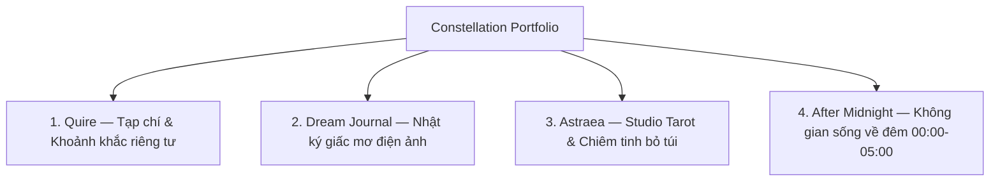

# Constellation Portfolio Overview & Documentation Index

> Trung tâm điều phối tài liệu và bản đồ tri thức cho bộ sưu tập 4 nguyên mẫu di động cao cấp (Constellation). Được chuẩn hóa theo quy ước Knowns để phục vụ kỹ sư, nhà thiết kế và các agent tự hành.

---

## 1. Định vị 4 Nguyên mẫu Di động (The Constellation)

Bộ sưu tập **Constellation** bao gồm 4 ứng dụng di động độc lập, mỗi ứng dụng đại diện cho một triết lý tương tác tĩnh, bảo vệ sự chú tâm và tôn trọng thế giới nội tâm của người dùng:



| Nguyên mẫu | Bản chất & Triết lý | Thẩm mỹ chủ đạo | Cặp Typography | Cơ chế đặc trưng |
|---|---|---|---|---|
| **Quire** | Đọc bài dài kiểu tạp chí & vòng chia sẻ ảnh thân mật (4–12 người) | Giấy ngà `#FBF9F5` / Than ấm `#1A1612` | Newsreader + JetBrains Mono | Vòng tròn hữu hạn, tự hủy 30 ngày, hoàn tác gửi ảnh |
| **Dream Journal** | Kho lưu trữ giấc mơ điện ảnh, riêng tư tuyệt đối (Vietnamese-first) | Đen Obsidian `#05050A`, Vàng cổ, Đỏ thẫm | Cormorant Garamond + Be Vietnam Pro | 5 tầng màn che ảo ảnh, lịch âm & chòm sao giấc mơ |
| **Astraea** | Studio Tarot & Chiêm tinh nghi thức chậm rãi như buổi lễ cá nhân | Tím than đêm `#0B0A12`, Vàng cổ `#C9A86A` | Jost + Cormorant Garamond + JetBrains Mono | 78 lá bài SVG vector, nghi thức 6 bước, xóa sạch 2 chạm |
| **After Midnight** | Không gian kết nối cho người thức đêm, cửa mở 00:00–05:00 | Đen tuyền `#080808`, Bạc, Đỏ vang `#6E2028` | Instrument Serif + IBM Plex Sans/Mono | Cổng thời gian diurnal, The Void không lưu, thư niêm phong |

---

## 2. Bản đồ Taxonomy Tài liệu Knowns

Hệ thống tài liệu được tổ chức theo 4 phân tầng chuyên biệt trong `.knowns/docs/`:

```
.knowns/docs/
├── README.md                                  # [Core] Điểm vào, tổng quan & bản đồ tài liệu
├── ARCHITECTURE.md                            # [Core] Kiến trúc vĩ mô, local-first & ranh giới hệ thống
├── CONVENTIONS.md                             # [Core] Quy ước kỹ thuật, anti-minting & an toàn Windows UTF-8
│
├── constellation/                             # [Prototypes] Tài liệu bóc tách chi tiết từng nguyên mẫu
│   ├── s-01-quy-c-vit-docs-constellation.md  # Quy ước viết docs bóc tách (observe-only)
│   ├── s-02-mu-trch-xut-prototype.md         # Template mẫu bóc tách prototype
│   ├── quire-01-flow.md / quire-02-data.md    # Chi tiết 19 màn hình & quy tắc Quire
│   ├── dream-journal-01-flow.md / -02-data.md # Chi tiết 22 màn hình & quy tắc Dream Journal
│   ├── astraea-01-flow.md / astraea-02-data.md# Chi tiết 18 màn hình & quy tắc Astraea
│   ├── after-midnight-01-flow.md / -02-data.md# Chi tiết 15 màn hình & quy tắc After Midnight
│   ├── c-90-cross-matrix.md                   # Ma trận chống hợp nhất (anti-merge)
│   ├── c-91-backlog.md                        # Danh mục hoãn có chủ đích (backend/auth/motion)
│   └── g-01-huong-dan-thiet-ke-impeccable.md  # Cẩm nang dùng Impeccable Design Skills cho Agent CLI
│
├── architecture/                              # [Architecture] Kiến trúc nền tảng chéo ứng dụng
│   ├── design-system-tokens.md                # Hệ thống Token, 4 cặp Typography & bề mặt vật liệu
│   ├── cross-app-invariants.md                # Các bất biến kiến trúc & ranh giới độc lập 4 ứng dụng
│   └── modular-reusable-components.md         # Kiến trúc module hóa, component tái sử dụng & SOLID
├── patterns/                                  # [Patterns] Các mẫu tương tác & hành vi đặc thù
│   ├── ephemeral-privacy-lifecycles.md        # Vòng đời dữ liệu tạm thời, The Void, tự hủy & niêm phong
│   ├── temporal-ritual-state-machines.md      # Máy trạng thái thời gian (cổng đêm) & nghi thức tuần tự
│   ├── calm-anti-social-mechanics.md          # Cơ chế Calm Computing, Anti-Retention & không gian tĩnh
│   └── offline-ambient-fallbacks.md           # Kiến trúc tự chứa, WebAudio & suy giảm duyên dáng
│
└── guides/                                    # [Guides] Cẩm nang vận hành & chuyển giao kỹ thuật
    ├── prototype-navigation-inspection.md     # Hướng dẫn mở, duyệt canvas & thẩm định DevTools
    └── prototype-to-implementation-boundary.md# Ranh giới bàn giao, bảo vệ S-01, C-90, C-91
```

---

## 3. Khởi động Agent Workflow (kn-init)

Khi một AI agent bắt đầu phiên làm việc mới trong repository này:

1. **Khởi tạo ngữ cảnh**: Chạy `kn-init` để tải tự động 3 tài liệu lõi:
   - `README` — Định hướng chung và định vị nguyên mẫu.
   - `ARCHITECTURE` — Nắm bắt bất biến kiến trúc và mô hình cục bộ.
   - `CONVENTIONS` — Tuân thủ kỷ luật observe-only và cấm mint code/schema.
2. **Truy cứu chuyên biệt**:
   - Khi cần bóc tách chi tiết màn hình: Tham khảo nhóm tài liệu `constellation/<app>-01-flow`.
   - Khi cần hiểu dữ liệu và quy tắc copy: Tham khảo nhóm tài liệu `constellation/<app>-02-data`.
   - Khi cần phân tích tương tác sâu: Tham khảo nhóm tài liệu `patterns/`.
   - Khi cần mở và kiểm tra nguyên mẫu: Tham khảo nhóm tài liệu `guides/`.

---

## 4. Ba Ranh giới Bất biến (Core Invariants)

Mọi đóng góp vào repository và tài liệu phải tuân thủ 3 nguyên tắc nền tảng:

1. **Observe-Only & Anti-Minting (S-01)**: Mọi mô tả phải bám sát HTML/CSS/JS quan sát được trong `designs/*`. Tuyệt đối không tự ý bịa đặt (mint) endpoint API, cấu trúc bảng cơ sở dữ liệu, hay lớp code giả tưởng.
2. **Anti-Merge (C-90)**: 4 ứng dụng giữ trọn vẹn 4 thế giới thẩm mỹ và tương tác độc lập. Nghiêm cấm gộp token, cấm hợp nhất giao diện thành một siêu ứng dụng (super-app).
3. **Intentional Deferrals (C-91)**: Mọi vấn đề về backend, xác thực người dùng (auth), cơ chế đồng bộ phân tán, đường cong chuyển động chi tiết (motion bezier), và kiểm định WCAG chính thức đều được hoãn sang giai đoạn sau.
