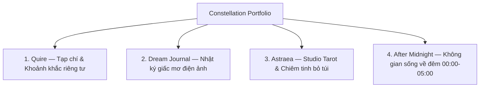

# Constellation Portfolio Overview & Documentation Index

> Trung tâm điều phối tài liệu và bản đồ tri thức cho bộ sưu tập 4 nguyên mẫu di động cao cấp (Constellation). Được chuẩn hóa theo quy ước Knowns để phục vụ kỹ sư, nhà thiết kế và các agent tự hành.

---

## 1. Định vị 4 Nguyên mẫu (The Constellation)

Bộ sưu tập **Constellation** hiện gồm 4 prototype chạy trong trình duyệt, được thiết kế mobile-first nhưng giữ ranh giới sản phẩm độc lập. Hướng implementation production là Flutter/Dart cho Mobile + Web; prototype browser không phải production runtime.



| Nguyên mẫu | Bản chất & Triết lý | Thẩm mỹ chủ đạo | Typography quan sát từ source | Cơ chế đặc trưng |
|---|---|---|---|---|
| **Quire** | Đọc bài dài kiểu tạp chí & chia sẻ ảnh trong vòng thân mật | Giấy ngà `#FBF9F5` / Than ấm `#1A1612` | Newsreader + JetBrains Mono | Vòng thân mật (không trần cứng 12; demo dùng 11); activity log tự hủy sau 30 ngày; hoàn tác gửi |
| **Dream Journal** | Kho lưu trữ giấc mơ điện ảnh, riêng tư tuyệt đối (Vietnamese-first) | Đen Obsidian `#05050A`, Vàng cổ, Đỏ thẫm | Cormorant Garamond + Be Vietnam Pro | 5 tầng màn che ảo ảnh, lịch âm & chòm sao giấc mơ |
| **Astraea** | Studio Tarot & nghi thức chậm rãi như buổi lễ cá nhân | Tím than đêm `#0B0A12`, Vàng cổ `#C9A86A` | Cormorant Garamond + Jost + JetBrains Mono | 78 lá SVG, nghi thức 6 bước, xóa sạch 2 chạm |
| **After Midnight** | Không gian kết nối cho người thức đêm, cửa mở 00:00–05:00 | Đen tuyền `#080808`, Bạc, Đỏ vang `#6E2028` | Instrument Serif + IBM Plex Sans/Mono | Cổng thời gian, The Void không lưu, thư niêm phong |

## 2. Bản đồ Taxonomy Tài liệu Knowns

Hệ thống tài liệu được tổ chức theo 4 phân tầng trong `.knowns/docs/`:

```
.knowns/docs/
├── README.md                                  # [Core] Điểm vào, tổng quan & nguồn canonical
├── ARCHITECTURE.md                            # [Core] Kiến trúc vĩ mô & quyết định production
├── CONVENTIONS.md                             # [Core] Governance, status model & validation
│
├── constellation/                             # [Extraction] Snapshot derived từ 4 prototype
│   ├── s-01-quy-c-vit-docs-constellation.md  # Observe-only cho app extraction docs
│   ├── s-02-mu-trch-xut-prototype.md          # Template inventory/data/state/failure
│   ├── quire-01-flow.md / quire-02-data.md    # 19 inventory items; 4 rendered + 6 promised states
│   ├── dream-journal-01-flow.md / -02-data.md # 22 screens từ SCREENS + canvas
│   ├── astraea-01-flow.md / astraea-02-data.md# 18 visual panels; 16 routes; count chưa hợp nhất
│   ├── after-midnight-01-flow.md / -02-data.md# 15 inventory items; số không gian chưa hợp nhất
│   ├── c-90-cross-matrix.md                   # Anti-merge + unresolved decisions
│   ├── c-91-backlog.md                        # DEFERRED scope registry
│   └── g-01-huong-dan-thiet-ke-impeccable.md  # Project-specific Impeccable overlay
│
├── architecture/                              # [Architecture] Contract & thiết kế hệ thống
│   ├── design-system-tokens.md                # Token/typography/surface inventory
│   ├── cross-app-invariants.md                # Invariants & product boundaries
│   ├── modular-reusable-components.md         # Chuẩn module hóa SOLID & package tách rời
│   ├── backend-supabase-version-gating.md     # Hạ tầng Supabase Docker, Storage & Version Gating
│   ├── backend-golang-bff-wrapper.md          # [CANONICAL SSOT] Backend Golang BFF, đóng DB & quản lý nghiệp vụ
│   ├── quire-photo-upload-logic.md            # Đặc tả luồng gửi ảnh Quire & 900ms Undo
│   └── supabase-postgrest-security-model.md   # [SUPERSEDED] Lưu trữ mô hình Direct PostgREST cũ
├── patterns/                                  # [Patterns] Hành vi và lifecycle
│   ├── ephemeral-privacy-lifecycles.md
│   ├── temporal-ritual-state-machines.md
│   ├── calm-anti-social-mechanics.md
│   └── offline-ambient-fallbacks.md
└── guides/                                    # [Guides] Inspection, handoff & quickstart
    ├── client-developer-quickstart.md         # Khởi động nhanh Monorepo Flutter & packages
    ├── prototype-navigation-inspection.md
    └── prototype-to-implementation-boundary.md
```

Source prototype tại `designs/*` tại commit đã pin là **nguồn quan sát cuối cùng**; các app docs, patterns và architecture docs là tài liệu derived hoặc đề xuất, không được gọi là production SSOT nếu chưa có `APPROVED`/ADR.

## 3. Khởi động Agent Workflow (kn-init)

Khi agent bắt đầu phiên, đọc theo thứ tự sau:

1. `KNOWNS.md` — quy tắc repository và precedence.
2. `README` → `ARCHITECTURE` → `CONVENTIONS` — định hướng, ranh giới phase và governance.
3. Skill hiện hành của runtime — điều phối workflow; không để G-01 tạo precedence riêng.
4. Với bóc tách prototype: `S-01` → `S-02` → app `<app>-01-flow`/`<app>-02-data` → `C-90` → `C-91`.
5. Với implementation/UI review: đọc source `designs/*` đã pin, sau đó mới dùng `architecture/*`, `patterns/*`, `guides/*` và G-01 như overlay.

Không coi memory, README hay app doc là nguồn quan sát cuối cùng khi source prototype đã pin đã ghi nguồn khác.

## 4. Bốn Ranh giới Bất biến (Core Invariants)

Mọi đóng góp vào tài liệu phải ghi rõ ranh giới và trạng thái:

1. **Observe-Only & Anti-Minting (S-01)**: app extraction chỉ mô tả source prototype; không tự mint API/schema/code.
2. **Anti-Merge (C-90)**: bốn app giữ bốn thế giới thị giác, domain, state và data identity độc lập; abstraction chung chỉ được phép ở tầng trung lập, không mang visual/domain identity.
3. **Intentional Deferrals (C-91)**: backend, auth, sync contract, AI service, motion chi tiết, accessibility audit, analytics và deploy là `DEFERRED` cho đến khi có quyết định/ADR.
4. **Phase Boundary**: prototype browser không phải production architecture. Hướng production Flutter/Dart + local-first đã được chọn, nhưng storage engine, sync, security và deletion propagation vẫn là `PROPOSED/DEFERRED`.
