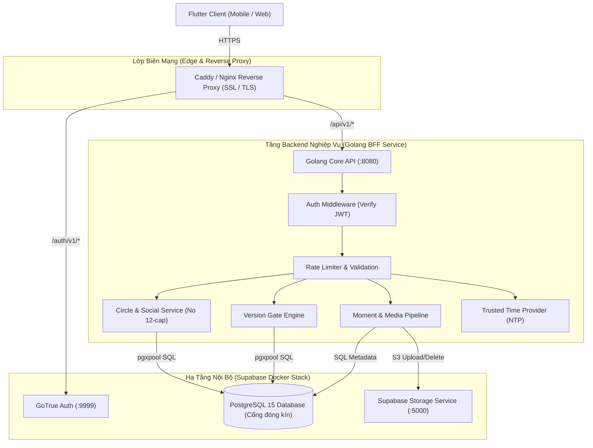

# Backend Architecture: Golang BFF Wrapper & Business Logic Engine — Kiến trúc Backend Golang bọc ngoài Supabase

> **TRẠNG THÁI: APPROVED / CANONICAL SSOT (CHUẨN KIẾN TRÚC DUY NHẤT)**  
> Quyết định kiến trúc kỹ thuật (ADR): Xây dựng một dịch vụ Backend độc lập bằng **Golang** đóng vai trò Backend-For-Frontend (BFF) và API Gateway bọc ngoài toàn bộ hạ tầng Supabase (PostgreSQL, Storage). Thay thế hoàn toàn mô hình Direct PostgREST cũ (@doc/architecture/supabase-postgrest-security-model). Đóng kín quyền truy cập database trực tiếp từ Internet, tập trung hóa toàn bộ logic nghiệp vụ vào mã nguồn Go, và **xóa bỏ hoàn toàn giả định giới hạn cứng 12 bạn bè** trong hệ thống.

---

## 1. Bối Cảnh & Quyết Định Kỹ Thuật (ADR)

### 1.1. Vấn Đề Của Mô Hình "Zero-Backend" Trực Tiếp (PostgREST + SQL Triggers)
Mô hình ban đầu để Flutter Client kết nối thẳng tới PostgREST thông qua Kong Gateway tuy giúp khởi tạo nhanh nhưng bộc lộ các hạn chế lớn khi mở rộng:
1. **Khó kiểm thử & bảo trì logic**: Toàn bộ nghiệp vụ (ràng buộc bạn bè, chu kỳ 30 ngày, phân quyền) bị đẩy vào PL/pgSQL Triggers và Stored Procedures, gây khó khăn cho việc viết unit test, debug luồng chạy và theo dõi log.
2. **Rủi ro rò rỉ bảo mật (RLS Leak)**: Khi các bảng mới được bổ sung, chỉ cần một sơ suất trong cấu hình Row-Level Security (RLS) là dữ liệu có thể bị truy cập ngoài ý muốn qua PostgREST.
3. **Bế tắc khi tích hợp bên thứ ba**: Không thể tích hợp các dịch vụ cần thiết trong tương lai như: kiểm tra thời gian thực từ máy chủ NTP (chống gian lận giờ trong After Midnight), đẩy thông báo (Firebase Cloud Messaging - FCM), hoặc kết nối module AI.

### 1.2. Đính Chính Quan Trọng: Xóa Bỏ Giới Hạn Cứng 12 Bạn Bè
- **Nguồn gốc hiểu lầm**: Trong bản mock HTML nguyên mẫu của Quire (`designs/quire/prototype.html`), có hiển thị 11 avatar mẫu và một chip `+6` mang tính chất dữ liệu minh họa giao diện. Từ đó các tài liệu phân tích trước đây đã giả định và cài đặt cứng một trigger `check_quire_circle_member_limit` chặn ở mức 12 người.
- **Quyết định chốt**: **Hệ thống KHÔNG áp đặt bất kỳ giới hạn cứng 12 bạn bè nào**. Người dùng có quyền kết nối số lượng bạn bè linh hoạt theo nhu cầu thực tế của sản phẩm. Toàn bộ logic kiểm soát mối quan hệ bạn bè được chuyển từ Database Trigger sang tầng Golang Backend để quản lý mềm dẻo bằng cấu hình động (hoặc không giới hạn).

### 1.3. Lựa Chọn Công Nghệ: Golang Service (BFF Pattern)
- **Ngôn ngữ**: Golang 1.22+ (Hiệu năng cực cao, tốn ít tài nguyên VPS: < 30MB RAM, khởi động tức thì, biên dịch ra 1 file binary duy nhất).
- **Web Framework đề xuất**: `Chi` (nhẹ, chuẩn `net/http` idiomatic Go) hoặc `Echo` (mạnh mẽ, router siêu tốc).
- **Database Driver**: `pgx/v5` với connection pooler `pgxpool` kết nối trực tiếp vào PostgreSQL nội bộ.
- **Object Storage Client**: Thư viện MinIO Go SDK hoặc AWS S3 Go SDK kết nối vào Supabase Storage nội bộ.

---

## 2. Mô Hình Kiến Trúc Phân Tầng (System Architecture)

Toàn bộ các cổng nội bộ của cơ sở dữ liệu (`5432`) và PostgREST (`3000`) đều bị **ĐÓNG HOÀN TOÀN** khỏi mạng Internet công cộng. Duy nhất Golang BFF Service và GoTrue (Auth) được ủy quyền xử lý các yêu cầu từ Client.



---

## 3. Cấu Trúc Mã Nguồn Golang BFF Chuẩn Mực

Dự án backend Golang được tổ chức theo cấu trúc chuẩn `Standard Go Project Layout`:

```text
backend/
├── go_service/
│   ├── cmd/
│   │   └── server/
│   │       └── main.go                  # Điểm khởi chạy ứng dụng, nạp config & DI
│   ├── internal/
│   │   ├── config/                      # Nạp biến môi trường (.env / struct)
│   │   ├── domain/                      # Định nghĩa Models & Interface nghiệp vụ
│   │   │   ├── profile.go
│   │   │   ├── circle.go                # Logic bạn bè (không giới hạn 12)
│   │   │   ├── moment.go                # Quire Moments
│   │   │   └── version_gate.go          # SemVer & Chống kẹt cache
│   │   ├── handler/                     # HTTP Handlers (REST controllers)
│   │   │   ├── auth_handler.go
│   │   │   ├── circle_handler.go
│   │   │   ├── moment_handler.go
│   │   │   └── system_handler.go
│   │   ├── middleware/
│   │   │   ├── auth.go                  # Xác thực Supabase JWT bằng JWT_SECRET
│   │   │   ├── cors.go
│   │   │   ├── logger.go
│   │   │   └── recover.go
│   │   ├── repository/                  # Tương tác PostgreSQL qua pgx/v5
│   │   │   ├── postgres_circle.go
│   │   │   ├── postgres_moment.go
│   │   │   └── postgres_system.go
│   │   └── storage/                     # Quản lý file ảnh qua Supabase Storage S3
│   │       └── s3_adapter.go
│   ├── migrations/                      # Script điều chỉnh DB (drop trigger cũ)
│   ├── Dockerfile                       # Multi-stage build (Scratch / Alpine < 25MB)
│   ├── go.mod
│   └── go.sum
└── supabase/                            # Hạ tầng DB & Storage hiện có
```

---

## 4. Các Trọng Tâm Nghiệp Vụ & Cơ Chế Bảo Mật

### 4.1. Xác Thực Token Tập Trung (JWT Verification Middleware)
- Client đăng nhập qua GoTrue (`/auth/v1`), nhận cặp `access_token` và `refresh_token`.
- Mọi yêu cầu gửi tới Golang BFF mang header `Authorization: Bearer <access_token>`.
- Middleware `AuthMiddleware` trong Go giải mã và xác thực chữ ký của token bằng `JWT_SECRET` (thuật toán HMAC-SHA256):
  - Bóc tách UUID của người dùng từ claim `sub`.
  - Đưa `user_id` vào `context.Context` của Go request.
  - Các handler tầng trong chỉ việc lấy `userID := ctx.Value("userID").(string)` mà không sợ bị giả mạo danh tính.

### 4.2. Xóa Bỏ Giới Hạn Cứng 12 Bạn Bè Tại Cơ Sở Dữ Liệu
Trong file migration tiếp theo, trigger chặn 12 bạn bè sẽ được loại bỏ:

```sql
-- Migration: Drop hard-coded 12 friend circle limit trigger
DROP TRIGGER IF EXISTS trg_check_quire_circle_member_limit ON public.quire_circle_members;
DROP FUNCTION IF EXISTS check_quire_circle_member_limit();
```

- **Quyền quyết định thuộc về Go Service**:
  - Tầng `circle_service.go` xử lý logic thêm/bớt bạn bè.
  - Không có trần 12 người mặc định. Nếu một sản phẩm con cần giới hạn (ví dụ chỉ định số bạn thân), giá trị đó được truyền qua biến cấu hình hệ thống hoặc thuộc tính riêng của từng vòng (`circle.max_members`), không bao giờ khóa cứng trong mã SQL.

### 4.3. Pipeline Xử Lý & Tự Hủy Ảnh Khoảnh Khắc (Quire Moments)
1. **Tiền kiểm tra tại Go Backend**:
   - Kiểm tra MIME type thực tế (`image/webp`, `image/jpeg`).
   - Kiểm tra dung lượng tải lên (giới hạn tối đa 2MB).
2. **Ghi nhận lưu trữ**:
   - Backend đẩy ảnh vào bucket `quire-moments` trên Supabase Storage thông qua S3 Protocol nội bộ.
   - Ghi bản ghi vào bảng `quire_moments` với thời điểm hết hạn tự động:
     `expires_at = time.Now().AddDate(0, 0, 30)` (30 ngày).
3. **Đảm bảo tính riêng tư**:
   - Chỉ những người nằm trong danh sách người nhận (`quire_moment_recipients`) mới được API Backend trả về đường dẫn tải ảnh.

### 4.4. Dịch Vụ Kiểm Soát Phiên Bản (Version Gate API)
Thay vì để Client trực tiếp query bảng hệ thống `app_system_configs`, Client gọi endpoint:
`GET /api/v1/system/version-gate?platform=ios&version=1.2.0`

Golang Backend thực hiện so sánh SemVer ngay trong bộ nhớ:
- So sánh phiên bản gửi lên với `min_supported_version` và `latest_version`.
- Trả về payload JSON rõ ràng:
  ```json
  {
    "status": "force_update",
    "can_proceed": false,
    "lock_sync": true,
    "title": "Cần cập nhật phiên bản mới",
    "message": "Phiên bản bạn đang sử dụng không còn tương thích.",
    "update_url": "https://apps.apple.com/app/id..."
  }
  ```

### 4.5. Khả Năng Mở Rộng Dịch Vụ Ngoại Vi (Future-Proofing)
- **NTP Time Verifier (After Midnight)**: Backend Go tích hợp gói NTP client query từ các time server tin cậy (`pool.ntp.org`), trả về cờ kiểm duyệt thời gian 00:00–05:00 cho client, loại bỏ hoàn toàn khả năng người dùng chỉnh giờ trên điện thoại để gian lận.
- **Push Notification Service**: Tích hợp Firebase Admin Go SDK gửi thông báo khi bạn bè phản hồi ảnh trong Quire mà không làm ảnh hưởng luồng đọc dữ liệu.

---

## 5. Cấu Hình Triển Khai Docker Compose Bổ Sung

Bổ sung service `backend` vào hệ sinh thái Docker hiện có:

```yaml
services:
  # Golang BFF Service
  backend:
    build:
      context: ./backend/go_service
      dockerfile: Dockerfile
    container_name: constellation-backend
    restart: unless-stopped
    depends_on:
      db:
        condition: service_healthy
      auth:
        condition: service_started
    environment:
      PORT: 8080
      DATABASE_URL: postgres://postgres:${POSTGRES_PASSWORD}@db:5432/${POSTGRES_DB:-postgres}?sslmode=disable
      JWT_SECRET: ${JWT_SECRET}
      STORAGE_ENDPOINT: http://storage:5000
      STORAGE_BUCKET: quire-moments
      STORAGE_KEY: ${SERVICE_ROLE_KEY}
    ports:
      - "127.0.0.1:8080:8080"
    networks:
      - supabase-net
```

---

## 6. Tham Chiếu Tài Liệu Liên Quan

- Kiến trúc lưu trữ Supabase & Version Gating ban đầu: @doc/architecture/backend-supabase-version-gating
- Hướng dẫn khởi động cho lập trình viên Client: @doc/guides/client-developer-quickstart
- Logic State Machine tải ảnh Quire: @doc/architecture/quire-photo-upload-logic
- Nguyên tắc Calm UX & Chống thao túng tâm lý: @doc/patterns/calm-anti-social-mechanics
