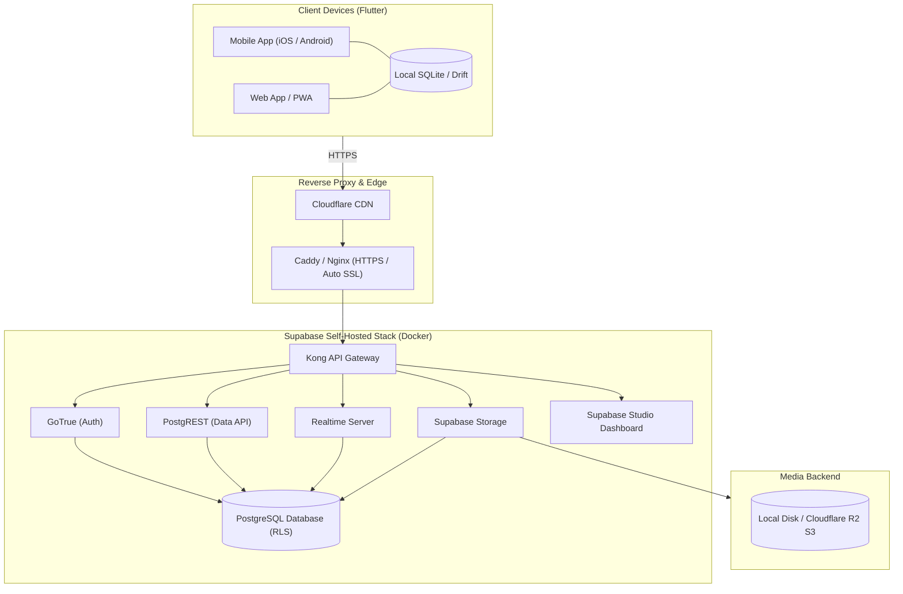
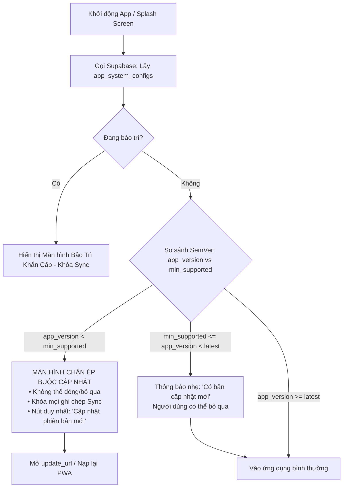

# Backend Architecture: Supabase Self-Hosted, Storage & Version Gating Contract — Kiến trúc Backend Supabase, Lưu trữ Media & Cơ chế Ép Cập Nhật Phiên Bản

> Quyết định kỹ thuật và hợp đồng kiến trúc (ADR/Contract): Lựa chọn Supabase làm nền tảng Backend/Sync cho Constellation (triển khai tự host qua Docker), chuẩn hóa cấu trúc upload Avatar & Media Storage, và đặc tả bắt buộc về Cơ chế Ép cập nhật phiên bản (Version Gating / Anti-Stale Cache) trên Client Flutter.

---

## 1. Quyết Định Công Nghệ: Supabase Self-Hosted (Trạng thái: APPROVED)

- **Trạng thái**: `APPROVED` (Chốt theo quyết định người dùng ngày 2026-09-24, giải phóng một phần mục 1 trong @doc/constellation/c-91-backlog).
- **Mục tiêu**: Xây dựng tầng backend chuẩn công nghiệp, bảo toàn quyền tự chủ dữ liệu 100% bằng cách tự triển khai (Self-Hosted) qua Docker trên VPS cá nhân, không bị khóa vào nhà cung cấp SaaS (Vendor Lock-in).
- **Cấu phần cốt lõi sử dụng trong Supabase Stack**:
  1. **PostgreSQL 15+**: Cơ sở dữ liệu quan hệ mạnh mẽ, hỗ trợ mở rộng schema lâu dài và các extension nâng cao.
  2. **Row-Level Security (RLS)**: Chính sách bảo mật cấp dòng dữ liệu bản địa của PostgreSQL. Mỗi người dùng chỉ có quyền đọc/ghi dữ liệu của chính mình hoặc vòng kết nối (circle) được chia sẻ.
  3. **GoTrue (Supabase Auth)**: Xác thực người dùng bằng JWT, Email/Password, OTP, hoặc đăng nhập không mật khẩu (Magic Link).
  4. **PostgREST**: Tự động sinh RESTful API từ schema PostgreSQL với độ trễ siêu thấp.
  5. **Supabase Realtime**: WebSocket engine lắng nghe thay đổi dữ liệu từ PostgreSQL WAL (Write-Ahead Logging).
  6. **Supabase Storage**: Quản lý file/ảnh tương thích chuẩn S3 API.



---

## 2. Tiêu Chuẩn Upload & Cấu Trúc File Avatar (Supabase Storage Spec)

Để đảm bảo an toàn, tối ưu dung lượng và tránh lỗi cache ảnh đại diện cũ, cấu trúc lưu trữ Avatar trên Supabase Storage được quy định nghiêm ngặt theo các tiêu chuẩn kỹ thuật sau:

### 2.1. Cấu Hình Bucket `avatars`
* **Bucket Name**: `avatars`
* **Public Access**: `true` (Cho phép đọc công khai qua URL để tối ưu tốc độ render danh sách bạn bè mà không cần tạo Signed URL liên tục).
* **Giới hạn dung lượng (File size limit)**: Tối đa **1MB** (Client sẽ nén trước khi upload xuống dưới 100KB).
* **Định dạng MIME cho phép**: `image/webp`, `image/jpeg`, `image/png`.

### 2.2. Quy Tắc Đặt Tên Đường Dẫn (Storage Path Structure)

Cấu trúc đường dẫn file bắt buộc tuân theo phân cấp thư mục theo ID người dùng và gắn dấu thời gian (timestamp):

```text
avatars/{user_id}/avatar_{timestamp}.webp
```

* **`{user_id}`**: UUID chuẩn của người dùng lấy từ `auth.uid()` (ví dụ: `a1b2c3d4-e5f6-7890-abcd-ef1234567890`).
* **`avatar_{timestamp}.webp`**: Tên file định dạng WebP kèm timestamp mili-giây tại thời điểm upload (ví dụ: `avatar_1727198400000.webp`).

> **Tại sao cần timestamp?**
> 1. **Chống kẹt Cache CDN/Browser**: Tránh việc trình duyệt hoặc CDN lưu cache file `avatar.webp` cũ khiến người dùng đổi ảnh nhưng giao diện vẫn hiện ảnh cũ.
> 2. **Dọn dẹp rác (Garbage Collection)**: Client hoặc Trigger Database sẽ xóa file avatar cũ trong thư mục `{user_id}/` ngay khi upload file mới thành công.

### 2.3. Quy Chuẩn Xử Lý Ảnh Tại Client (Flutter Pre-Processing)

Trước khi gọi lệnh upload lên Supabase, Client Flutter bắt buộc thực hiện chuỗi tiền xử lý:
1. **Cắt khung vuông (1:1 Square Crop)**: Tỉ lệ chuẩn `1:1`, khung nhìn tập trung vào khuôn mặt hoặc biểu tượng đại diện.
2. **Kích thước chuẩn hóa (Resize)**: Max width/height là `400px × 400px` (đủ sắc nét trên màn hình Retina 3x của điện thoại mà dung lượng siêu nhỏ).
3. **Định dạng & Nén (Compression)**: Chuyển đổi sang định dạng `WebP` với chất lượng `quality: 80–85%`. Dung lượng tệp đích thường chỉ đạt khoảng **30KB – 80KB**.

### 2.4. Chính Sách Bảo Mật Cấp Dòng (Storage RLS Policies)

Áp dụng trực tiếp trên bảng `storage.objects` của Supabase bằng SQL để đảm bảo người dùng chỉ được quyền can thiệp vào avatar của chính mình:

```sql
-- 1. Cho phép mọi người (kể cả khách) xem ảnh đại diện
CREATE POLICY "Public Avatars Access"
ON storage.objects FOR SELECT
USING ( bucket_id = 'avatars' );

-- 2. Chỉ chính chủ mới được tải ảnh vào thư mục user_id của mình
CREATE POLICY "User Can Upload Own Avatar"
ON storage.objects FOR INSERT
TO authenticated
WITH CHECK (
    bucket_id = 'avatars' 
    AND (storage.foldername(name))[1] = auth.uid()::text
);

-- 3. Chỉ chính chủ mới được cập nhật ảnh của mình
CREATE POLICY "User Can Update Own Avatar"
ON storage.objects FOR UPDATE
TO authenticated
USING (
    bucket_id = 'avatars' 
    AND (storage.foldername(name))[1] = auth.uid()::text
);

-- 4. Chỉ chính chủ mới có quyền xóa ảnh của mình
CREATE POLICY "User Can Delete Own Avatar"
ON storage.objects FOR DELETE
TO authenticated
USING (
    bucket_id = 'avatars' 
    AND (storage.foldername(name))[1] = auth.uid()::text
);
```

### 2.5. Liên Kết Bảng Dữ Liệu `profiles` & Dọn Dẹp File Cũ

Khi upload thành công file mới `avatars/{user_id}/avatar_1727198400000.webp`:
1. Cập nhật cột `avatar_url` trong bảng `profiles`:
   ```sql
   UPDATE public.profiles
   SET avatar_url = 'avatars/' || auth.uid()::text || '/avatar_' || new_timestamp || '.webp',
       updated_at = NOW()
   WHERE id = auth.uid();
   ```
2. Xóa các file avatar cũ hơn nằm trong cùng thư mục `avatars/{user_id}/` thông qua Storage API để tiết kiệm dung lượng ổ cứng VPS.

---

## 3. Kiến Trúc Lưu Trữ Media & Tối Ưu Băng Thông Cho Các App

Đối chiếu thực tế 4 ứng dụng Constellation:
1. **Quire**: Phát sinh tải ảnh khoảnh khắc (Moments) giữa vòng bạn bè 4–11 người (chu kỳ tự hủy 30 ngày) và avatar người dùng.
2. **Dream Journal**: Phát sinh tải ảnh đính kèm gợi nhớ giấc mơ (màn `attach` - ảnh/vật gợi nhớ đánh thức giấc mơ).
3. **Astraea & After Midnight**: Hoàn toàn dùng Vector SVG nội tuyến, Canvas và WebAudio, **zero bitmap upload**.

### 3.1. Các Bucket Lưu Trữ Media:
- **`avatars`** (Public): Ảnh đại diện người dùng, cấu trúc `avatars/{user_id}/avatar_{timestamp}.webp`.
- **`quire-moments`** (Private RLS): Ảnh khoảnh khắc Quire, cấu trúc `quire-moments/{circle_id}/{moment_id}.webp` (chỉ vòng bạn bè được quyền xem; tự hủy theo chính sách 30 ngày).
- **`dream-attachments`** (Private RLS): Ảnh đính kèm giấc mơ trong Dream Journal, cấu trúc `dream-attachments/{user_id}/{dream_id}/{photo_id}.webp` (chỉ chính chủ xem được).

### 3.2. Quy trình xử lý ảnh tại Client (Zero-Waste Upload Pipeline):
1. **Nén tại Client**: Client Flutter bắt buộc nén ảnh bằng `flutter_image_compress` trước khi gửi. Độ phân giải tối đa `1440px`, định dạng WebP, chất lượng 80–85% (dung lượng ~200KB–400KB thay vì ảnh gốc 8MB).
2. **Cơ chế CDN & Cache Caching**:
   - Đặt Cloudflare CDN phía trước VPS để phân phối ảnh tĩnh, tận dụng tính năng zero-egress fee (không tính tiền băng thông tải về) của Cloudflare R2 nếu mở rộng lưu trữ S3.

---

## 4. Cơ Chế Ép Cập Nhật Phiên Bản (Version Gating & Anti-Stale Cache Contract)

### 4.1. Rủi ro cốt lõi (Problem Statement)
- **Lệch Schema cơ sở dữ liệu**: Khi backend hoặc schema local-first thay đổi cấu trúc bảng, các client cũ nếu vẫn tiếp tục gọi API đồng bộ có thể làm hỏng dữ liệu (Data Corruption) hoặc sập app (Crash).
- **Kẹt Cache trên Web/PWA**: Trình duyệt có xu hướng cache file `index.html` và file JavaScript bundle cũ. Người dùng mở app vẫn chạy code của bản tải lần đầu mà không biết hệ thống đã có bản cập nhật mới.
- **Bản Mobile cũ ngoài Store**: Người dùng tắt tính năng tự động cập nhật của App Store / Google Play, dẫn đến việc ứng dụng chạy trên phiên bản đã bị ngưng hỗ trợ API.

### 4.2. Bảng Cấu Hình Hệ Thống trên Supabase: `app_system_configs`

| Cột (Field) | Kiểu dữ liệu | Ý nghĩa & Quy tắc nghiệp vụ |
|---|---|---|
| `platform` | `text` (PK) | Nền tảng: `'android'`, `'ios'`, `'web'` |
| `min_supported_version` | `text` | Phiên bản tối thiểu bắt buộc hỗ trợ (chuẩn SemVer: ví dụ `'1.2.0'`). Nhỏ hơn giá trị này sẽ bị **CHẶN HOÀN TOÀN** |
| `latest_version` | `text` | Phiên bản mới nhất trên môi trường live (ví dụ `'1.3.1'`) |
| `force_update_title` | `text` | Tiêu đề thông báo cập nhật (song ngữ EN/VI) |
| `force_update_message` | `text` | Lời giải thích ngắn gọn, từ tốn theo phong cách Calm UX |
| `update_url` | `text` | Đường dẫn tải bản mới (Play Store URL, App Store URL, hoặc link APK/PWA Reload) |
| `maintenance_mode` | `boolean` | Cờ bảo trì khẩn cấp (`true` = tạm dừng toàn bộ sync để migrate DB) |
| `maintenance_notice` | `text` | Thông điệp bảo trì nhã nhặn cho người dùng |

### 4.3. Hợp Đồng Kiểm Tra Phiên Bản trên Client Flutter (Version Gate Engine)



#### Quy tắc bất biến của Version Gate:
1. **Khóa hoàn toàn luồng ghi dữ liệu**: Khi rơi vào trạng thái `Force Update`, client lập tức ngắt động cơ sync (Sync Engine Pause) để ngăn client cũ ghi các payload sai cấu trúc lên Supabase.
2. **Kích hoạt tại 2 thời điểm**: 
   - Khi khởi động ứng dụng (App Boot / Splash).
   - Khi ứng dụng chuyển từ chạy ngầm lên tiền cảnh (`AppLifecycleState.resumed`).

### 4.4. Xử Lý Triệt Để Kẹt Cache trên Web & PWA

Đối với phiên bản Web App (PWA) chạy trên trình duyệt:

1. **Chống Cache HTML Cốt Lõi (Cache-Control Headers)**:
   - Tại máy chủ web (Caddy / Nginx), tệp `index.html` và `flutter_service_worker.js` **TUYỆT ĐỐI KHÔNG ĐƯỢC CACHE**:
     ```http
     Cache-Control: no-cache, no-store, must-revalidate
     Pragma: no-cache
     Expires: 0
     ```
   - Mọi tệp assets tĩnh (`.wasm`, `.js`, font, ảnh) được băm mã định danh (cache-busting hash: `main.dart.js?v=hash123`).
2. **Service Worker Controller Change Listener**:
   - Client Flutter Web đăng ký lắng nghe sự kiện `waiting` của Service Worker:
     ```javascript
     navigator.serviceWorker.addEventListener('controllerchange', () => {
       // Tự động thông báo người dùng nạp lại trang để nạp bản build mới nhất
       showReloadBanner('Phiên bản mới đã sẵn sàng. Tải lại trang để cập nhật.');
     });
     ```
3. **Cơ chế Tự Bốc Hơi LocalStorage Cũ khi Đổi Version**:
   - Khi phát hiện mã build mới (`buildNumber` tăng), client tự động kiểm tra tính tương thích của schema cache cục bộ; nếu cấu trúc cũ không thể tương thích, client thực hiện di chuyển dữ liệu (migration) trước khi render giao diện.

---

## 5. Đặc Tả Triển Khai Docker Compose (Self-Hosting Blueprint)

Cấu trúc triển khai chuẩn trên máy chủ VPS (Ubuntu 22.04/24.04 LTS):

```yaml
# docker-compose.yml mẫu cho Supabase Self-Hosted tối giản
version: '3.8'

services:
  db:
    image: supabase/postgres:15.1.1.78
    restart: unless-stopped
    environment:
      POSTGRES_PASSWORD: ${POSTGRES_PASSWORD}
    volumes:
      - ./volumes/db/data:/var/lib/postgresql/data
    networks:
      - supabase-net

  kong:
    image: kong:2.8.1
    restart: unless-stopped
    ports:
      - "8000:8000"
      - "8443:8443"
    networks:
      - supabase-net

  auth:
    image: supabase/gotrue:v2.132.3
    restart: unless-stopped
    environment:
      GOTRUE_JWT_SECRET: ${JWT_SECRET}
      DATABASE_URL: postgres://postgres:${POSTGRES_PASSWORD}@db:5432/postgres
    networks:
      - supabase-net

  rest:
    image: postgrest/postgrest:v11.2.0
    restart: unless-stopped
    environment:
      PGRST_DB_URI: postgres://postgres:${POSTGRES_PASSWORD}@db:5432/postgres
      PGRST_JWT_SECRET: ${JWT_SECRET}
    networks:
      - supabase-net

  storage:
    image: supabase/storage-api:v0.43.11
    restart: unless-stopped
    environment:
      ANON_KEY: ${ANON_KEY}
      SERVICE_KEY: ${SERVICE_ROLE_KEY}
      POSTGREST_URL: http://rest:3000
      PGRST_JWT_SECRET: ${JWT_SECRET}
      DATABASE_URL: postgres://postgres:${POSTGRES_PASSWORD}@db:5432/postgres
      FILE_STORAGE_BACKEND_PATH: /var/lib/storage
    volumes:
      - ./volumes/storage:/var/lib/storage
    networks:
      - supabase-net

networks:
  supabase-net:
    driver: bridge
```

---

## 6. Ranh Giới Quản Trị & Anti-Minting (Governance Checklist)

1. **Tuân thủ S-01**: Tài liệu này là đặc tả kiến trúc tầng Backend triển khai (`architecture/`), không vi phạm tính Observe-Only của 8 tài liệu trích xuất nguyên mẫu (`constellation/*-01-flow`, `*-02-data`).
2. **The Void Invariant**: Mọi dữ liệu rơi vào *The Void* (trong After Midnight) tuyệt đối **KHÔNG BAO GIỜ** được đẩy lên Supabase hay lưu vào bất kỳ bảng nào trên database.
3. **Quiet by Default**: Không sử dụng Supabase Push Notification để gửi thông báo mồi chài (retention bait). Chỉ gửi thông báo khi có hành động phản hồi trực tiếp từ bạn thân trong Quire nếu người dùng đã chủ động bật.
