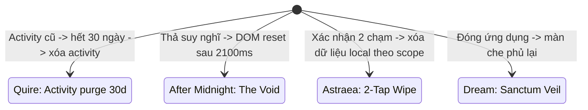

# Cross-App Boundaries & Architectural Invariants — Ranh giới chéo & Bất biến hệ thống

> Tài liệu xác lập các ranh giới kiến trúc bất khả xâm phạm giữa 4 ứng dụng Constellation, định nghĩa các bất biến âm tính (negative invariants - những gì tuyệt đối không được tồn tại), và cơ chế dọn dẹp dữ liệu cục bộ nhằm bảo vệ quyền riêng tư và trạng thái tâm lý của người dùng.

---

## 1. Bất biến Kiến trúc Toàn hệ thống (Core Invariants)

Hệ thống Constellation định nghĩa 5 bất biến, là ranh giới hành vi chung chứ không phải một lớp implementation dùng chung:

1. **Local-First**: prototype không gửi user data qua backend, không auth/sync thật; remote static asset là dependency riêng cần gắn `OBSERVED`/`DEFERRED`.
2. **Calm**: không chủ động níu kéo, ép phản hồi hoặc biến ghi chép thành streak/điểm số.
3. **Anti-Merge**: không trộn visual, navigation, domain, state hoặc data identity giữa bốn app.
4. **Data Disposal**: mỗi app có retention, visibility và deletion contract riêng; `xóa 100%` chỉ được dùng sau khi kiểm tra storage/cache/backup/sync.
5. **Ritual Pacing**: giữ thứ tự nghi thức và điểm dừng; không thêm CTA, notification hay transition làm thay đổi ý nghĩa.

Các invariant này được áp dụng như checklist governance; implementation adapter phải giữ domain ownership riêng.
## 2. Ma trận Ranh giới Tương tác & Dữ liệu Chéo

Bảng dưới đây là contract hành vi, không phải schema dùng chung:

| Khía cạnh tương tác | Quire | Dream Journal | Astraea | After Midnight |
|---|---|---|---|---|
| **Chia sẻ xã hội** | Vòng thân mật (không trần cứng 12; demo 11); chỉ gửi trực tiếp trong circle đã duyệt | Không có chia sẻ; kho nội tâm cá nhân | Không có mạng xã hội; bài đọc riêng tư | Thành phố đêm ẩn danh, không hồ sơ công khai |
| **Tính bền vững của văn bản** | Bài viết dài lưu trữ; moment có retention riêng | Giấc mơ chuyển hóa thành tác phẩm & chòm sao | Bài đọc lưu vào nhật ký; thư viện 78 lá cố định | Thư niêm phong khóa thời gian; Void không lưu |
| **Xác nhận đọc** | Mặc định tắt; mọi dòng “read receipts ON” trong prototype là `Chưa rõ — hỏi Lead`, không phải production default | Không áp dụng | Không áp dụng | Không áp dụng |
| **Phản hồi bằng AI** | Không có AI | UX/copy phản chiếu trong prototype; provider/prompt/guardrail `DEFERRED` | Diễn giải gợi mở trong prototype; không tiên tri; service production `DEFERRED` | Không có AI |
| **Số liệu tương tác** | Không vanity metrics công khai; số liệu mẫu phải gắn `FIXTURE` | Không gamification/streak | Bộ đếm chỉ được giữ nếu không trở thành chuỗi/điểm số; nếu không rõ thì `Chưa rõ — hỏi Lead` | Không chỉ số thúc ép |

Các khác biệt trên là chủ ý; không dùng chúng làm lý do để hợp nhất UI hoặc data model.
## 3. Triết lý Calm Computing & Danh mục Bất biến Âm tính (Negative Invariants)

Nhằm bảo vệ sự tập trung của con người, hệ thống thiết lập một danh mục **những điều cấm tuyệt đối** xuất hiện trong bất kỳ ứng dụng nào:

```
[DANH MỤC CẤM XUẤT HIỆN TRÊN TOÀN HỆ THỐNG]
├── [CẤM] Hệ thống điểm danh chuỗi ngày (Streaks)
├── [CẤM] Hệ thống huy hiệu khen thưởng (Achievement Badges)
├── [CẤM] Số lượng người theo dõi hoặc đếm view công khai (Vanity Metrics)
├── [CẤM] Bảng xếp hạng cạnh tranh giữa người dùng (Leaderboards)
├── [CẤM] Luồng cuộn vô tận thuật toán gây nghiện (Infinite Algorithmic Feeds)
├── [CẤM] Thông báo đẩy tự động khi người dùng không tương tác (Retention Push)
└── [CẤM] Âm thanh cảnh báo gây giật mình hoặc căng thẳng
```

---

## 4. Cơ chế Hủy & Xóa Dữ liệu (Data Disposal Mechanisms)

Mỗi ứng dụng có cơ chế riêng; đây là hành vi quan sát, chưa phải effective-deletion guarantee:



### 1. Quire — Activity purge 30 ngày & hoàn tác gửi
- Chu kỳ 30 ngày áp dụng cho **activity log**; không tự động xóa bài viết, moment hoặc toàn bộ vòng bạn.
- Cửa sổ hoàn tác 3–5 giây là quan sát prototype; network/upload semantics là `PROPOSED` và phải có test.

### 2. After Midnight — The Void
- Quan sát được: sau hiệu ứng `2100ms`, nội dung bị gỡ khỏi DOM và không được persist/gửi mạng.
- Không tuyên bố xóa được khỏi RAM của OS/browser, backup hoặc thiết bị khác; trusted-time và physical deletion là `DEFERRED`.

### 3. Astraea — 2-Tap Wipe
- Xóa theo scope local đã quan sát; chưa được gọi là “xóa 100%” khi chưa kiểm tra cache, backup, sync hoặc bản sao khác.

Mọi thay đổi retention/deletion phải có owner, trigger, recovery test và deletion propagation trước khi chuyển `APPROVED`.
## 5. Bảo toàn Tính Độc lập Không Hợp nhất (Anti-Merge Enforcement)

Mọi đề xuất tái cấu trúc phải vượt qua checklist sau:

1. **Không tạo Super-App**: không gom bốn app thành một portal chung.
2. **Không hợp nhất identity hoặc domain**: không dùng shared user/activity/social model làm tiện lợi; có thể dùng hạ tầng kỹ thuật trung lập nếu ownership và policy vẫn tách biệt.
3. **Không trộn visual/token/typography/navigation**: giữ namespace và design language riêng.
4. **Không tự mở rộng deferred scope**: auth, sync, AI, analytics và shared backend phải qua ADR/C-90; The Void luôn ngoài sync.
5. **Mọi thay đổi phải trace về invariant**: nếu không chỉ ra invariant được bảo toàn và test evidence, proposal bị hoãn.
