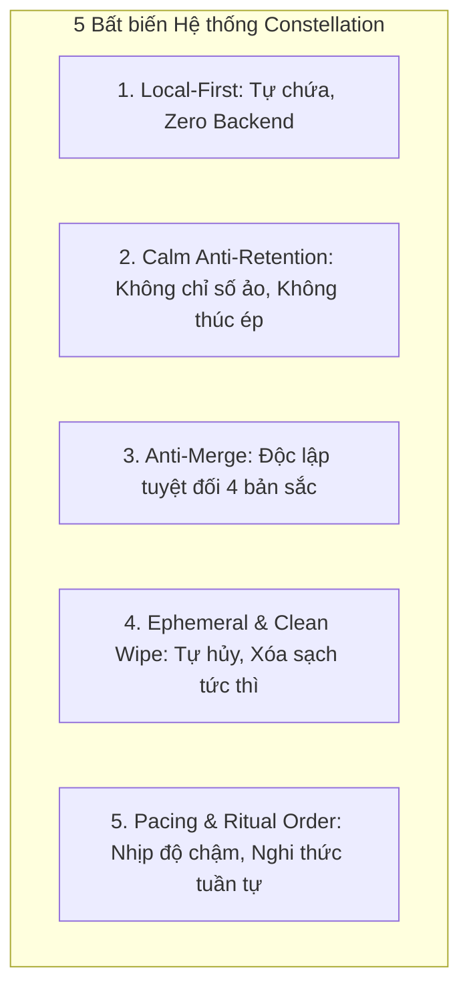
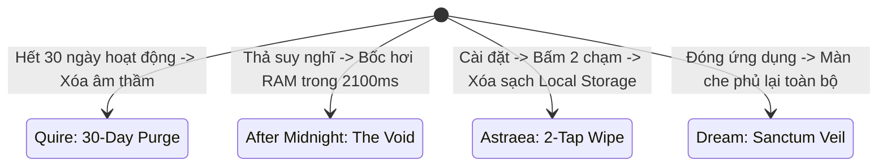

# Cross-App Boundaries & Architectural Invariants — Ranh giới chéo & Bất biến hệ thống

> Tài liệu xác lập các ranh giới kiến trúc bất khả xâm phạm giữa 4 ứng dụng Constellation, định nghĩa các bất biến âm tính (negative invariants - những gì tuyệt đối không được tồn tại), và cơ chế dọn dẹp dữ liệu cục bộ nhằm bảo vệ quyền riêng tư và trạng thái tâm lý của người dùng.

---

## 1. Bất biến Kiến trúc Toàn hệ thống (Core Invariants)

Hệ thống Constellation định nghĩa 5 bất biến kiến trúc mang tính ràng buộc bắt buộc:



1. **Bất biến Cục bộ (Local-First Invariant)**: Không có luồng dữ liệu nào truyền qua mạng internet ở giai đoạn nguyên mẫu. Trạng thái người dùng được giam giữ an toàn trong phiên DOM hiện hành.
2. **Bất biến Điềm tĩnh (Calm Invariant)**: Ứng dụng không bao giờ chủ động tìm cách níu kéo người dùng ở lại lâu hơn mức cần thiết.
3. **Bất biến Chống Hợp nhất (Anti-Merge Invariant)**: Không trộn lẫn triết lý, màu sắc hay luồng nghiệp vụ giữa 4 ứng dụng.
4. **Bất biến Dọn dẹp Dữ liệu (Sanitization Invariant)**: Mọi dữ liệu nhạy cảm đều có đường thoát hoặc cơ chế tự hủy rõ ràng.
5. **Bất biến Trật tự Nghi thức (Ritual Pacing Invariant)**: Các thao tác mang tính nghi thức (bốc bài, vén màn che, gửi thư đêm) không cho phép nhảy cóc hoặc thực hiện tức thời một cách cẩu thả.

---

## 2. Ma trận Ranh giới Tương tác & Dữ liệu Chéo

Bảng ranh giới ngăn chặn sự thẩm thấu sai lệch giữa các miền chức năng:

| Khía cạnh tương tác | Quire | Dream Journal | Astraea | After Midnight |
|---|---|---|---|---|
| **Chia sẻ xã hội** | Vòng bạn thân khép kín (4–12 người), chỉ gửi ảnh trực tiếp | Không có chia sẻ; kho lưu trữ nội tâm cá nhân | Không có mạng xã hội; xem bài đọc riêng tư | Thành phố đêm ẩn danh, không hồ sơ công khai |
| **Tính bền vững của văn bản** | Bài viết dài lưu trữ; khoảnh khắc tạm thời | Giấc mơ chuyển hóa thành tác phẩm & chòm sao | Bài đọc lưu vào nhật ký; thư viện 78 lá cố định | Thư niêm phong khóa thời gian; Void bốc hơi tức thì |
| **Xác thực đọc** | Mặc định tắt; người gửi không biết người nhận đã đọc hay chưa | Không áp dụng | Không áp dụng | Không áp dụng |
| **Phản hồi bằng AI** | Không có trí tuệ nhân tạo | AI phản chiếu biểu tượng, không phán xét, không định danh | Diễn giải bài đọc mang tính gợi mở, cấm tiên tri | Không có trí tuệ nhân tạo |

---

## 3. Triết lý Calm Computing & Danh mục Bất biến Âm tính (Negative Invariants)

Nhằm bảo vệ sự tập trung của con người, hệ thống thiết lập một danh mục **những điều cấm tuyệt đối** xuất hiện trong bất kỳ ứng dụng nào:

```
[DANH MỤC CẤM XUẤT HIỆN TRÊN TOÀN HỆ THỐNG]
├── [CẤM] Hệ thống điểm danh chuỗi ngày (Streaks)
├── [CẤM] Hệ thống huy hiệu khen thưởng (Achievement Badges)
├── [CẤM] Số lượng người theo dõi hoặc đếm view công khai (Vanity Metrics)
├── [CẤM] Bảng xếp hạng cạnh tranh giữa người dùng (Leaderboards)
├── [CẤM] Luồng cuộn vô tận thuật toán gây nghiện (Infinite Algorithmic Feeds)
├── [CẤM] Thông báo đẩy tự động khi người dùng không tương tác (Retention Push)
└── [CẤM] Âm thanh cảnh báo gây giật mình hoặc căng thẳng
```

---

## 4. Cơ chế Hủy & Xóa Dữ liệu (Data Disposal Mechanisms)

Mỗi ứng dụng cài đặt một cơ chế giải phóng dữ liệu riêng biệt phù hợp với bối cảnh:



### 1. Quire — Chu kỳ tự hủy 30 ngày & Hoàn tác gửi:
- **Chu kỳ 30 ngày**: Hoạt động trong dòng khoảnh khắc tự động bốc hơi sau 30 ngày kể từ ngày phát hành. Không lưu trữ vĩnh viễn dòng thời gian quá khứ.
- **Cửa sổ hoàn tác**: Khi gửi ảnh, người dùng có 3–5 giây để bấm "Hoàn tác". Khi bấm hoàn tác, hình ảnh chưa bao giờ rời khỏi thiết bị cục bộ.

### 2. After Midnight — Cơ chế The Void:
- **Cam kết không lưu trữ (Non-Persistence Invariant)**: Bất kỳ suy nghĩ nào gõ vào ô nhập liệu của The Void và bấm "Thả đi" sẽ kích hoạt animation tan rã trong `2100ms`. Ngay sau đó, chuỗi ký tự bị gán rỗng trong RAM, không ghi vào cookie hay bộ nhớ đệm.

### 3. Astraea — Xóa dữ liệu 2 chạm (2-Tap Wipe):
- Trong mục Hồ sơ cá nhân, chỉ cần 2 thao tác chạm có xác nhận, toàn bộ lịch sử rút bài, ghi chép nhật ký và thông tin ngày sinh sẽ bị xóa sạch khỏi bộ nhớ thiết bị.

---

## 5. Bảo toàn Tính Độc lập Không Hợp nhất (Anti-Merge Enforcement)

Để bảo vệ tính toàn vẹn nghệ thuật của từng tác phẩm thiết kế, mọi đề xuất tái cấu trúc mã nguồn trong tương lai phải vượt qua bài kiểm tra **Hàng rào Chống Hợp nhất**:

1. **Không tạo Super-App**: Tuyệt đối không xây dựng một ứng dụng "cổng" chứa cả 4 app như 4 tab hay 4 chức năng con.
2. **Không ép chung cơ sở dữ liệu**: Khi triển khai backend tương lai, mỗi sản phẩm phải có schema và dịch vụ tách biệt, ngăn chặn nguy cơ liên kết chéo hồ sơ người dùng giữa After Midnight (ẩn danh hoàn toàn) và Quire (vòng bạn thân).
3. **Tôn trọng ranh giới bản sắc**: Giữ vững sự tương phản giữa nền giấy ngà của Quire và bóng tối obsidian của Dream Journal.
