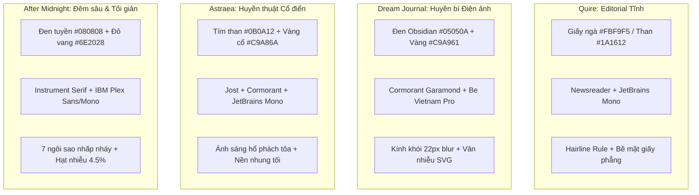

# Design System & Token Architecture — Nền tảng thiết kế & Hệ thống Token

> Tài liệu phân tích chuyên sâu về hệ thống Token, cấu trúc phân tầng hiển thị, 4 cặp Typography đối lập và chất liệu bề mặt trong 4 nguyên mẫu di động Constellation. Khẳng định tính tự chủ không gian tên (namespace isolation) và hàng rào kiểm soát chất lượng thị giác.

---

## 1. Triết lý Thẩm mỹ & Độc lập Thị giác

Trong bộ sưu tập Constellation, hệ thống thiết kế được xây dựng theo mô hình **Hệ sinh thái Đa bản sắc (Federated Identity Ecosystem)**. Trái ngược với xu hướng gom toàn bộ ứng dụng vào một "Design System" chung dùng các biến CSS toàn cục, 4 ứng dụng sở hữu 4 thế giới thẩm mỹ độc lập:



- **Quy tắc cô lập Namespace**: Mỗi ứng dụng chỉ truy cập token mang tiền tố hoặc scope riêng. Tuyệt đối không import chéo biến CSS giữa các ứng dụng.

---

## 2. Phân tích 4 Cặp Typography Đối lập

Mỗi nguyên mẫu thiết lập một cặp phông chữ đại diện cho sự giằng co giữa **Cảm xúc Thơ mộng / Tác giả (Display/Serif)** và **Dữ liệu / Kỹ thuật / Điều hướng (UI/Data/Sans/Mono)**:

| Ứng dụng | Phông Tiêu đề / Cảm xúc (Display) | Phông Dữ liệu / Điều hướng (UI & Data) | Nguồn tham chiếu HTML | Đặc tính quan sát được |
|---|---|---|---|---|
| **Quire** | `Newsreader` (optical size 6..72, weights 300–600) | `JetBrains Mono` (cho số liệu, giờ '14:23', đếm '420 TỪ') | `designs/quire/prototype.html#600B:14, 23-25` | Đậm chất báo chí in ấn cao cấp, chân serif thanh lịch kết hợp monospace kỹ thuật chính xác. |
| **Dream Journal** | `Cormorant Garamond` (serif biên tập cổ điển) | `Be Vietnam Pro` (sans tối ưu dấu tiếng Việt) | `designs/dream-journal/index.html#9FC4:10, 58-61` | Cormorant truyền tải ảo ảnh huyền bí, Be Vietnam Pro bảo toàn độ sắc nét của hệ thống dấu thanh tiếng Việt. |
| **Astraea** | `Cormorant Garamond` & `Cinzel` (huyền bí, cổ xưa) | `Jost` (hình học thiên văn) + `JetBrains Mono` (tọa độ sao) | `designs/astraea/V2 astraea-nguyên mẫu tương tác.html#9352:30-32` | Sự kết hợp giữa ký tự La Mã cổ đại và phông hình học hiện đại của các thiết bị thiên văn. |
| **After Midnight** | `Instrument Serif` (dáng vẻ sắc sảo, đêm tối) | `IBM Plex Sans` (giao diện) + `IBM Plex Mono` (bộ đếm giờ) | `designs/after-midnight/v1 after midnight - interactive prototype.html#19F5:47-50` | Serif thanh mảnh như ánh sáng lướt qua bóng đêm, font mono tái hiện nhịp đếm lạnh của đồng hồ số. |

---

## 3. Cấu trúc Phân cấp Token 4 Tầng (4-Tier Token Hierarchy)

Hệ thống token trong mỗi nguyên mẫu được chuẩn hóa thành 4 tầng kiến trúc:

```
[ Tier 4: Geometry & Timing ] -> Border radius, Touch targets >= 44px, Motion curves
       ^
[ Tier 3: Atmospheric ]     -> Radial gradients, SVG noise, Backdrop-filter blur
       ^
[ Tier 2: Semantic Tokens ] -> --bg-canvas, --surface, --text-primary, --accent
       ^
[ Tier 1: Foundation ]      -> Primitive Hex (#05050A, #FBF9F5, #C9A961)
```

1. **Foundation Tier (Tầng Nguyên thủy)**: Bảng màu thô dạng mã Hex, đặt tại khối `:root` của mỗi nguyên mẫu.
2. **Semantic Tier (Tầng Ý nghĩa)**: Ánh xạ giá trị màu vào vai trò hiển thị cụ thể:
   - `--canvas` / `--bg`: Mặt phẳng nền thấp nhất.
   - `--surface` / `--panel`: Mặt phẳng nổi của card hoặc modal.
   - `--text-primary` / `--text-muted`: Phân cấp nội dung đọc.
   - `--accent`: Điểm nhấn hành động (chỉ xuất hiện tối đa 1–2 lần mỗi màn hình).
3. **Atmospheric Tier (Tầng Khí quyển & Hiệu ứng)**:
   - Các lớp phát sáng tỏa tròn (radial glows).
   - Bộ lọc nhiễu hạt SVG (`feTurbulence` fractal noise).
   - Hiệu ứng mờ nền kính khói (`backdrop-filter: blur(16px - 22px)`).
4. **Geometry & Timing Tier (Tầng Hình học & Nhịp độ)**:
   - Bán kính bo góc: Bo góc nút và card từ `10px` đến `24px`; bo góc khung thiết bị `44px`.
   - Vùng chạm tối thiểu: Không thành phần tương tác nào có vùng bấm nhỏ hơn `44px × 44px` (tuân thủ WCAG Target Size).
   - Nhịp độ chuyển động: Chậm, tiết chế (`200ms - 800ms`), tôn trọng chế độ giảm chuyển động.

---

## 4. Bề mặt & Chất liệu (Surfaces & Materials)

| Ứng dụng | Tên chất liệu | Công thức xây dựng kỹ thuật | Trải nghiệm xúc giác |
|---|---|---|---|
| **Quire** | *Tactile Paper & Warm Charcoal* | Nền giấy kép (`#FBF9F5` sáng, `#1A1612` tối), đường kẻ hairline mảnh (`#E8E3DB` / `#37322C`), không dùng bóng đổ giả | Chạm vào như trang giấy báo mịn của một ấn phẩm in |
| **Dream Journal** | *Obsidian & 5-Layer Veil Glass* | Nền đen obsidian `#05050A` + 3 nguồn sáng tỏa (bạc 30%, vàng 20%, crimson 14%) + kính mờ `blur(22px)` + nhiễu hạt 5% | Cảm giác nhìn qua màn kính khói vào đáy sâu của tâm thức |
| **Astraea** | *Midnight Velvet & Antique Gold* | Nền tím than `#0B0A12` + quầng sáng hổ phách đỉnh và tím đáy + viền nhấn vàng kim metallic `#C9A86A` | Buổi lễ rút bài trang trọng trên tấm khăn nhung tối |
| **After Midnight** | *Nocturnal Void & Starfield Vignette* | Nền `#080808` + lưới 7 ngôi sao nhấp nháy CSS (chu kỳ 12s) + hạt nhiễu 4.5% + quầng sáng đỏ vang `#2A1014` | Đêm sâu thanh vắng nhìn từ khung cửa sổ căn hộ cao tầng |

---

## 5. Hàng rào Tương phản, Focus Ring & Khuyến nghị WCAG

### Quy tắc tương phản đã kiểm chứng trong Prototype:
- **Quire**: Đã ghi nhận chỉ số tương phản kiểm nghiệm sơ bộ đạt chuẩn WCAG 2.2 AA:
  - Chữ chính trên nền giấy: `15.67:1`.
  - Chữ phụ: `6.63:1`.
  - Chữ bậc ba: `5.04:1`.
  - Điểm nhấn trên nền: `7.09:1`.
  - Nút bấm: `4.83:1` (sáng) và `6.91:1` (tối).
  - Vòng lấy nét trực quan (focus ring): `3px solid var(--accent)` với viền ngoài cách `2px`.
- **Dream Journal**: Thiết lập tương phản phân tầng rõ rệt: chữ chính đạt trên `12:1`, chữ phụ đạt xấp xỉ `8:1`, chữ mờ đạt `4.5:1`.

### Hàng rào kiểm định C-91 ("Chưa kiểm độc lập"):
> **CẢNH BÁO QUẢN TRỊ**: Các token ánh sáng mờ khí quyển trong After Midnight (`--dust: #7A756D`) và Astraea (`--faint`) nằm sát ngưỡng `4.5:1`. Theo danh mục C-91, toàn bộ các chỉ số tương phản này được gắn nhãn **`Chưa kiểm độc lập`**. Trước khi tiến hành cắt mã production, bắt buộc phải đo đạc lại bằng thiết bị quang phổ kế và công cụ kiểm thử trợ năng chuyên dụng.
