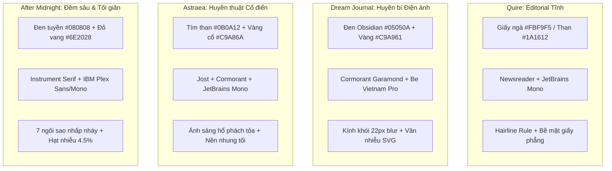

# Design System & Token Architecture — Nền tảng thiết kế & Hệ thống Token

> Tài liệu phân tích chuyên sâu về hệ thống Token, cấu trúc phân tầng hiển thị, 4 cặp Typography đối lập và chất liệu bề mặt trong 4 nguyên mẫu di động Constellation. Khẳng định tính tự chủ không gian tên (namespace isolation) và hàng rào kiểm soát chất lượng thị giác.

---

## 1. Triết lý Thẩm mỹ & Độc lập Thị giác

Trong bộ sưu tập Constellation, hệ thống thiết kế được xây dựng theo mô hình **Hệ sinh thái Đa bản sắc (Federated Identity Ecosystem)**. Trái ngược với xu hướng gom toàn bộ ứng dụng vào một "Design System" chung dùng các biến CSS toàn cục, 4 ứng dụng sở hữu 4 thế giới thẩm mỹ độc lập:



- **Quy tắc cô lập Namespace**: Mỗi ứng dụng chỉ truy cập token mang tiền tố hoặc scope riêng. Tuyệt đối không import chéo biến CSS giữa các ứng dụng.

---

## 2. Phân tích 4 Cặp Typography Đối lập

Typography quan sát từ source prototype tại commit đã pin; không tự thêm font chỉ vì một tài liệu tổng hợp khác nêu tên khác:

| Ứng dụng | Phông tiêu đề / cảm xúc | Phông dữ liệu / điều hướng | Nguồn | Trạng thái |
|---|---|---|---|---|
| **Quire** | Newsreader | JetBrains Mono | `designs/quire/prototype.html`, `index.html` | `OBSERVED` |
| **Dream Journal** | Cormorant Garamond | Be Vietnam Pro | `designs/dream-journal/index.html` | `OBSERVED` |
| **Astraea** | Cormorant Garamond | Jost + JetBrains Mono | `designs/astraea/V2 astraea-nguyên mẫu tương tác.html` | `OBSERVED`; không có Cinzel trong source hiện tại |
| **After Midnight** | Instrument Serif | IBM Plex Sans + IBM Plex Mono | `designs/after-midnight/v1 after midnight - interactive prototype.html` | `OBSERVED` |

Các font remote trong prototype là dependency `OBSERVED`; production phải bundle hoặc cung cấp license theo quyết định riêng. Không dùng font từ app này cho app khác.
## 3. Cấu trúc Phân cấp Token 4 Tầng (4-Tier Token Hierarchy)

Hệ thống token trong mỗi nguyên mẫu được chuẩn hóa thành 4 tầng kiến trúc:

```
[ Tier 4: Geometry & Timing ] -> Border radius, Touch targets >= 44px, Motion curves
       ^
[ Tier 3: Atmospheric ]     -> Radial gradients, SVG noise, Backdrop-filter blur
       ^
[ Tier 2: Semantic Tokens ] -> --bg-canvas, --surface, --text-primary, --accent
       ^
[ Tier 1: Foundation ]      -> Primitive Hex (#05050A, #FBF9F5, #C9A961)
```

1. **Foundation Tier (Tầng Nguyên thủy)**: Bảng màu thô dạng mã Hex, đặt tại khối `:root` của mỗi nguyên mẫu.
2. **Semantic Tier (Tầng Ý nghĩa)**: Ánh xạ giá trị màu vào vai trò hiển thị cụ thể:
   - `--canvas` / `--bg`: Mặt phẳng nền thấp nhất.
   - `--surface` / `--panel`: Mặt phẳng nổi của card hoặc modal.
   - `--text-primary` / `--text-muted`: Phân cấp nội dung đọc.
   - `--accent`: Điểm nhấn hành động (chỉ xuất hiện tối đa 1–2 lần mỗi màn hình).
3. **Atmospheric Tier (Tầng Khí quyển & Hiệu ứng)**:
   - Các lớp phát sáng tỏa tròn (radial glows).
   - Bộ lọc nhiễu hạt SVG (`feTurbulence` fractal noise).
   - Hiệu ứng mờ nền kính khói (`backdrop-filter: blur(16px - 22px)`).
4. **Geometry & Timing Tier (Tầng Hình học & Nhịp độ)**:
   - Bán kính bo góc: Bo góc nút và card từ `10px` đến `24px`; bo góc khung thiết bị `44px`.
   - Vùng chạm tối thiểu: Không thành phần tương tác nào có vùng bấm nhỏ hơn `44px × 44px` (tuân thủ WCAG Target Size).
   - Nhịp độ chuyển động: Chậm, tiết chế (`200ms - 800ms`), tôn trọng chế độ giảm chuyển động.

---

## 4. Bề mặt & Chất liệu (Surfaces & Materials)

| Ứng dụng | Tên chất liệu | Công thức xây dựng kỹ thuật | Trải nghiệm xúc giác |
|---|---|---|---|
| **Quire** | *Tactile Paper & Warm Charcoal* | Nền giấy kép (`#FBF9F5` sáng, `#1A1612` tối), đường kẻ hairline mảnh (`#E8E3DB` / `#37322C`), không dùng bóng đổ giả | Chạm vào như trang giấy báo mịn của một ấn phẩm in |
| **Dream Journal** | *Obsidian & 5-Layer Veil Glass* | Nền đen obsidian `#05050A` + 3 nguồn sáng tỏa (bạc 30%, vàng 20%, crimson 14%) + kính mờ `blur(22px)` + nhiễu hạt 5% | Cảm giác nhìn qua màn kính khói vào đáy sâu của tâm thức |
| **Astraea** | *Midnight Velvet & Antique Gold* | Nền tím than `#0B0A12` + quầng sáng hổ phách đỉnh và tím đáy + viền nhấn vàng kim metallic `#C9A86A` | Buổi lễ rút bài trang trọng trên tấm khăn nhung tối |
| **After Midnight** | *Nocturnal Void & Starfield Vignette* | Nền `#080808` + lưới 7 ngôi sao nhấp nháy CSS (chu kỳ 12s) + hạt nhiễu 4.5% + quầng sáng đỏ vang `#2A1014` | Đêm sâu thanh vắng nhìn từ khung cửa sổ căn hộ cao tầng |

---

## 5. Hàng rào Tương phản, Focus Ring & Khuyến nghị WCAG

Các số đo dưới đây là **claim quan sát/chưa kiểm độc lập**, không phải chứng nhận WCAG production:

- Quire ghi nhận các tỷ lệ tương phản trong prototype; cần đo lại trên từng theme, font, trạng thái focus/disabled và thiết bị thật.
- Dream Journal ghi nhận tương phản phân tầng; mọi mức dưới ngưỡng hoặc token mờ phải được đánh dấu rõ.
- Contract hệ thống là interactive target tối thiểu `44 × 44px`. Nếu một prototype đo 40px, ghi `observed deviation` và tạo issue/ADR; không tự hạ tiêu chuẩn.
- Focus ring, keyboard navigation, screen-reader semantics, reduced-motion, safe area, dynamic type và touch/keyboard alternative đều cần test độc lập trước release.
- C-91 giữ các hạng mục audit đầy đủ ở trạng thái `DEFERRED`; không dùng tên “đã kiểm chứng” trước khi có báo cáo audit.
