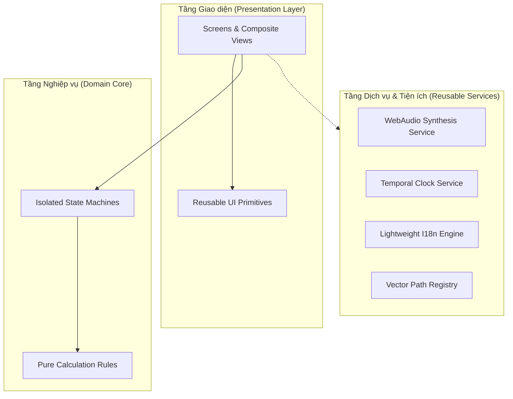

# Modular Architecture & Reusable Component Standards — Kiến trúc module hóa, thành phần tái sử dụng & Nguyên lý SOLID

> Tài liệu quy chuẩn hóa kiến trúc thành phần (Component Architecture), phân rã chức năng theo nguyên lý SOLID, thiết lập thư viện khối giao diện nguyên thủy (UI Primitives) và các module dịch vụ dùng lại được. Đảm bảo mã nguồn sau này khi triển khai đạt tính module hóa cao nhất, dễ bảo trì, dễ kiểm thử và độc lập xử lý.

---

## 1. Triết lý Module hóa & Bóc tách Chức năng (Decoupled Modular Architecture)

Để giải quyết triệt để vấn đề mã nguồn phình to và các chức năng đan xen lẫn nhau trong các tệp HTML nguyên mẫu, kiến trúc hệ thống áp dụng chiến lược **Bóc tách Đa tầng (Multi-Tier Decomposition)**:



- **Mỗi chức năng một vị trí**: Mỗi chức năng (đếm ngược, lật bài, vén màn, tổng hợp âm thanh) được đóng gói trong một file riêng biệt.
- **Không có phụ thuộc vòng tròn (Zero Circular Dependencies)**: Các tầng dưới (Primitives, Services) không bao giờ được import hay phụ thuộc vào các tầng trên (Screens).

---

## 2. Áp dụng Toàn diện Bộ 5 Nguyên lý SOLID

### 1. Single Responsibility Principle (SRP - Trách nhiệm Duy nhất)
Mỗi module, lớp hoặc hàm chỉ chịu trách nhiệm về một lý do thay đổi duy nhất:
- **Tách View khỏi State**: Khối hiển thị DOM của màn hình The Void trong After Midnight chỉ lo việc render CSS hiệu ứng hạt tan biến. Việc đếm thời gian `2100ms` và lệnh giải phóng RAM thuộc về một `VoidStateController` độc lập.
- **Tách Dữ liệu khỏi Render**: Thư viện 78 lá bài Tarot của Astraea chỉ chứa dữ liệu thuần túy (tên lá, số la mã, ý nghĩa xuôi/ngược, chòm sao). Việc render thẻ bài 3D và sự kiện lật thẻ thuộc về component `TarotCardPlate`.

### 2. Open-Closed Principle (OCP - Mở rộng Mở, Sửa đổi Đóng)
- **Hệ thống Trải bài Tarot (Spread Engine)**: Động cơ rút bài mở rộng cho phép khai báo thêm các sơ đồ trải bài mới (như trải bài 3 lá Quá khứ - Hiện tại - Tương lai, trải bài Chiêm tinh 12 nhà) chỉ bằng cách truyền một cấu hình mảng tọa độ `SpreadConfig`, hoàn toàn không cần sửa đổi mã nguồn thuật toán rút hay lật bài.
- **Hệ thống Theme**: Trình đổi giao diện trong Quire cho phép thêm theme thứ ba (như Theme Sepia hoặc Dark Minimal) bằng việc đăng ký bản đồ màu token mới mà không cần can thiệp vào logic chuyển trang.

### 3. Liskov Substitution Principle (LSP - Nguyên lý Thay thế Liskov)
- Mọi thành phần thẻ nội dung (Card Primitives) đều tuân thủ cùng một chuẩn giao tiếp:
  - Thẻ bài viết trong Quire, Thẻ giấc mơ trong Dream Journal, và Thẻ suy nghĩ trong After Midnight đều nhận cùng một tập thuộc tính cơ bản (tiêu đề, thời gian, trạng thái đã đọc) và có thể thay thế cho nhau trong các container danh sách cuộn.
  - Các nút hành động (Primary, Secondary, Ghost, Danger) có thể tráo đổi vị trí cho nhau mà không làm thay đổi luồng xử lý sự kiện bấm.

### 4. Interface Segregation Principle (ISP - Phân tách Giao diện/Hợp đồng)
- Thay vì tạo một giao diện khổng lồ cho toàn bộ ứng dụng, hệ thống phân chia thành các hợp đồng nhỏ, chuyên biệt:
  - `ITemporalReadable`: Chỉ cung cấp phương thức đọc giờ và phân định ngày/đêm.
  - `IAudioPlayable`: Chỉ cung cấp lệnh phát, dừng và điều chỉnh âm lượng âm thanh nền.
  - `IDataPurgeable`: Chỉ cung cấp phương thức kích hoạt dọn dẹp bộ nhớ tạm.
- Một component chỉ phụ thuộc vào đúng những hợp đồng mà nó thực sự sử dụng.

### 5. Dependency Inversion Principle (DIP - Đảo ngược Phụ thuộc)
- Tầng giao diện không bao giờ giao tiếp trực tiếp với các API trình duyệt đặc thù (như `window.localStorage` hay `window.AudioContext`).
- Thay vào đó, giao diện gọi thông qua các lớp cổng giao tiếp (Service Abstractions). Điều này cho phép:
  - Chạy thử nghiệm giao diện trên môi trường máy chủ (Server-Side Rendering) mà không gặp lỗi `window is not defined`.
  - Thay thế bộ nhớ tạm In-Memory bằng IndexedDB hoặc SQLite Adapter mà không phải sửa một dòng mã giao diện nào.

---

## 3. Thư viện Khối Giao diện Nguyên thủy Tái sử dụng (Reusable UI Primitives)

Bốn ứng dụng chia sẻ chung danh mục cấu trúc các khối giao diện nền tảng:

```
[DANH MỤC UI PRIMITIVES DÙNG CHUNG]
├── Primitives.Button
│   ├── Kích thước chuẩn: Chiều cao 48px, vùng bấm tối thiểu 44px
│   ├── Bo góc: 12px đến 24px (tùy app)
│   └── Trạng thái bắt buộc: Default, Active (nhấn chìm), Disabled (opacity 0.4), Focus ring (3px)
│
├── Primitives.ModalSheet
│   ├── Khung trượt từ dưới lên (Bottom Drawer) cho cài đặt và bộ lọc
│   ├── Nền mờ kính khói (Backdrop-filter blur 16px - 22px)
│   └── Thanh tay nắm kéo (Drag handle) chuẩn 36px x 4px
│
├── Primitives.HairlineDivider
│   ├── Đường kẻ phân cách siêu mảnh: 1px với độ mờ tinh tế
│   └── Tự động đổi màu theo token nền sáng/tối
│
└── Primitives.EmptyStateView
    ├── Biểu tượng minh họa dạng vector SVG nội tuyến
    ├── Dòng tiêu đề ngắn gọn phản ánh đúng giọng văn
    └── Nút hành động định hướng (nếu luồng cho phép)
```

---

## 4. Các Tiện ích & Dịch vụ Dùng chung (Reusable Utility Services)

Các chức năng kỹ thuật phức tạp được tách thành các module dịch vụ độc lập, có thể tái sử dụng xuyên suốt dự án:

### 1. `AmbientAudioSynthesizer` (Dịch vụ Tổng hợp Âm thanh WebAudio)
- **Nguồn gốc**: Bóc tách từ Midnight Radio (`designs/after-midnight/`).
- **Nhiệm vụ**: Tự động tạo tiếng ồn trắng (white/pink noise), tiếng mưa rào nhẹ, hoặc tiếng rè sóng radio analog hoàn toàn bằng mã JavaScript và thuật toán toán học, không cần tải bất kỳ file MP3/WAV nào qua mạng.
- **Tái sử dụng**: Có thể tích hợp vào màn hình thiền định, màn hình đọc sách Quire, hoặc âm thanh lật bài Astraea.

### 2. `TemporalEngine` (Bộ Tiện ích Tính toán Thời gian)
- **Nguồn gốc**: Bóc tách từ bộ điều khiển Diurnal Gate của After Midnight.
- **Nhiệm vụ**:
  - Tính toán khoảng cách thời gian còn lại tới nửa đêm hoặc bình minh.
  - Định dạng chuỗi giờ phút giây `hh:mm:ss` chuẩn xác.
  - Phân định 4 nấc chu kỳ thời gian (Day, Dusk, Midnight, Dawn).

### 3. `I18nDictionaryEngine` (Cỗ máy Từ điển Đa ngôn ngữ Tối giản)
- **Nguồn gốc**: Bóc tách từ hệ thống 126 từ khóa Anh - Việt của Quire.
- **Nhiệm vụ**: Cung cấp hàm tra cứu từ khóa `t(key)` với hỗ trợ fallback tự động, xử lý chuỗi nội suy tham số, và lưu trữ lựa chọn ngôn ngữ an toàn.

### 4. `VectorIconRegistry` (Kho Biểu tượng Vector Nội tuyến)
- **Nhiệm vụ**: Lưu trữ toàn bộ các chuỗi đường dẫn SVG (SVG path data) của biểu tượng các chòm sao, biểu tượng điều hướng tab, và hình vẽ 78 lá bài Tarot. Đảm bảo toàn bộ ứng dụng hiển thị vector siêu nét ở mọi độ phân giải màn hình mà không cần nạp icon font từ bên ngoài.

---

## 5. Cấu trúc Thư mục Triển khai Chuẩn hóa (Production Layout Blueprint)

Khi bước vào giai đoạn phát triển mã nguồn thực tế, toàn bộ hệ thống được tổ chức theo cấu trúc module hóa phân tầng:

```
src/
├── packages/                                  # Các gói chức năng dùng chung độc lập
│   ├── ui-primitives/                         # Thư viện nút, modal, divider, card
│   ├── audio-synthesizer/                     # Module WebAudio độc lập
│   ├── temporal-utils/                        # Module tính toán thời gian & cổng đêm
│   └── i18n-core/                             # Module quản lý từ điển song ngữ
│
├── apps/                                      # 4 không gian ứng dụng độc lập
│   ├── quire/
│   │   ├── components/                        # Các view bóc tách riêng (Reader, Moments, Settings)
│   │   ├── state/                             # Quản lý trạng thái đọc & 30-day purge
│   │   └── index.ts                           # Điểm chạy của Quire
│   ├── dream-journal/
│   ├── astraea/
│   └── after-midnight/
│
└── tokens/                                    # 4 bộ CSS Tokens cô lập theo namespace
    ├── quire.tokens.css
    ├── dream.tokens.css
    ├── astraea.tokens.css
    └── midnight.tokens.css
```
