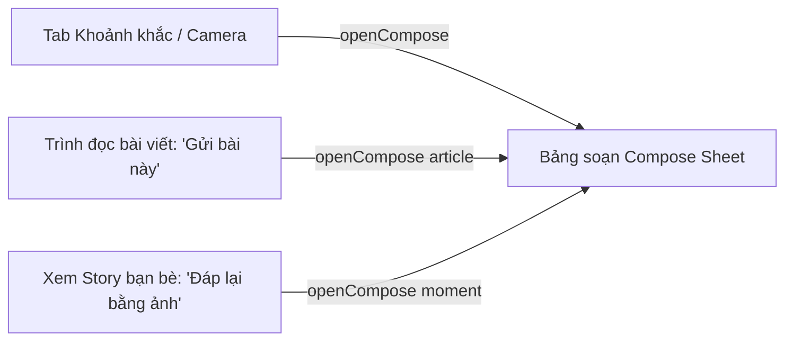
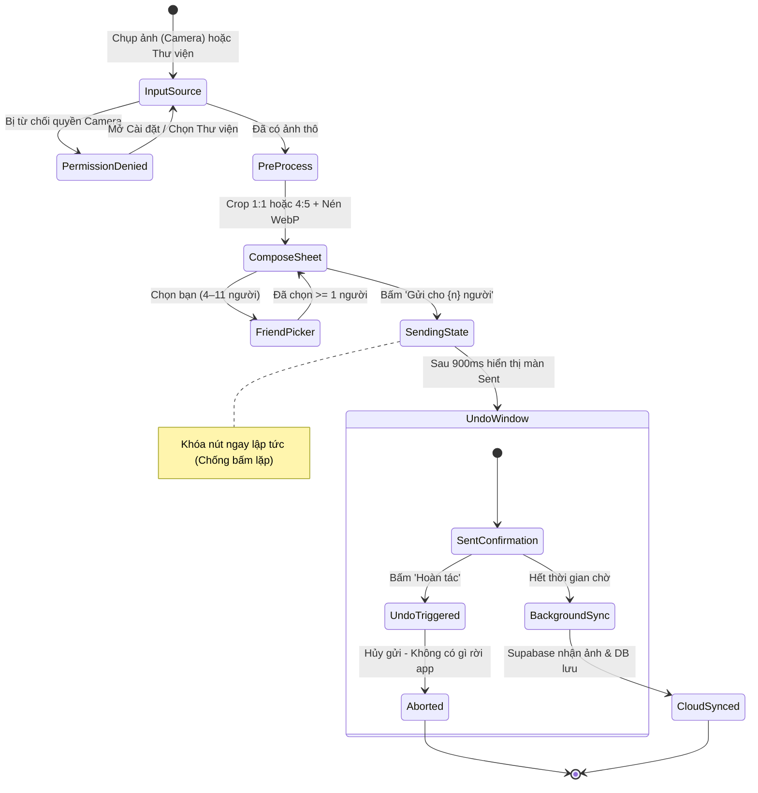

# Quire Photo Upload & Moment Pipeline — Đặc Tả Logic Đẩy & Chia Sẻ Ảnh Chuẩn Chỉnh

> Tài liệu đặc tả kỹ thuật toàn diện cho tính năng quan trọng nhất của Quire: Luồng chụp, tiền xử lý, chọn bạn bè, cơ chế Hoàn tác (Undo Send), tải ảnh lên Supabase Storage và lưu trữ có thời hạn (30-day Ephemeral Lifecycle).

---

## 1. Triết Lý & Ranh Giới Nghiệp Vụ (Business Invariants)

Khác với các mạng xã hội thông thường (Instagram, BeReal, Facebook), Quire là ứng dụng **Đọc biên tập & Chia sẻ khoảnh khắc thân mật (Quiet Editorial & Private Moments)**:
* **Không có mạng xã hội (Zero Social Graph)**: Không có follower, không có bảng tin công khai, không có nút khám phá ảnh người lạ.
* **Vòng kết nối thân mật (Intimate Circle)**: Mỗi người dùng chia sẻ trong vòng tròn thân thiết riêng (không áp trần cứng 12 người; giao diện nguyên mẫu minh họa với 11 người).
* **Vòng đời tự hủy 30 ngày (30-day Ephemeral)**: Mọi khoảnh khắc (Moments) và nhật ký hoạt động tự động hết hạn và xóa sạch sau 30 ngày.
* **Xác nhận xem (Read receipts) mặc định TẮT**: Để việc xem ảnh không biến thành gánh nặng hay nghĩa vụ phải phản hồi ngay lập tức.

---

## 2. Ba Cổng Vào Kích Hoạt Luồng Gửi Ảnh (3 Entry Points)



1. **Cổng 1 — Từ Tab Khoảnh khắc (Moments Tab / Camera)**: Người dùng chạm vào vòng tròn của chính mình (*"Khoảnh khắc của bạn" / "Your moment"*) hoặc nút Camera đáy màn hình.
2. **Cổng 2 — Từ Trình đọc bài viết (Article Reader)**: Người dùng chạm nút *"Gửi bài này cho bạn" / "Send this to a friend"* — gắn kèm bài viết vào ảnh khoảnh khắc.
3. **Cổng 3 — Từ Lớp xem Story (Story Viewer)**: Khi xem ảnh của một người bạn, người dùng bấm nút *"Đáp lại bằng ảnh" / "Reply with a photo"* — tự động đóng lớp xem story và mở bảng soạn với ngữ cảnh trả lời (Thread Context).

---

## 3. Máy Trạng Thái Toàn Trình Tại Client (Client State Machine)



### 3.1. Bước 1: Nguồn Ảnh & Xử Lý Lỗi Quyền (Input & Permission)
- Hai nguồn: **Camera bản địa** hoặc **Thư viện ảnh**.
- Xử lý khi bị khóa quyền (màn hình States quan sát được):
  - Hiển thị thông báo lịch thiệp: *"Quyền truy cập máy ảnh đang tắt" / "Camera access is off"*.
  - Cung cấp 2 lối thoát rõ ràng: Nút *"Mở cài đặt"* và Nút *"Chọn từ thư viện"*.

### 3.2. Bước 2: Chuỗi Tiền Xử Lý Ảnh Tại Client (Flutter Pre-Processing)
- **Tỉ lệ khung hình (Aspect Ratio)**: Chuẩn `1:1` vuông hoặc `4:5` (chuẩn xem dọc Story).
- **Độ phân giải tối đa (Max Dimensions)**: `1440px` (chiều dài nhất).
- **Định dạng & Nén**: Bắt buộc nén sang **`WebP`** với chất lượng `80–85%` thông qua thư viện `flutter_image_compress`.
- **Dung lượng đầu ra**: Từ ảnh gốc 4MB–12MB giảm xuống còn **200KB – 380KB**, bảo đảm upload tức thì ngay cả khi mạng 3G/4G yếu.

### 3.3. Bước 3: Bảng Soạn Thảo (Compose Sheet Logic)
- **Khung Preview**: Hiển thị ảnh thu nhỏ (thumbnail) vừa nén.
- **Danh sách chọn người nhận (Friend Chips)**:
  - Liệt kê danh sách các bạn bè trong vòng kết nối (4–11 chips).
  - **Ràng buộc bắt buộc**: Phải chọn **ít nhất 1 người** (`state.picks.length >= 1`). Nếu chưa chọn ai, nút gửi bị vô hiệu hóa (`b.disabled = true`) và hiển thị nhãn: *"Chọn ít nhất một người" / "Pick at least one friend"*.
- **Lời nhắn tùy chọn (Optional Note)**: Ô nhập text ngắn (placeholder: *"Bước hai của buổi dạo bộ."*).
- **Nhãn nút gửi động**: Tự động nhảy số theo lựa chọn: *"Gửi cho 1 người"*, *"Gửi cho 3 người"*...

### 3.4. Bước 4: Trạng Thái "Đang Gửi" & Chống Bấm Lặp (Sending State)
- Ngay khi người dùng chạm nút gửi:
  - Nút chuyển ngay sang trạng thái vô hiệu hóa: `b.disabled = true`.
  - Chữ trên nút đổi thành: *"Đang gửi…" / "Sending…"*.
  - **Mục đích**: Chặn triệt để việc bấm liên tiếp nhiều lần gây trùng lặp bản ghi trên cơ sở dữ liệu.

### 3.5. Bước 5: Cửa Sổ Hoàn Tác (Graceful Undo Window)
- Sau 900ms, giao diện chuyển sang màn hình Xác nhận đã gửi (`composeDone`):
  - Tiêu đề: *"Đã gửi cho {n} người" / "Sent to {n}"*.
  - Dòng phụ: *"Họ có thể thả tim, đáp lại bằng ảnh, hoặc giữ riêng." / "They can react, answer with a photo, or keep it to themselves."*
  - **Nút Hoàn tác (Undo button)**: Nút bấm nổi bật cho phép người dùng rút lại quyết định.
- **Hành vi khi bấm Hoàn tác**:
  - Hủy ngay tác vụ upload ngầm.
  - Đóng bảng soạn thảo.
  - Hiển thị Toast thông báo cam kết: *"Đã huỷ gửi. Không có gì rời khỏi ứng dụng." / "Send cancelled. Nothing left the app."*

---

## 4. Đặc Tả Tầng Backend Supabase (Storage & Database)

### 4.1. Cấu Trúc File trên Supabase Storage
* **Bucket Name**: `quire-moments` (Trạng thái: `Private`).
* **Cấu trúc đường dẫn file**:
  ```text
  quire-moments/{circle_id}/{moment_id}.webp
  ```
  * `{circle_id}`: Định danh vòng kết nối của nhóm bạn.
  * `{moment_id}`: UUID định danh duy nhất của khoảnh khắc.

### 4.2. Schema Bảng Dữ Liệu PostgreSQL

```sql
-- 1. Bảng lưu trữ khoảnh khắc
CREATE TABLE public.quire_moments (
    id UUID PRIMARY KEY DEFAULT gen_random_uuid(),
    circle_id UUID NOT NULL REFERENCES public.quire_circles(id) ON DELETE CASCADE,
    sender_id UUID NOT NULL REFERENCES auth.users(id) ON DELETE CASCADE,
    image_path TEXT NOT NULL,
    caption TEXT,
    article_id UUID, -- Nếu gửi kèm bài viết
    reply_to_moment_id UUID REFERENCES public.quire_moments(id) ON DELETE SET NULL, -- Nếu là ảnh đáp
    created_at TIMESTAMPTZ NOT NULL DEFAULT NOW(),
    expires_at TIMESTAMPTZ NOT NULL DEFAULT (NOW() + INTERVAL '30 days') -- Tự hủy sau 30 ngày
);

-- 2. Bảng người nhận và trạng thái xem riêng tư
CREATE TABLE public.quire_moment_recipients (
    moment_id UUID NOT NULL REFERENCES public.quire_moments(id) ON DELETE CASCADE,
    recipient_id UUID NOT NULL REFERENCES auth.users(id) ON DELETE CASCADE,
    read_at TIMESTAMPTZ, -- Mặc định NULL (Read receipt OFF)
    liked BOOLEAN NOT NULL DEFAULT FALSE,
    PRIMARY KEY (moment_id, recipient_id)
);
```

### 4.3. Chính Sách Bảo Mật Cấp Dòng (Storage & Database RLS)

Chỉ người trong cùng vòng `circle_id` và nằm trong danh sách người nhận mới có quyền xem ảnh:

```sql
-- RLS trên Storage Objects cho quire-moments
CREATE POLICY "Circle Members Can Access Moment Images"
ON storage.objects FOR SELECT
TO authenticated
USING (
    bucket_id = 'quire-moments'
    AND EXISTS (
        SELECT 1 FROM public.quire_circle_members cm
        WHERE cm.circle_id = (storage.foldername(name))[1]::uuid
          AND cm.user_id = auth.uid()
    )
);

-- Chỉ người gửi mới được upload ảnh vào folder circle của mình
CREATE POLICY "Moment Sender Can Upload"
ON storage.objects FOR INSERT
TO authenticated
WITH CHECK (
    bucket_id = 'quire-moments'
    AND EXISTS (
        SELECT 1 FROM public.quire_circle_members cm
        WHERE cm.circle_id = (storage.foldername(name))[1]::uuid
          AND cm.user_id = auth.uid()
    )
);
```

---

## 5. Cơ Chế Xóa Khoảnh Khắc & Vòng Đời Tự Hủy (Purge & Ephemeral Lifecycle)

1. **Người dùng chủ động xóa**: 
   - Cam kết giao diện: *"Xoá với mọi người"*.
   - Khi người gửi xóa khoảnh khắc: Lập tức xóa bản ghi trong `quire_moments` (kéo theo xóa `quire_moment_recipients` qua `ON DELETE CASCADE`) và gọi lệnh Supabase Storage API xóa tệp ảnh vật lý.
2. **Tự động hết hạn sau 30 ngày (Automated Expiry Cron)**:
   - Sử dụng `pg_cron` trên PostgreSQL:
     ```sql
     SELECT cron.schedule('purge_expired_moments', '0 3 * * *', $$
         DELETE FROM public.quire_moments WHERE expires_at < NOW();
     $$);
     ```
   - Một Trigger hoặc Supabase Edge Function sẽ quét và dọn dẹp các tệp ảnh mồ côi trên Storage tương ứng.

---

## 6. Xử Lý Khi Mất Mạng & Suy Giảm Thẩm Mỹ (Offline Resilience)

1. **Khi gửi ảnh bị đứt mạng**:
   - Ảnh đã nén và thông tin người nhận được lưu tạm vào hàng đợi SQLite cục bộ (`pending_moments`).
   - Hiển thị thông báo dịu mắt: *"Đã lưu ngoại tuyến. Khoảnh khắc sẽ được gửi đi khi có mạng trở lại."*
2. **Khi tải ảnh bạn bè bị lỗi mạng**:
   - Tuyệt đối không hiển thị khung ảnh vỡ mặc định của trình duyệt.
   - Tự động thay thế bằng **khung viền nét đứt thanh lịch** mang màu giấy ấm ngà, giữ nguyên tỷ lệ khung hình `1:1` hoặc `4:5`, đi kèm tên bạn bè và nhãn thời gian tương đối (*"2 giờ trước"*).
