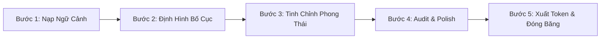

# G-01 Hướng dẫn dùng Impeccable Design Skills cho Agent CLI

> Bộ skill thiết kế UI/UX hàng đầu thế giới (Apache-2.0, ~70.4k ⭐ GitHub của Paul Bakaus) đã được tích hợp sẵn vào dự án tại `.opencode/skills/impeccable`, `.claude/skills/impeccable` và `.agent/skills/impeccable`.

---

## 1. Bản đồ tra cứu lệnh: "Cái nào cần sài cho việc gì?"

Thay vì để AI tự đoán phong cách hoặc sinh giao diện lỗi thời ("AI Slop"), hãy chọn đúng lệnh cho từng nhu cầu:

| Nhu cầu thiết kế | Lệnh cần dùng | Mô tả tác vụ |
| :--- | :--- | :--- |
| **Bắt đầu màn hình mới** | `/shape` | Phỏng vấn xác định yêu cầu, đối tượng người dùng, luồng UX trước khi viết code |
| **Làm dịu, yên tĩnh giao diện** | `/quieter` | **Đặc biệt quan trọng cho Constellation:** Giảm bớt độ rực, hạ kích thích thị giác, tạo cảm giác tĩnh mịch |
| **Gọt giũa tối giản** | `/distill` | Loại bỏ chi tiết rườm rà, card lồng card, chỉ giữ lại phần cốt lõi của nội dung |
| **Chỉnh font & typography** | `/typeset` | Cân đối thang cỡ chữ (type scale), line-height, độ đậm, khoảng cách mắt |
| **Sắp xếp bố cục & khoảng cách** | `/layout` | Cân chỉnh khoảng cách (padding/margin), phá vỡ lưới rập khuôn, tạo nhịp điệu thị giác |
| **Phối màu có chủ đích** | `/colorize` | Đưa màu nhấn vào vị trí đắt giá, giữ màu nền theo chuẩn token của app |
| **Tạo điểm nhấn thị giác** | `/bolder` | Tăng cá tính cho các màn hình quá nhạt nhòa, tạo điểm neo ánh mắt |
| **Hiệu ứng chuyển động vi mô** | `/animate` | Bổ sung micro-interaction nhẹ nhàng (vén lớp, ánh sao, lật bài) |
| **Tạo trải nghiệm thú vị** | `/delight` | Thêm những chi tiết nhỏ tinh tế mang lại cảm xúc cho người dùng |
| **Soạn lời UX & thông báo** | `/clarify` | Chuẩn hóa copy tiếng Việt/Anh, sửa câu từ vụng về, thông báo lỗi tinh tế |
| **Đánh giá phản biện UX** | `/critique` | Soi lỗi phân cấp thị giác, chỗ gây rối mắt, hành vi người dùng bị nghẽn |
| **Kiểm tra kỹ thuật & tiếp cận** | `/audit` | Kiểm tra độ tương phản màu (contrast ratio), kích thước vùng chạm (44px), a11y |
| **Hoàn thiện bước cuối** | `/polish` | Lượt chải chuốt pixel-perfection: căn viền, hairline, bo góc, trạng thái hover/active |
| **Chỉnh sửa trực quan trên Web** | `/live` | Mở browser cục bộ, click chọn thành phần trên màn hình để AI sinh biến thể trực tiếp |
| **Xuất tài liệu Design System** | `/document` | Đọc toàn bộ code và tự động tổng hợp ra file `DESIGN.md` lưu trữ tokens |

---

## 2. Quy trình làm việc chuẩn: "Nên sài sao trước, xuất sao sau?"

Để thiết kế hoặc làm mới một màn hình trong dự án, thực hiện tuần tự theo chu trình 5 bước sau:

### Bước 1: Khởi tạo & nạp ngữ cảnh (`/impeccable init`)
- **Trước khi làm:** Bật tính năng kiểm tra tự động bằng lệnh `/impeccable hooks on` (hoặc chạy trong chat agent).
- Đọc tài liệu đối chiếu của app đó trong `.knowns/docs/constellation/` và ma trận @doc/constellation/c-90-cross-matrix để không vi phạm quy tắc đặc thù.

### Bước 2: Định hình cấu trúc & UX trước code (`/shape` hoặc `/critique`)
- Nếu làm màn mới: Dùng `/shape [tên màn]` để xác định rõ: Màn hình này vào từ đâu, ra tới đâu, bị chặn khi nào (khớp với bảng §1 Screens trong doc app).
- Nếu sửa màn cũ: Dùng `/critique` để phát hiện điểm chưa hợp lý.

### Bước 3: Tinh chỉnh nhịp điệu & phong thái Quiet Software
1. Chạy `/layout` để dàn trang, đảm bảo không gian thở rộng rãi.
2. Chạy `/typeset` để ép typography chuẩn theo từng app (xem mục 3 bên dưới).
3. Chạy `/quieter` kết hợp `/distill` để triệt tiêu các thói quen xấu của AI (AI Slop: bóng đổ dày, card lồng card, màu be xám vô hồn).
4. Dùng `/colorize` có chọn lọc (chỉ nhấn accent hiếm ở CTA chính).

### Bước 4: Kiểm toán chất lượng & Hoàn thiện (`/audit` → `/polish`)
- Chạy `/audit` để quét lỗi a11y, độ tương phản chữ trên nền tối/sáng, kiểm tra vùng chạm tối thiểu 44px.
- Chạy `/polish` cho lượt chải chuốt cuối cùng trước khi bàn giao.

### Bước 5: Xuất bản và Đóng băng tài liệu (`/document`)
- Chạy `/document` để AI tự động trích xuất các token thực tế đang dùng vào `DESIGN.md`.
- Cập nhật lại các thông số mới vào tài liệu Knowns tương ứng (`<app>-02-data.md`) nếu có sự thay đổi được Lead duyệt.

---

## 3. Hướng dẫn áp dụng cho 4 App trong `designs/` (Tuân thủ C-90)

Tuyệt đối tuân thủ **Ma trận chống merge C-90** (@doc/constellation/c-90-cross-matrix), không để Impeccable tự ý hợp nhất màu sắc hay typography của 4 app:

### 3.1. Dream Journal (Sổ tay giấc mơ - 22 màn)
- **Nguồn thiết kế:** `designs/dream-journal/index.html` và `canvas.html`.
- **Tài liệu SSOT:** @doc/constellation/dream-journal-01-flow & @doc/constellation/dream-journal-02-data.
- **Lệnh trọng tâm:** `/quieter` + `/typeset` + `/animate`.
- **Bộ quy tắc áp đặt cho Agent:**
  * Nền đen sâu Obsidian `#05050A`, chữ tiêu đề `Cormorant Garamond`, chữ dữ liệu `Be Vietnam Pro`.
  * Màu nhấn hiếm: Đỏ thẫm `#941D2E` hoặc Vàng cổ `#C9A961`.
  * Hiệu ứng `/animate`: Vén 5 lớp ảo ảnh (*Giấc mơ → Ảo ảnh → Ký ức → Cảm xúc → Bản ngã*), sao sáng dần theo chuỗi đêm.
  * Cấm tuyệt đối: Bảng xếp hạng, điểm số gamification, màu xanh dương rực.

### 3.2. Quire (Tạp chí đọc & Bưu thiếp ảnh - 19 màn)
- **Nguồn thiết kế:** `designs/quire/prototype.html` và `index.html`.
- **Tài liệu SSOT:** @doc/constellation/quire-01-flow & @doc/constellation/quire-02-data.
- **Lệnh trọng tâm:** `/distill` + `/layout` + `/clarify`.
- **Bộ quy tắc áp đặt cho Agent:**
  * Phong cách Tạp chí tĩnh lặng (Editorial): Nền giấy ấm `#FBF9F5` (bản sáng) hoặc Than ấm `#1A1612` (bản tối).
  * Chữ tiêu đề `Newsreader`, chữ dữ liệu `JetBrains Mono`. Kẻ tách khối bằng hairline giấy, viền nét đứt cho bài/ảnh chưa xem.
  * Màu nhấn: Cam son `#E76136` (sử dụng tối đa $\le 2$ lần/màn).
  * Chạy `/clarify` để đảm bảo 126 chuỗi từ khóa song ngữ EN/VI chuẩn xác.
  * Cấm tuyệt đối: Thông báo giục giã, follower graph, biên nhận đã đọc bật mặc định.

### 3.3. After Midnight (Không gian đêm 00:00 - 05:00 - 15 màn)
- **Nguồn thiết kế:** `designs/after-midnight/v1 after midnight - interactive prototype.html`.
- **Tài liệu SSOT:** @doc/constellation/after-midnight-01-flow & @doc/constellation/after-midnight-02-data.
- **Lệnh trọng tâm:** `/quieter` + `/distill` + `/colorize`.
- **Bộ quy tắc áp đặt cho Agent:**
  * Nền đen tuyền Obsidian `#080808`, Muted gold `#8C7445`, Màu nhấn hiếm: Đỏ vang `#6E2028`.
  * Chữ tiêu đề `Instrument Serif`, chữ dữ liệu `IBM Plex Mono`.
  * Màn **The Void**: Áp dụng triệt để `/distill` — khung soạn tối đa 400 ký tự, nút thả đi tan biến, tuyệt đối không có CTA kêu gọi quay lại.
  * Màn **Sân thượng**: Im lặng hoàn toàn, không có nút hành động (No-action screen).

### 3.4. Astraea (Studio Tarot chiêm nghiệm - 18 panels)
- **Nguồn thiết kế:** `designs/astraea/V2 astraea-nguyên mẫu tương tác.html`.
- **Tài liệu SSOT:** @doc/constellation/astraea-01-flow & @doc/constellation/astraea-02-data.
- **Lệnh trọng tâm:** `/shape` + `/animate` + `/audit`.
- **Bộ quy tắc áp đặt cho Agent:**
  * Nền tím than vũ trụ `#0B0A12`, màu nhấn Vàng cổ `#C9A86A` duy nhất.
  * Luồng nghi thức tuyến tính 6 bước: *Hỏi → Chọn trải → Xòe bài → Lật từng lá → Kết quả → Lưu Nhật ký*.
  * `/animate` phục vụ chuyển động lật bài và hiệu ứng đường nối vector chòm sao hoàng đạo.
  * Copywriting: Giọng thơ chiêm nghiệm, phản chiếu cảm xúc; cấm tuyệt đối phán đoán tương lai hoặc hù dọa số phận.

---

## 4. Kỷ luật an toàn hệ thống (Safety & Governance)

1. **Tuyệt đối không đè các file Markdown đã có:**
   - Không được ghi đè các file shim tương thích runtime ở gốc (`AGENTS.md`, `CLAUDE.md`, `OPENCODE.md`, `KNOWNS.md`).
   - Mọi tài liệu đặc tả phải lưu trong `.knowns/docs/constellation/`.
2. **Kỷ luật Anti-Minting:**
   - Khi chạy các lệnh như `/shape`, `/layout`, không được tự ý bịa ra API backend, DB table hay cơ chế xác thực đám mây (đã hoãn tại @doc/constellation/c-91-backlog).
3. **Thẩm định bằng Knowns Validate:**
   - Sau khi bổ sung hoặc cập nhật tài liệu thiết kế, luôn chạy `knowns validate` (hoặc công cụ `mcp__knowns_validate`) để đảm bảo không gãy liên kết nội bộ.
