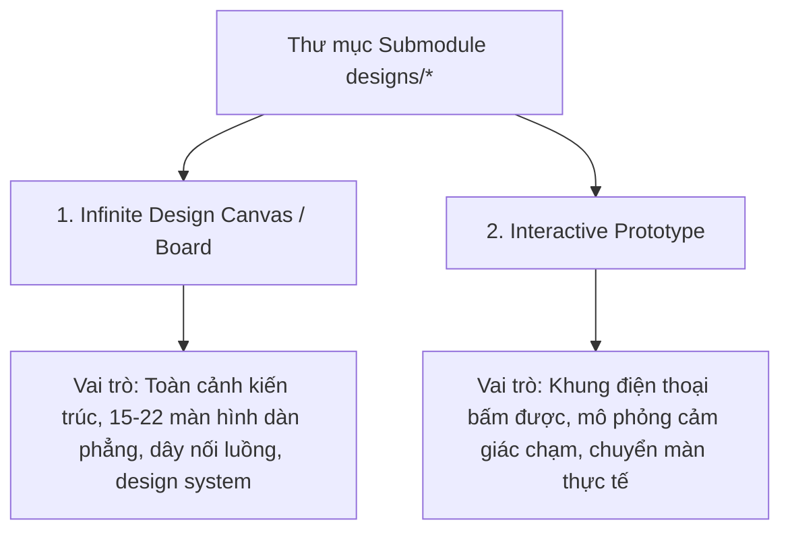

# Prototype Navigation & Inspection Guide — Hướng dẫn điều hướng & Thẩm định kỹ thuật prototype

> Cẩm nang thực hành toàn diện hướng dẫn các kỹ sư, chuyên viên kiểm thử chất lượng (QA) và các AI agent cách khởi chạy, tương tác, điều hướng và thẩm định kỹ thuật 4 nguyên mẫu di động Constellation.

---

## 1. Khởi Động Nguyên Mẫu (Zero-Install Execution)

Toàn bộ 4 nguyên mẫu đều được xây dựng theo kiến trúc tự chứa (self-contained HTML). Không yêu cầu cài đặt `Node.js`, không cần chạy lệnh `npm install`, và không cần dựng máy chủ cục bộ.

### Lệnh mở trực tiếp bằng trình duyệt:

```powershell
# [Windows PowerShell]
# 1. Quire
Start-Process "chrome.exe" "designs/quire/prototype.html"
Start-Process "chrome.exe" "designs/quire/design-board.html"

# 2. Dream Journal
Start-Process "chrome.exe" "designs/dream-journal/index.html"
Start-Process "chrome.exe" "designs/dream-journal/canvas.html"

# 3. Astraea
Start-Process "chrome.exe" "designs/astraea/V2 astraea-nguyên mẫu tương tác.html"
Start-Process "chrome.exe" "designs/astraea/V2 astraea-bản đồ toàn cảnh.html"

# 4. After Midnight
Start-Process "chrome.exe" "designs/after-midnight/v1 after midnight - interactive prototype.html"
Start-Process "chrome.exe" "designs/after-midnight/v1 after midnight - infinite canvas.html"
```

```bash
# [macOS Terminal]
open -a "Google Chrome" "designs/quire/prototype.html"
open -a "Google Chrome" "designs/dream-journal/index.html"

# [Linux Terminal]
xdg-open "designs/quire/prototype.html"
```

---

## 2. Phân Biệt Hai Hình Thái Tài Sản (Dual-Asset Paradigm)

Trong mỗi thư mục nguyên mẫu tại `designs/*`, luôn tồn tại song song 2 tệp HTML phục vụ 2 mục đích thẩm định khác nhau:



| Đặc điểm | Infinite Design Canvas (`canvas.html` / `design-board.html`) | Interactive Prototype (`prototype.html` / `index.html`) |
|---|---|---|
| **Mục đích** | Đánh giá tổng thể hệ thống, luồng chuyển dịch và độ phủ toàn bộ màn hình | Trải nghiệm cảm giác xúc giác của người dùng cuối trên thiết bị di động |
| **Bố cục** | Một bảng phẳng vô tận chứa từ 15 đến 22 màn hình xếp cạnh nhau có dây nối | Một khung nhìn giả lập màn hình di động `390px × 844px` ở giữa màn hình |
| **Thao tác chính** | Kéo chuột để di chuyển canvas, lăn chuột để phóng to / thu nhỏ | Chạm / click vào các nút bấm, tab bar, hoặc vuốt ngón tay |

---

## 3. Thao Tác Trên Infinite Design Canvas

Khi mở các tệp sơ đồ toàn cảnh (`canvas.html` hoặc `design-board.html`):

- **Di chuyển toàn cảnh (Pan)**: Nhấp giữ chuột trái vào khoảng trống của nền và kéo để di chuyển khung nhìn.
- **Phóng to / Thu nhỏ (Zoom)**: Giữ phím `Ctrl` (hoặc `Cmd` trên macOS) và lăn con lăn chuột để zoom in/out từ mức nhìn bao quát 10% đến mức soi chi tiết 200%.
- **Hoàn tác vị trí (Undo)**: Nếu vô tình kéo dịch chuyển một khối màn hình trên bảng, nhấn tổ hợp phím `Ctrl + Z` để đưa khối đó trở về tọa độ ban đầu.
- **Đọc dây nối luồng**: Các đường kẻ nối giữa các màn hình đại diện cho sự kiện chuyển trang. Hãy đọc nhãn văn bản gắn trên mỗi đường nối để biết điều kiện kích hoạt.

---

## 4. Thao Tác Trên Interactive Prototype

Khi mở các tệp nguyên mẫu tương tác:

- **Thanh điều khiển giả lập thời gian (Time Panel - After Midnight)**: Nằm ở mép dưới cùng màn hình. Cho phép kỹ sư chuyển đổi nhanh giữa 4 nấc thời gian: *Ban ngày*, *Chạng vạng*, *Nửa đêm*, và *Bình minh* để kiểm thử sự thay đổi giao diện.
- **Công tắc Theme & Chuyển ngữ (Quire)**: Vào tab **Bạn** -> bấm biểu tượng bánh răng **Cài đặt** -> chọn **Giao diện & Ngôn ngữ** để đổi giao diện Sáng/Tối hoặc Anh/Việt.
- **Nghi thức Tarot (Astraea)**: Chọn kiểu trải bài -> di chuột xòe bài -> bấm vào lá bài để chọn -> nhấp vào từng lá bài để kích hoạt hiệu ứng xoay lật 3D.
- **5 Lớp màn che (Dream Journal)**: Tại màn hình chi tiết giấc mơ, nhấp giữ chuột vào thanh trượt "Vén lớp ảo ảnh" để bóc tách 5 tầng cảm xúc.

---

## 5. Thẩm Định Kỹ Thuật qua DevTools (Inspection Protocols)

Mở bảng công cụ lập trình viên trình duyệt (`F12` hoặc `Ctrl + Shift + I`):

### 1. Kiểm tra Hệ thống Token CSS:
- Chọn thẻ `<html>` hoặc `:root` trong tab **Elements**.
- Quan sát danh sách các biến CSS `--bg-canvas`, `--surface`, `--accent` để đảm bảo chúng khớp với tài liệu @doc/architecture/design-system-tokens.

### 2. Thẩm định Bộ chuyển đổi Giảm Chuyển động (Reduced Motion):
- Mở menu ba chấm của DevTools -> **More tools** -> **Rendering**.
- Cuộn xuống mục **Emulate CSS media feature prefers-reduced-motion** và chọn `prefers-reduced-motion: reduce`.
- Quan sát nguyên mẫu: Toàn bộ hiệu ứng trượt màn hình hoặc xoay 3D phải tự động chuyển thành hiệu ứng mờ dần nhẹ nhàng, không gây rung lắc giật màn hình.

### 3. Thẩm định Kích thước Vùng chạm (Touch Target Size):
- Bật công cụ Inspect (biểu tượng mũi tên).
- Trỏ vào các nút bấm, biểu tượng tab bar và các thành phần thao tác.
- Đảm bảo hộp bao quanh (bounding box) luôn đạt kích thước tối thiểu `44px × 44px`.

---

## 6. Phân Biệt Màn Nối Thật vs Màn Tượng Trưng (NotWired Detection)

Trong các nguyên mẫu thiết kế, không phải 100% màn hình đều có mã JavaScript xử lý đầy đủ:

```
[QUY TẮC NHẬN DIỆN MÀN HÌNH NỐI THẬT]
├── MÀN NỐI THẬT (Wired Screens):
│   ├── Bấm vào chuyển đổi DOM tức thì, có animation mượt mà.
│   └── Biểu mẫu nhận dữ liệu và cập nhật trực tiếp lên giao diện.
│
└── MÀN TƯỢNG TRƯNG (Symbolic / NotWired):
    ├── Màn hình chỉ xuất hiện trên Infinite Design Canvas để minh họa ý đồ thiết kế.
    ├── Khi bấm vào nút trên Prototype, xuất hiện thông báo ngắn (Toast / Alert) hoặc không phản hồi.
    └── CẦN KIỂM CHỨNG: Tham khảo tài liệu constellation/<app>-01-flow để biết chính xác danh sách màn có dây nối thật.
```

---

## 7. Danh Mục Kiểm Tra Tiền Bay (Pre-flight Inspection Checklist)

Trước khi ký nhận bàn giao hoặc thực hiện bóc tách tài liệu:

- [ ] Đã mở thử cả 2 tệp HTML (Canvas và Prototype) trên trình duyệt thực tế.
- [ ] Đã kiểm tra phông chữ tiếng Việt hiển thị đầy đủ dấu, không bị nhảy phông lỗi.
- [ ] Đã kiểm tra âm thanh WebAudio (đối với After Midnight) phát sinh tiếng ồn trắng chuẩn xác khi bật radio.
- [ ] Đã kiểm tra tính năng hoàn tác `Ctrl+Z` trên canvas hoạt động bình thường.
- [ ] Đã ghi nhận các điểm mơ hồ vào mục `Chưa rõ — hỏi Lead` theo đúng quy ước S-01.
