# Prototype-to-Implementation Boundary Guide — Hướng dẫn phân định ranh giới giữa prototype và triển khai

> Tài liệu khung quản trị kỹ thuật (Governance Framework) thiết lập các đường biên giới rõ ràng giữa những gì được quan sát trong các nguyên mẫu thiết kế và những gì cần được thiết kế lại khi bước vào giai đoạn kỹ nghệ phần mềm sản xuất (Production Engineering).

---

## 1. Nguyên Lý Ranh Giới Bất Biến (The Boundary Principle)

Trong quy trình phát triển sản phẩm kỹ thuật số, sai lầm phổ biến nhất của các đội ngũ kỹ sư là **coi nguyên mẫu thiết kế giao diện như một bản đặc tả kiến trúc kỹ thuật hoàn chỉnh (Architectural Specification)**.

```mermaid
graph LR
    subgraph Prototype_Realm["Miền Nguyên Mẫu (Prototype Realm)"]
        UI_Mocks[Mô phỏng Giao diện HTML/CSS]
        Mock_Data[Dữ liệu Mẫu Tĩnh]
        Client_Clock[Thanh Giả lập Thời gian]
    end
    
    subgraph Boundary_Gate["HÀNG RÀO QUẢN TRỊ (BOUNDARY GATE)"]
        S01[S-01: Observe-Only, Không tự bịa API/Schema]
        C90[C-90: Không hợp nhất 4 ứng dụng]
        C91[C-91: Hoãn có chủ đích Backend/Auth/Sync]
    end
    
    subgraph Production_Realm["Miền Sản Xuất (Production Realm)"]
        DB_Schema[Cơ sở Dữ liệu Độc lập SQLite/Postgres]
        Auth_System[Hệ thống Xác thực Người dùng]
        Server_Clock[Nguồn Thời gian Tin cậy NTP]
    end
    
    Prototype_Realm --> Boundary_Gate
    Boundary_Gate --> Production_Realm
```



- **Quy tắc phân định cốt lõi**: Nguyên mẫu trả lời câu hỏi *"Người dùng nhìn thấy gì và cảm nhận ra sao?"*. Kiến trúc sản xuất trả lời câu hỏi *"Hệ thống vận hành an toàn, bền vững và mở rộng thế nào?"*.
- Tuyệt đối không sao chép nguyên xi cấu trúc DOM thành cấu trúc cơ sở dữ liệu.

---

## 2. Ranh Giới Dữ Liệu: Mẫu Giao Diện KHÔNG PHẢI Schema Cơ Sở Dữ Liệu

- **Hiện tượng trên Prototype**: Trong mã nguồn HTML có các khối dữ liệu mẫu (mock objects) chứa danh sách bạn bè, các bài viết Quire, hay 78 lá bài Tarot.
- **Ranh giới bất biến**:
  - Không được lấy tên trường trong mock data HTML (ví dụ: `card_id`, `author_name`) để tạo bảng cơ sở dữ liệu quan hệ (SQL table) hay interface TypeScript mà không qua phê duyệt kiến trúc.
  - Các dữ liệu mẫu này chỉ mang tính chất minh họa mật độ từ ngữ (typographic density) và chiều dài dòng văn bản.
  - Toàn bộ thiết kế schema cho giai đoạn sản xuất phải tuân thủ kỷ luật S-01: được thiết kế độc lập dựa trên các quy tắc nghiệp vụ văn xuôi.

---

## 3. Ranh Giới Thời Gian & Bảo Mật: Giả Lập Client KHÔNG PHẢI Bảo Mật Production

- **Hiện tượng trên Prototype**:
  - Trong After Midnight, người dùng có thể nhấp vào các nút Ngày / Chạng vạng / Nửa đêm trên thanh điều khiển dưới đáy màn hình để xem giao diện đổi trạng thái.
  - Người dùng có thể chỉnh đồng hồ hệ điều hành máy tính để "vượt cổng" 00:00–05:00.
- **Ranh giới bất biến**:
  - Thanh điều khiển thời gian là **công cụ kiểm thử (Test Fixture)** chỉ dành riêng cho việc thẩm định giao diện của người đánh giá, không phải tính năng người dùng cuối.
  - Trong ứng dụng sản xuất, việc phân định thời gian bắt buộc phải sử dụng nguồn thời gian máy chủ tin cậy (NTP Time Server) hoặc chữ ký thời gian mật mã, tuyệt đối không tin tưởng đồng hồ máy khách (`client-side clock`).

---

## 4. Ranh Giới Đồng Bộ & Lưu Trữ: Trạng Thái Cục Bộ KHÔNG PHẢI Giao Thức Đồng Bộ

- **Hiện tượng trên Prototype**: Mọi thao tác ghi nhật ký giấc mơ, rút bài Tarot, gõ thư đêm đều được lưu tạm trong bộ nhớ JavaScript hoặc biến toàn cục.
- **Ranh giới bất biến**:
  - Theo danh mục hoãn C-91, toàn bộ cơ chế đồng bộ hóa dữ liệu qua mạng (Offline-Sync, Conflict Resolution, WebSockets) đều chưa được thiết kế.
  - Đội ngũ triển khai không được tự ý viết các bộ đồng bộ đám mây phức tạp khi chưa có chỉ đạo từ System Architect.

---

## 5. Ranh Giới Tài Sản & Bản Quyền (Assets & Licensing Boundary)

- **Ảnh minh họa**: Các hình ảnh trong Quire được nạp từ `picsum.photos` theo mã ID cố định. Đây là tài nguyên minh họa ngẫu nhiên. Khi phát hành ứng dụng thật, toàn bộ ảnh phải được cấp phép thương mại hoặc do người dùng tự tải lên.
- **Phông chữ**: Các phông chữ tải từ Google Fonts. Khi triển khai bản sản xuất di động (iOS/Android), phông chữ cần được đóng gói cục bộ (self-hosted / bundled fonts) để đảm bảo tốc độ mở ứng dụng không phụ thuộc vào kết nối máy chủ Google.

---

## 6. Quy Trình Bàn Giao Hợp Lệ (Step-by-Step Handoff Protocol)

Khi chuyển giao tài liệu cho đội ngũ kỹ nghệ triển khai mã nguồn:

```
[BƯỚC 1: TRÍCH XUẤT TOKEN & BỀ MẶT]
  Chỉ trích xuất các thông số màu sắc, khoảng cách, bo góc, phông chữ từ file css/tokens.
       v
[BƯỚC 2: TRÍCH XUẤT BẤT BIẾN NGHIỆP VỤ]
  Đọc các quy tắc trong patterns/* (như Non-Persistence của The Void, 6 bước nghi thức Tarot).
       v
[BƯỚC 3: THIẾT KẾ SCHEMA & HỢP ĐỒNG KỸ THUẬT MỚI]
  Lập hồ sơ kiến trúc mới, gắn thẻ bắt buộc [PROPOSED NEW CONTRACT].
       v
[BƯỚC 4: RÀ SOÁT CÙNG LEAD]
  Đối chiếu bản thiết kế kỹ thuật với c-90 (Anti-merge) và c-91 (Deferral list) trước khi duyệt.
```

---

## 7. Sổ Tay Rủi Ro & Ma Trận Hậu Quả Khi Phá Vỡ Ranh Giới

| Hành vi vi phạm ranh giới | Nguy cơ hệ thống | Mức độ nguy hiểm | Biện pháp ngăn chặn |
|---|---|---|---|
| **Tự ý gộp chung bảng User cho 4 app** | Vi phạm quyền riêng tư ẩn danh của After Midnight | CỰC KỲ CAO | Cấm thiết kế shared user table giữa các domain |
| **Dùng Local Clock để kiểm soát cổng đêm** | Người dùng dễ dàng đổi giờ điện thoại để hack cổng | TRUNG BÌNH | Xác thực thời gian từ nguồn tin cậy khi ra mắt |
| **Lưu dữ liệu The Void vào database server** | Phá vỡ cam kết tâm lý thiêng liêng với người dùng | CỰC KỲ CAO | Bộ lọc phần mềm chặn lưu chuỗi Void ở tầng thấp nhất |
| **Tự ý thêm nút Follower trong Quire** | Biến ứng dụng đọc tĩnh thành mạng xã hội ồn ào | CAO | Tuân thủ Hiến chương Chống thao túng tâm lý Calm UX |
