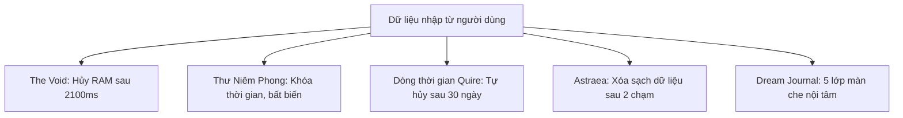

# Ephemeral & Privacy Lifecycles — Vòng đời dữ liệu tạm thời & Cơ chế riêng tư cốt lõi

> Tài liệu khảo sát và chuẩn hóa các mô thức vòng đời dữ liệu tạm thời (ephemeral), các cơ chế bảo mật danh tính và quyền riêng tư nội tâm được cài đặt trong 4 nguyên mẫu Constellation. Khẳng định nguyên tắc giảm thiểu dữ liệu tối đa và cam kết không lưu vết.

---

## 1. Triết lý Calm Privacy & Dữ liệu Tối giản (Data Minimization)

Khác với các ứng dụng mạng xã hội thông thường với mục tiêu thu thập và tích lũy dữ liệu người dùng vô thời hạn, Constellation định vị quyền riêng tư là một **trạng thái tâm lý an tâm (Psychological Safety)**. Người dùng có thể bộc lộ những suy nghĩ sâu kín nhất, những giấc mơ hoang đường nhất hoặc những cảm xúc đêm muộn mà không lo sợ bị đánh giá, theo dõi hay lưu vết vĩnh viễn.

---

## 2. Cơ chế The Void: DOM Dissolve & Cam kết Không lưu (Non-Persistence Invariant)

- **Nguồn quan sát**: `designs/after-midnight/v1 after midnight - interactive prototype.html#19F5:668-682, 764-784`
- **Mục đích**: Cung cấp một nơi để người dùng trút bỏ gánh nặng tâm lý mà không để lại bất kỳ dấu vết nào trên thế giới số.

### Cơ chế hoạt động kỹ thuật quan sát được:
1. Người dùng nhập một đoạn suy nghĩ vào ô văn bản lớn tại không gian The Void.
2. Khi bấm nút "Thả đi", giao diện kích hoạt animation phân rã:
   - Các dòng chữ mờ dần (`opacity: 0`) và tan biến theo hiệu ứng khói bụi trong đúng `2100ms`.
   - Khi animation hoàn tất, trường nhập liệu được reset về chuỗi rỗng `""`.
3. **Bất biến Bất khả xâm phạm (Non-Persistence Invariant)**:
   - Chuỗi văn bản nhập vào The Void **TUYỆT ĐỐI KHÔNG BAO GIỜ** được lưu vào `localStorage`, `sessionStorage`, hay gửi qua mạng tới máy chủ.
   - Dữ liệu bị hủy hoàn toàn khỏi bộ nhớ RAM của trình duyệt ngay sau khi kết thúc animation.

---

## 3. Cơ chế Thư Niêm Phong: Khóa Thời Gian & Tính Bất biến (Time-Locked Immutability)

- **Nguồn quan sát**: `designs/after-midnight/v1 after midnight - interactive prototype.html#19F5:27, 43, 61`
- **Mục đích**: Gửi thư cho chính bản thân mình trong tương lai từ không gian Bưu cục đêm.

### Cơ chế hoạt động:
1. Người dùng viết một bức thư và chọn thời điểm mở khóa:
   - Ngày mai (Tomorrow)
   - 7 ngày sau (7 days)
   - 30 ngày sau (30 days)
   - 1 năm sau (1 year)
2. **Trạng thái Niêm phong (Sealed State)**:
   - Ngay khi bấm "Niêm phong & Gửi", bức thư chuyển sang trạng thái đóng băng bất biến (read-only).
   - Nội dung thư bị ẩn hoàn toàn, chỉ hiển thị biểu tượng phong bì niêm phong cùng đồng hồ đếm ngược tới ngày mở khóa.
   - Người dùng không có quyền chỉnh sửa, sửa đổi hay mở thư trước kỳ hạn đã chọn.

---

## 4. Vòng tròn Hữu hạn & Cửa sổ Hoàn tác Gửi Quire (11-Person Circle & Grace Window)

- **Nguồn quan sát**: `designs/quire/prototype.html` & `designs/quire/design-notes.md#BA1E:15-19`
- **Mục đích**: Bảo vệ người dùng khỏi áp lực xã hội và ngăn ngừa chia sẻ nông nổi ngoài ý muốn.

### Quy tắc quan sát được:
1. **Giới hạn vòng bạn bè**: Một tài khoản Quire chỉ được kết nối tối đa từ 4 đến 12 người bạn thân (thiết kế mẫu chốt 11 người). Không có khái niệm mở rộng kết nối công chúng.
2. **Cửa sổ hoàn tác gửi ảnh (Unsend Grace Period)**:
   - Sau khi chọn ảnh và bấm gửi vào khoảnh khắc của nhóm, hệ thống cung cấp một thanh đếm thời gian từ 3 đến 5 giây kèm nút "Hoàn tác".
   - Nếu người dùng bấm "Hoàn tác" trước khi thanh đếm chạy hết, hình ảnh bị hủy tức thì tại máy khách: *"Đã hủy gửi. Chưa có dữ liệu nào rời khỏi thiết bị."*

---

## 5. Chu kỳ Tự hủy Hoạt động 30 Ngày (Activity Purge Lifecycle)

- **Nguồn quan sát**: `designs/quire/README.md#7F8C:29`
- **Mục đích**: Xóa bỏ gánh nặng quá khứ và ngăn chặn việc "đào bới" lại lịch sử tương tác cũ.

### Quy tắc chu kỳ:
- Toàn bộ nhật ký hoạt động (ai đã xem bài viết nào, ai đã phản hồi ảnh của ai) tự động bốc hơi hoàn toàn sau đúng 30 ngày.
- Ứng dụng không duy trì kho lưu trữ lịch sử tương tác vĩnh viễn, giúp người dùng luôn cảm thấy nhẹ nhõm khi bắt đầu ngày mới.

---

## 6. 5 Tầng Màn Che Riêng tư Nội tâm Dream Journal (Veil Layer Sanctum)

- **Nguồn quan sát**: `designs/dream-journal/index.html` & `designs/dream-journal/canvas.html`
- **Mục đích**: Bảo vệ những giấc mơ kỳ lạ nhất khỏi ánh mắt tò mò vô tình của người đứng cạnh.

### 5 Tầng vén màn:
1. **Lớp 1: Bề mặt Giấc mơ** (Tên giấc mơ, cảm xúc chủ đạo, thời gian ghi nhận).
2. **Lớp 2: Ảo ảnh** (Hình ảnh mờ nhạt, biểu tượng xuất hiện trong mơ).
3. **Lớp 3: Ký ức** (Mối liên hệ giữa chi tiết trong mơ và sự kiện thực tế trong ngày).
4. **Lớp 4: Cảm xúc** (Rung động nội tâm sâu kín: lo âu, hy vọng, khát khao).
5. **Lớp 5: Bản ngã** (Tầng sâu nhất, chỉ hiển thị khi người dùng chủ động giữ tay để vén màn).

---

## 7. Xóa Dữ liệu 2 Chạm Astraea (Local-Only Wipe)

- **Nguồn quan sát**: `designs/astraea/V2 astraea-nguyên mẫu tương tác.html`
- **Mục đích**: Cho phép người dùng giải phóng hoàn toàn dấu vết tâm linh/chiêm tinh bất cứ lúc nào.

### Quy trình 2 chạm:
1. Chạm 1: Vào mục Cài đặt tài khoản -> Bấm nút "Xóa toàn bộ dữ liệu".
2. Chạm 2: Hộp thoại xác nhận xuất hiện giải thích rõ hậu quả -> Bấm "Xác nhận xóa". Toàn bộ lịch sử rút bài, ghi chú nhật ký và ngày sinh trong thiết bị bị xóa trắng ngay lập tức.

---

## 8. Ma trận Vòng đời & Failure-Modes Rò rỉ Dữ liệu

| Thành phần | Hành vi mong đợi | Failure-Mode nếu triển khai sai | Mức độ nghiêm trọng | Biện pháp phòng vệ |
|---|---|---|---|---|
| **The Void** | Hủy RAM trong 2100ms | Developer tự ý log văn bản vào hệ thống telemetry hoặc cache | CỰC KỲ NGUY HIỂM | Cấm toàn bộ logger trên component The Void |
| **Thư Niêm Phong** | Đóng băng tới đúng ngày | Cho phép người dùng bấm "Xem trước" hoặc sửa ngày máy tính để mở | NGUY HIỂM | Khóa cứng trạng thái và cần nguồn thời gian đáng tin cậy |
| **Quire Unsend** | Hủy tại client trong 5s | Ảnh đã kịp upload lên CDN trước khi hết 5 giây hoàn tác | NGUY HIỂM | Chỉ bắt đầu truyền tải sau khi cửa sổ đếm ngược kết thúc |
| **Astraea Wipe** | Xóa sạch 100% | Chỉ xóa cờ hiển thị (soft-delete), dữ liệu vẫn nằm trong máy | CAO | Thực thi xóa vật lý triệt để toàn bộ keys liên quan |
