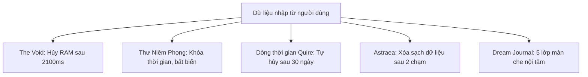

# Ephemeral & Privacy Lifecycles — Vòng đời dữ liệu tạm thời & Cơ chế riêng tư cốt lõi

> Tài liệu khảo sát và chuẩn hóa các mô thức vòng đời dữ liệu tạm thời (ephemeral), các cơ chế bảo mật danh tính và quyền riêng tư nội tâm được cài đặt trong 4 nguyên mẫu Constellation. Khẳng định nguyên tắc giảm thiểu dữ liệu tối đa và cam kết không lưu vết.

---

## 1. Triết lý Calm Privacy & Dữ liệu Tối giản (Data Minimization)

Khác với các ứng dụng mạng xã hội thông thường với mục tiêu thu thập và tích lũy dữ liệu người dùng vô thời hạn, Constellation định vị quyền riêng tư là một **trạng thái tâm lý an tâm (Psychological Safety)**. Người dùng có thể bộc lộ những suy nghĩ sâu kín nhất, những giấc mơ hoang đường nhất hoặc những cảm xúc đêm muộn mà không lo sợ bị đánh giá, theo dõi hay lưu vết vĩnh viễn.

---

## 2. Cơ chế The Void: DOM Dissolve & Cam kết Không lưu (Non-Persistence Invariant)

- **Quan sát prototype**: sau hiệu ứng `2100ms`, trường nhập được reset và nội dung biến mất khỏi DOM.
- **Invariant**: không persist vào cookie/local/session storage, không gửi qua mạng, không telemetry, không đi vào AI/sync.
- **Không overclaim**: không tuyên bố xóa được khỏi RAM của OS/browser, backup, swap hoặc bản sao ngoài prototype; physical deletion là `DEFERRED`.
- **Test contract**: cold reload, network trace, storage inspection, DOM assertion và no-sync assertion trước khi coi là `APPROVED`.
## 3. Cơ chế Thư Niêm Phong: Khóa Thời Gian & Tính Bất biến (Time-Locked Immutability)

- **Nguồn quan sát**: `designs/after-midnight/v1 after midnight - interactive prototype.html#19F5:27, 43, 61`
- **Mục đích**: Gửi thư cho chính bản thân mình trong tương lai từ không gian Bưu cục đêm.

### Cơ chế hoạt động:
1. Người dùng viết một bức thư và chọn thời điểm mở khóa:
   - Ngày mai (Tomorrow)
   - 7 ngày sau (7 days)
   - 30 ngày sau (30 days)
   - 1 năm sau (1 year)
2. **Trạng thái Niêm phong (Sealed State)**:
   - Ngay khi bấm "Niêm phong & Gửi", bức thư chuyển sang trạng thái đóng băng bất biến (read-only).
   - Nội dung thư bị ẩn hoàn toàn, chỉ hiển thị biểu tượng phong bì niêm phong cùng đồng hồ đếm ngược tới ngày mở khóa.
   - Người dùng không có quyền chỉnh sửa, sửa đổi hay mở thư trước kỳ hạn đã chọn.

---

## 4. Vòng tròn Hữu hạn & Cửa sổ Hoàn tác Gửi Quire (11-Person Circle & Grace Window)

- **Quan sát**: Quire giới hạn circle tối đa 12; fixture hiện dùng 11 người. Không có follower graph công khai.
- **Privacy default**: read receipts mặc định tắt; không thu per-user read event nếu invariant cấm. Mọi activity/read-state còn lại phải có purpose, visibility và retention riêng.
- **Unsend**: prototype hiển thị cửa sổ 3–5 giây và copy “chưa rời khỏi ứng dụng”. Network/upload timing, thu hồi sau khi đã xem và cancellation là `PROPOSED`; không coi copy là security guarantee.
- Circle identity, storage ownership, authorization và effective deletion phải được duyệt riêng trước production.
## 5. Chu kỳ Tự hủy Hoạt động 30 Ngày (Activity Purge Lifecycle)

- **Quan sát**: activity log cũ tự biến mất sau 30 ngày; đây là scope purge, không phải xóa toàn bộ dữ liệu Quire.
- **Privacy constraint**: nếu read receipts mặc định tắt và anti-tracking được duyệt, không thu per-user “ai đã xem” chỉ để tạo activity; mọi event còn lại phải có purpose/visibility/retention.
- **Production**: storage owner, purge trigger, backup/cache expiry, recovery và deletion propagation là `PROPOSED/DEFERRED`; không tự thêm analytics để đo retention.
## 6. 5 Tầng Màn Che Riêng tư Nội tâm Dream Journal (Veil Layer Sanctum)

- **Nguồn quan sát**: `designs/dream-journal/index.html` & `designs/dream-journal/canvas.html`
- **Mục đích**: Bảo vệ những giấc mơ kỳ lạ nhất khỏi ánh mắt tò mò vô tình của người đứng cạnh.

### 5 Tầng vén màn:
1. **Lớp 1: Bề mặt Giấc mơ** (Tên giấc mơ, cảm xúc chủ đạo, thời gian ghi nhận).
2. **Lớp 2: Ảo ảnh** (Hình ảnh mờ nhạt, biểu tượng xuất hiện trong mơ).
3. **Lớp 3: Ký ức** (Mối liên hệ giữa chi tiết trong mơ và sự kiện thực tế trong ngày).
4. **Lớp 4: Cảm xúc** (Rung động nội tâm sâu kín: lo âu, hy vọng, khát khao).
5. **Lớp 5: Bản ngã** (Tầng sâu nhất, chỉ hiển thị khi người dùng chủ động giữ tay để vén màn).

---

## 7. Xóa Dữ liệu 2 Chạm Astraea (Local-Only Wipe)

- **Quan sát prototype**: người dùng xác nhận 2 chạm để xóa lịch sử rút bài, ghi chú và dữ liệu cá nhân trong phạm vi local.
- **Không overclaim**: chưa có bằng chứng về cache, backup, sync hoặc thiết bị khác; không gọi là “xóa 100%” hay “xóa vật lý” trước khi có effective-deletion test.
- **Production contract**: ownership, cascade scope, recovery, backup expiry và deletion propagation là `PROPOSED/DEFERRED`; The Void và dữ liệu non-eligible vẫn bị loại khỏi mọi sync.
## 8. Ma trận Vòng đời & Failure-Modes Rò rỉ Dữ liệu

| Thành phần | Failure-mode | Mức độ | Contract/test cần trước khi chốt |
|---|---|---|---|
| **The Void** | Log, cache, telemetry hoặc sync nhận nội dung | Cực cao | Network/storage/DOM assertions; no persistence/no sync |
| **Thư niêm phong** | Mở sớm, sửa thời hạn hoặc tin client clock | Cao | Trusted-time/recovery decision; không giả định NTP đã chốt |
| **Quire Unsend** | Copy “đã hủy” trong khi asset đã rời thiết bị | Cao | Network timeline, cancellation boundary và quyền thu hồi; `PROPOSED` |
| **Astraea Wipe** | Chỉ xóa UI nhưng còn cache/backup/sync | Cao | Effective-deletion test; scope và propagation `DEFERRED` |

Không ghi tên logger, storage key, upload timing hay provider cụ thể như đã được chốt trong pattern; các chi tiết đó thuộc ADR/test.
