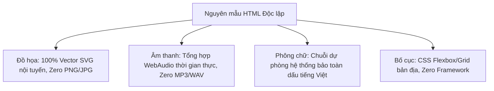

# Offline Resilience & Ambient Fallbacks — Dự phòng ngoại tuyến & Suy giảm thẩm mỹ duyên dáng

> Tài liệu phân tích các giải pháp kỹ thuật bảo đảm khả năng hoạt động ngoại tuyến (Offline-First), các chiến lược dự phòng khi mất kết nối mạng và cơ chế suy giảm thẩm mỹ êm ái (Graceful Aesthetic Degradation) trong 4 nguyên mẫu di động Constellation.

---

## 1. Kiến trúc Tự Chứa (Self-Contained Single-File Deliverable)

Một trong những thành tựu kỹ thuật quan sát được trong 4 nguyên mẫu là tính **Độc lập Tuyệt đối (Self-Sufficiency)**. Mỗi nguyên mẫu được cấu thành từ một tệp HTML duy nhất, có thể chạy trơn tru ngay cả khi tải về máy tính và ngắt hoàn toàn kết nối Wi-Fi:



- **Không dùng CDN bên thứ ba**: Không gọi jQuery, Tailwind CDN, Bootstrap hay FontAwesome. Toàn bộ mã điều khiển và kiểu dáng được nhúng trực tiếp trong tệp HTML.
- **Khởi động tức thì (Zero Latency)**: Không tốn thời gian chờ tải các tài nguyên phụ thuộc qua mạng.

---

## 2. Đồ họa Vector SVG Nội tuyến (78 Lá bài Tarot & Bầu trời Sao)

- **Nguồn quan sát**: `designs/astraea/readme.md#8EDE:35` & `designs/dream-journal/README.md#B48F:76`
- Thay vì sử dụng hàng trăm megabyte ảnh bitmap tải từ server, các nguyên mẫu tận dụng tối đa sức mạnh của vector SVG:

### Các triển khai đặc sắc:
1. **78 Lá bài Tarot trong Astraea**: Toàn bộ tranh minh họa của 22 lá Ẩn Chính và 56 lá Ẩn Phụ đều được vẽ hoàn toàn bằng các thẻ `<path>`, `<circle>`, `<polygon>` của SVG.
   - Ưu điểm: Dung lượng cực nhẹ, sắc nét ở mọi mật độ điểm ảnh Retina, có thể đổi màu các chi tiết theo CSS và không bao giờ bị vỡ hình khi mất mạng.
2. **Bầu trời sao & Chòm sao trong Dream Journal**: Bản đồ bầu trời đêm và các chòm sao được kết nối động bằng các đường line SVG vẽ theo tọa độ thời gian thực của các giấc mơ.

---

## 3. Tổng hợp Âm thanh Tại Chỗ bằng WebAudio (Synthesized Soundscapes)

- **Nguồn quan sát**: `designs/after-midnight/v1 after midnight - interactive prototype.html#19F5:410-439` & `readme.md#B144:78`
- Thay vì truyền tải các tệp âm thanh `.mp3` hay `.wav` cồng kềnh, After Midnight sử dụng trực tiếp API âm thanh bản địa của trình duyệt (**WebAudio API**) để tổng hợp không gian âm thanh đêm:

### Cơ chế hoạt động:
- **Tạo tiếng ồn trắng (Noise Generator)**: Sử dụng một bộ đệm âm thanh (`AudioBuffer`) chứa các số ngẫu nhiên toán học kết hợp với bộ lọc thông thấp (`BiquadFilterNode`) để mô phỏng tiếng mưa rơi ngoài hiên hoặc tiếng gió rít trên sân thượng.
- **Tiếng rè sóng radio analog**: Sử dụng bộ dao động sóng sin (`OscillatorNode`) kết hợp với điều chế tần số nhẹ để tái tạo âm thanh của một chiếc radio cổ đang dò đài trong đêm.
- **Hiệu quả**: Không tốn một byte băng thông mạng, âm thanh vô tận không bao giờ bị lặp đoạn (loop artifact).

---

## 4. Chuỗi Phông Chữ Dự Phòng & Bảo Toàn Dấu Tiếng Việt

- **Nguồn quan sát**: `designs/dream-journal/README.md#B48F:99` & `designs/after-midnight/readme.md#B144:71`
- Khi người dùng sử dụng ứng dụng trong điều kiện ngoại tuyến hoàn toàn (không tải được Google Fonts), bố cục và độ dễ đọc của tiếng Việt phải được bảo toàn:

```css
/* Chuỗi phông chữ dự phòng chuẩn hóa */
--font-display: "Cormorant Garamond", "Times New Roman", Times, "Palatino Linotype", serif;
--font-ui: "Be Vietnam Pro", -apple-system, BlinkMacSystemFont, "Segoe UI", Roboto, Helvetica, Arial, sans-serif;
--font-mono: "JetBrains Mono", "IBM Plex Mono", Menlo, Monaco, Consolas, "Courier New", monospace;
```

- **Quy tắc dấu tiếng Việt**: `Be Vietnam Pro` là phông được thiết kế riêng cho ngôn ngữ tiếng Việt. Chuỗi dự phòng ưu tiên các phông hệ thống hiện đại của iOS (`-apple-system`) và Windows (`Segoe UI`) để đảm bảo các ký tự có dấu phức tạp (`ở`, `ễ`, `ặ`, `ự`) không bị nhảy phông (font fallback glitch).

---

## 5. Dự phòng Ảnh Mất Mạng (Graceful Image Degradation)

- **Nguồn quan sát**: `designs/quire/README.md#7F8C:69`
- Trong Quire, các hình ảnh minh họa bài viết được lấy từ dịch vụ `picsum.photos`. Để xử lý tình huống mất kết nối:

### Cơ chế suy giảm thẩm mỹ:
- Nếu thẻ `` không tải được tài nguyên (sự kiện `onerror`), component tự động thay thế bằng một **Khung thẻ có viền nét đứt thanh lịch kèm nhãn mô tả**:
  - Không hiển thị biểu tượng "ảnh vỡ" mặc định xấu xí của trình duyệt.
  - Hiển thị tên bài viết hoặc nhãn thể loại trên nền màu giấy ngà dịu mắt.
  - Giữ nguyên tỷ lệ khung hình (aspect ratio) để không làm nhảy bố cục trang văn bản.

---

## 6. Hỗ trợ Giảm Chuyển Động (`prefers-reduced-motion`)

- **Nguồn quan sát**: Toàn bộ 4 nguyên mẫu (`designs/*`)
- Nhằm phục vụ những người dùng nhạy cảm với tiền đình hoặc muốn tiết kiệm pin tối đa:
  - Khi hệ điều hành bật chế độ `prefers-reduced-motion: reduce`, toàn bộ các hiệu ứng trượt màn hình, xoay 3D lá bài Tarot hay nhấp nháy sao đều được chuyển đổi ngay lập tức thành hiệu ứng mờ dần (crossfade) nhẹ nhàng hoặc hiển thị trực tiếp không qua hiệu ứng.

---

## 7. Ma trận Rủi ro Ngoại tuyến & Biện pháp Khắc phục

| Tài nguyên | Nguy cơ khi mất kết nối | Trải nghiệm suy giảm | Giải pháp khắc phục trong mã |
|---|---|---|---|
| **Google Fonts** | Chậm hiển thị chữ (FOIT - Flash of Invisible Text) | Chữ bị giật khi nạp xong hoặc chữ mất dấu | Cài đặt thuộc tính `font-display: swap` và chuỗi font dự phòng kỹ lưỡng |
| **WebAudio** | Trình duyệt chặn âm thanh do chính sách Autoplay | Không nghe thấy tiếng radio hoặc tiếng mưa | Chỉ khởi động `AudioContext` sau khi có tương tác chạm đầu tiên của người dùng |
| **Ảnh bài viết** | Ảnh không tải được để lại ô trắng trống hoác | Trang tạp chí bị mất cân đối thẩm mỹ | Dùng khối placeholder nền giấy có viền hairline và nhãn chữ |
