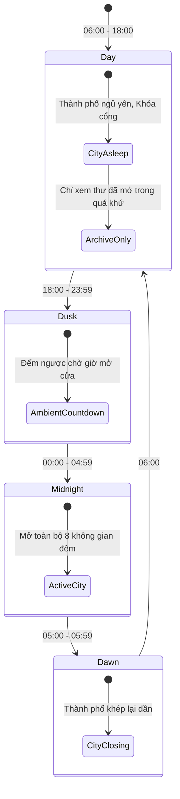
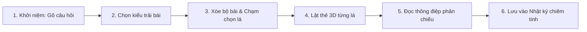

# Temporal & Ritual State Machines — Máy trạng thái thời gian & Nghi thức tương tác

> Tài liệu phân tích các cỗ máy trạng thái (State Machines) điều khiển nhịp độ thời gian tự nhiên, các nghi thức tương tác tuần tự không thể đảo lộn và các giai đoạn chuyển hóa tâm lý trong các ứng dụng Constellation.

---

## 1. Nhịp điệu Thời gian & Ma sát Tích cực (Frictional Restraint)

Khác với các ứng dụng hiện đại luôn cố gắng tối ưu hóa tốc độ ("1-click", "instant gratification"), Constellation chủ động đưa vào **Ma sát Tích cực (Positive Friction)**. Thời gian được đối xử như một chất liệu thiết kế:
- Buộc người dùng phải sống chậm lại.
- Tạo khoảng lặng để suy ngẫm trước khi đưa ra quyết định hoặc đón nhận một thông điệp.
- Tạo cảm giác linh thiêng và trân trọng cho các trải nghiệm cá nhân.

---

## 2. Cổng Thời gian Diurnal 4 Nấc After Midnight (Diurnal State Machine)

- **Nguồn quan sát**: `designs/after-midnight/v1 after midnight - interactive prototype.html#19F5:341-346, 448-454`
- **Nguyên lý**: Ứng dụng After Midnight thay đổi toàn bộ trạng thái hoạt động dựa trên 4 nấc thời gian trong ngày:



### Chi tiết 4 nấc trạng thái:
1. **Ban ngày (Day, 06:00–18:00)**: Giao diện chìm trong trạng thái tĩnh lặng. Cửa thành phố đêm đóng chặt. Người dùng chỉ có thể mở phòng Lưu trữ để đọc lại những bức thư đã tới kỳ hạn mở.
2. **Chạng vạng (Dusk, 18:00–23:59)**: Bầu không khí chuyển màu tím sẫm. Đồng hồ đếm ngược từng giây hiển thị thời gian còn lại tới nửa đêm.
3. **Nửa đêm (Midnight, 00:00–04:59)**: Cổng thành phố mở rộng. Thanh điều hướng 5-tab xuất hiện, cho phép truy cập đầy đủ các không gian: Café, Radio, Bưu cục, Đài thiên văn, Sân thượng và The Void.
4. **Bình minh (Dawn, 05:00–05:59)**: Đèn thành phố mờ dần. Thông báo nhắc nhở người dùng nên đi nghỉ ngơi. Các hoạt động gõ dở được khuyến khích kết thúc trước khi cổng đóng lúc 06:00.

---

## 3. Nghi thức Rút Bài 6 Bước Tuần Tự Astraea (Non-Commutative Ritual Order)

- **Nguồn quan sát**: `designs/astraea/V2 astraea-nguyên mẫu tương tác.html#9352:376-464, 728-732`
- **Bất biến Nghi thức (Ritual Invariant)**: Nghi thức rút bài Tarot tuân thủ một chuỗi tuần tự nghiêm ngặt 6 bước. Tuyệt đối không thể đảo lộn thứ tự hoặc nhảy cóc qua bất kỳ bước nào:



### Quy tắc chuyển trạng thái:
- Nếu người dùng bấm nút quay lại hoặc thoát ứng dụng trước Bước 4 (chưa lật bài), phiên bốc bài bị hủy hoàn toàn, không lưu bài bốc dở vào nhật ký.
- Chỉ khi hoàn tất Bước 4 và bước sang Bước 5, bộ bài mới chính thức ghi nhận kết quả.

---

## 4. Cơ chế Lật Thẻ 3D & Chuyển đổi Xuôi / Ngược (Card Reveal Dynamics)

- **Hiệu ứng lật 3D**: Mỗi lá bài Tarot là một thẻ 3D hai mặt dựng bằng CSS `transform: rotateY()`. Mặt sau mang hoa văn hình học thiên văn; mặt trước là tranh minh họa vector SVG độc bản.
- **Công tắc Xuôi / Ngược (Upright / Reversed Toggle)**:
  - Mỗi lá bài có 2 chiều diễn giải đối lập.
  - Khi người dùng gạt công tắc Xuôi/Ngược tại màn hình chi tiết, thẻ bài xoay 180 độ và toàn bộ 4 lớp diễn giải (ý nghĩa chính, tình duyên, sự nghiệp, phát triển bản thân) tự động chuyển hóa văn bản tương ứng.

---

## 5. Chuỗi Chuyển Hóa Giấc Mơ trong Dream Journal

- **Nguồn quan sát**: `designs/dream-journal/index.html` & `designs/dream-journal/canvas.html`
- Quá trình ghi nhận một giấc mơ trải qua 5 giai đoạn chuyển hóa nghệ thuật:

```
[1. Ghi thô]     -> Người dùng ghi vội bằng chữ, giọng nói, nét vẽ khi vừa thức dậy.
       v
[2. Hé lộ]       -> Giấc mơ thô được xử lý thành một tác phẩm nghệ thuật có tựa đề thơ.
       v
[3. Mảnh ghép]   -> Bóc tách các biểu tượng: Nước, Cánh bướm, Đồng hồ, Người lạ.
       v
[4. Chiêm nghiệm]-> AI đưa ra câu hỏi gợi mở để người dùng tự đối thoại với chính mình.
       v
[5. Tinh tú]     -> Giấc mơ hóa thành một ngôi sao sáng, nối vào Chòm sao cá nhân trên bầu trời.
```

---

## 6. Ma trận Chuyển Trạng thái & Failure-Modes Kỹ thuật

| Cỗ máy trạng thái | Chuyển dịch trạng thái | Nguy cơ lỗi (Failure-Mode) | Hậu quả | Giải pháp phòng ngừa |
|---|---|---|---|---|
| **Diurnal Gate** | 04:59 -> 05:00 (Hết giờ đêm) | Đang viết dở thư bưu cục thì cổng đóng đột ngột | Mất dữ liệu của người dùng, gây ức chế tâm lý | Cung cấp cửa sổ ân hạn 5 phút lưu nháp hoặc cảnh báo trước 10 phút |
| **Tarot Ritual** | Bước 3 -> Thoát ứng dụng | Hệ thống tự động lưu lá bài đầu tiên vào cơ sở dữ liệu | Phá vỡ tính linh thiêng của nghi thức rút bài | Tuân thủ Invariant: Chỉ commit kết quả sau khi lật thẻ |
| **Radio Audio** | Đang phát -> Chuyển tab | Trình duyệt tiếp tục chạy AudioContext gây tốn pin nền | Người dùng khó chịu vì âm thanh không tắt | Bắt sự kiện `visibilitychange` để tạm dừng hoặc giảm dần âm lượng (fade out) |
