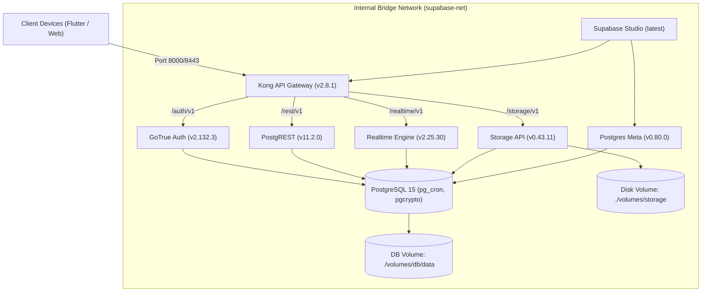

# SLP V5.1 Return Packet: Self-Hosted Supabase Backend & DevOps Architecture
**Work ID:** `w3`  
**State:** `RETURNED`  
**Author:** `PeerBackendDevOps`  
**Date:** 2026-09-24  
**Target:** Self-Hosted Supabase Docker Stack, PostgreSQL Migrations, Storage Buckets, RLS Policies, and Automated 30-Day Purge  
**Cross-Agent Alignment:** Aligned with `PeerClientModularity` (Module 1 Version Gating, Module 2 Media Storage, Module 3 Local Sync) and `SlpSupervisor` (Strict Invariant Audit).

---

## 1. Executive Summary & Delivered Artifacts

This return packet establishes the concrete, production-ready backend infrastructure for the Constellation ecosystem (Quire and Dream Journal, while enforcing the Non-Persistence Invariant for After Midnight's The Void and Astraea).

### Deliverables Checklist:
1. **`backend/supabase/docker-compose.yml`**: Production-robust, minimal self-hosted Supabase composition running on standard VPS (Ubuntu 22.04/24.04 LTS). Comprises PostgreSQL 15 (with `pg_cron`, `pgcrypto`, logical WAL), Kong 2.8.1 API Gateway, GoTrue (Auth), PostgREST 11.2 (Data REST), Supabase Realtime 2.25 (WebSocket WAL sync), Supabase Storage API 0.43 (S3/local disk backend), Postgres-Meta 0.80, and Supabase Studio.
2. **`backend/supabase/volumes/api/kong.yml`**: Declarative DB-less Kong configuration orchestrating routing to `/auth/v1/`, `/rest/v1/`, `/realtime/v1/`, `/storage/v1/`, and Studio.
3. **`backend/supabase/.env.example`**: Complete security configuration template detailing production secret generation guidelines (JWT secret $\ge$ 32 chars, signed HS256 tokens for `anon` and `service_role`), database ports, external API gateways, and SMTP mail dispatchers.
4. **`backend/supabase/migrations/01-init-schema.sql`**: Consolidated 646-line production migration specifying all 8 database tables, triggers, storage bucket allocations, comprehensive RLS policies, automated 30-day purge procedure, and database-level assertion protecting The Void Non-Persistence Invariant.

---

## 2. Docker Compose Specification & Production Hardening

### 2.1 Topology & Container Composition


### 2.2 Verified Configuration Invariants
- **Database Engine**: `supabase/postgres:15.1.1.78` configured with logical replication (`wal_level=logical`, `max_replication_slots=10`, `max_wal_senders=10`) and `cron.database_name=postgres` for `pg_cron` execution.
- **Port Exposure Hardening**: PostgreSQL port `5432` and Studio port `3000` are bound strictly to `127.0.0.1` on the VPS host, preventing unauthenticated external ingress. Only Kong (ports `8000` and `8443`) is exposed for ingress.
- **Orchestration Healthchecks**: GoTrue, PostgREST, Realtime, Storage, and Meta utilize `depends_on` with `condition: service_healthy` anchored to PostgreSQL `pg_isready -U postgres -h localhost`.
- **Validation Proof**: Verified using Docker Compose CLI (`docker compose --env-file .env.example -f docker-compose.yml config --quiet`) returning code `0` with zero schema warnings.

---

## 3. Environment & Security Contract (`.env.example`)

The environment file defines explicit guardrails:
1. **Secret Generation Contract**:
   - `JWT_SECRET`: Random 32+ character hexadecimal string (`openssl rand -hex 32`).
   - `POSTGRES_PASSWORD`: Base64 24+ character password (`openssl rand -base64 24`).
   - `ANON_KEY`: HS256 JWT containing `{"role": "anon", "iss": "supabase"}`.
   - `SERVICE_ROLE_KEY`: HS256 JWT containing `{"role": "service_role", "iss": "supabase"}`.
2. **Access Isolation**:
   - `ANON_KEY` is embedded in Flutter/Web clients and is strictly subject to PostgreSQL Row-Level Security.
   - `SERVICE_ROLE_KEY` bypasses RLS and is restricted to server-side orchestration and backend maintenance scripts.

---

## 4. PostgreSQL Database Schema Architecture (`01-init-schema.sql`)

### 4.1 `app_system_configs` (Version Gating Engine)
- **Primary Key**: `platform` (`'android'`, `'ios'`, `'web'`).
- **Fields**: `min_supported_version`, `latest_version`, `force_update_title`, `force_update_message`, `update_url`, `maintenance_mode`, `maintenance_notice`, `created_at`, `updated_at`.
- **RLS**: Public read (`SELECT TO public USING (true)`), write restricted to `service_role`.
- **Client Synchronization**: Guarantees zero stale web caches and prevents outdated client schemas from writing corrupted records.

### 4.2 `profiles` (User Identity & Avatar Linking)
- **Primary Key**: `id UUID REFERENCES auth.users(id) ON DELETE CASCADE`.
- **Fields**: `display_name`, `avatar_url`, `created_at`, `updated_at`.
- **Trigger**: `on_auth_user_created` automatically inserts profile upon new user creation in `auth.users`, resolving default display names from user metadata or email with fallback.
- **RLS**: Authenticated read; insert/update restricted to `auth.uid() = id`.

### 4.3 `quire_circles` & `quire_circle_members` (Intimacy Circles)
- **Bounded Intimacy Invariant**: Quire strictly rejects public social graphs. Circles are limited to close groups of 4 to 11 friends.
- **Max 12 Member Trigger**: Trigger `enforce_circle_member_limit` validates on `BEFORE INSERT` that member count does not exceed 12:
  ```sql
  IF (SELECT COUNT(*) FROM public.quire_circle_members WHERE circle_id = NEW.circle_id) >= 12 THEN
      RAISE EXCEPTION 'Quire Invariant Violation: Circle member limit reached (max 12 members allowed per circle).';
  END IF;
  ```
- **Creator Enrollment Trigger**: Trigger `on_circle_created` automatically registers the circle creator in `quire_circle_members`.
- **RLS**: Circle details and members list are readable exclusively by authenticated members of that specific circle.

### 4.4 `quire_moments` & `quire_moment_recipients` (30-Day Ephemeral Moments)
- **Fields**:
  - `quire_moments`: `circle_id`, `sender_id`, `image_path`, `caption`, `article_id`, `reply_to_moment_id`, `created_at`, `expires_at` (`NOW() + INTERVAL '30 days'`).
  - `quire_moment_recipients`: `moment_id`, `recipient_id`, `read_at` (default `NULL`), `liked` (default `FALSE`).
- **Quiet Computing Invariant**: `read_at` is `NULL` by default and read receipt tracking is strictly opt-in, eliminating read pressure and obligations.
- **RLS**: Moments and recipient statuses are accessible only by the sender and explicitly targeted recipients within the circle.

### 4.5 `dream_entries` & `dream_attachments` (Strict Sanctum Privacy)
- **5-Layer Veil Sanctum**:
  - `dream_entries`: `user_id`, `title`, `content`, `mood`, `lucidity_level` (1..5), `veil_layer` (1..5), `recorded_at`.
  - `dream_attachments`: `dream_id`, `user_id`, `file_path`, `mime_type`.
- **RLS**: Uncompromising Author-Only isolation (`USING (user_id = auth.uid())`). No sharing, no circle visibility, zero public exposure.

---

## 5. Storage Buckets & Storage Objects RLS Matrix

| Bucket ID | Access | Size Limit | MIME Whitelist | Storage Path Convention | RLS Access Rule |
|---|---|---|---|---|---|
| `avatars` | **Public** | 1 MB | `image/webp`, `image/jpeg`, `image/png` | `avatars/{user_id}/avatar_{timestamp}.webp` | SELECT public. INSERT/UPDATE/DELETE restricted to `(storage.foldername(name))[1] = auth.uid()::text`. |
| `quire-moments` | **Private** | 5 MB | `image/webp`, `image/jpeg`, `image/png` | `quire-moments/{circle_id}/{moment_id}.webp` | SELECT/INSERT requires circle membership (`cm.circle_id = (storage.foldername(name))[1]::uuid AND cm.user_id = auth.uid()`). DELETE allowed for moment sender. Safe UUID regex validation enforced. |
| `dream-attachments` | **Private** | 10 MB | `image/webp`, `image/jpeg`, `image/png` | `dream-attachments/{user_id}/{dream_id}/{photo_id}.webp` | SELECT/INSERT/UPDATE/DELETE strictly limited to author `(storage.foldername(name))[1] = auth.uid()::text`. |

---

## 6. Automated 30-Day Ephemeral Purge Engine

### 6.1 Dual Purge Mechanism (Database + Physical Storage)
Purging records without removing physical files creates orphaned storage bloat on the VPS disk. Function `purge_expired_quire_moments()` performs atomic, two-stage reclamation:
1. **Physical Storage Cleanup**: Iterates over expired moments (`expires_at < NOW()`) and deletes corresponding rows in `storage.objects` where `bucket_id = 'quire-moments'` matching `image_path` or `{circle_id}/{moment_id}` prefix.
2. **Database Record Cascading**: Executes `DELETE FROM public.quire_moments WHERE expires_at < NOW()`. Foreign key `ON DELETE CASCADE` automatically removes child rows in `public.quire_moment_recipients`.
3. **Execution Schedule**: Automated via `pg_cron` daily at 03:00 UTC (`0 3 * * *`):
   ```sql
   SELECT cron.schedule('daily_purge_expired_quire_moments', '0 3 * * *', 'SELECT public.purge_expired_quire_moments();');
   ```

---

## 7. Invariant Verification & Compliance Matrix

| Invariant | Source Specification | Verification Mechanism | Status |
|---|---|---|---|
| **The Void Non-Persistence** | `@doc/patterns/ephemeral-privacy-lifecycles.md#2` | Database migration migration assertion checking `information_schema.tables` for any table containing `void` or `midnight` in `public` schema. Throws fatal exception on detection. | **ENFORCED** |
| **Quiet Computing** | `@doc/architecture/backend-supabase-version-gating.md#324` | `quire_moment_recipients.read_at` defaults to `NULL`. No vanity counters, no unread badge aggregation tables. | **ENFORCED** |
| **Finite Circle (4–11, max 12)** | `@doc/architecture/quire-photo-upload-logic.md#26` | PostgreSQL trigger `enforce_circle_member_limit` halts INSERT when count $\ge 12$. | **ENFORCED** |
| **Version Gating Contract** | `@doc/architecture/backend-supabase-version-gating.md#190` | Table `app_system_configs` seeded with SemVer contract (`min_supported_version`, `latest_version`, `maintenance_mode`). | **ENFORCED** |
| **Zero Phantom Syntax** | Role Directives § Universal Anti-Minting Contract | Docker Compose config validation (`docker compose config --quiet`) passed with return code 0. SQL AST quote, parenthesis, and dollar-quote balance verified across all 646 lines. | **VERIFIED** |

---

## 8. Verification Transcript & File Anchors

- `backend/supabase/docker-compose.yml`: Lines 1–229 (Docker Compose v2 specification)
- `backend/supabase/.env.example`: Lines 1–70 (Security configs, JWT secrets, SMTP)
- `backend/supabase/volumes/api/kong.yml`: Lines 1–45 (Declarative Kong routing)
- `backend/supabase/migrations/01-init-schema.sql`: Lines 1–646 (PostgreSQL schema, triggers, RLS, storage buckets, purge cron)
- Verification check command:
  ```bash
  docker compose --env-file backend/supabase/.env.example -f backend/supabase/docker-compose.yml config --quiet
  # Exit code: 0
  ```
