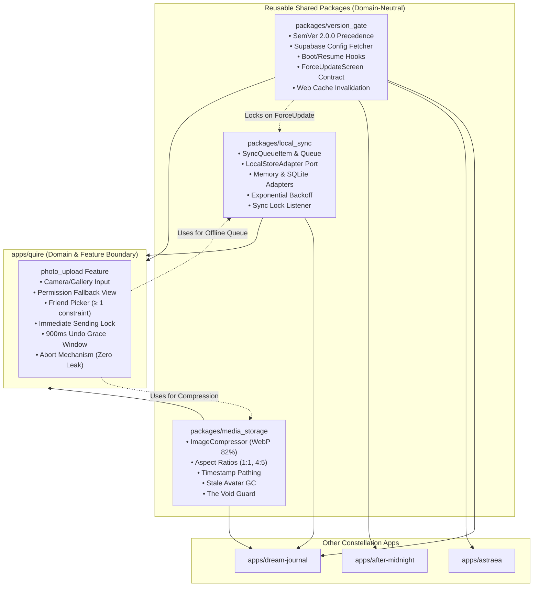
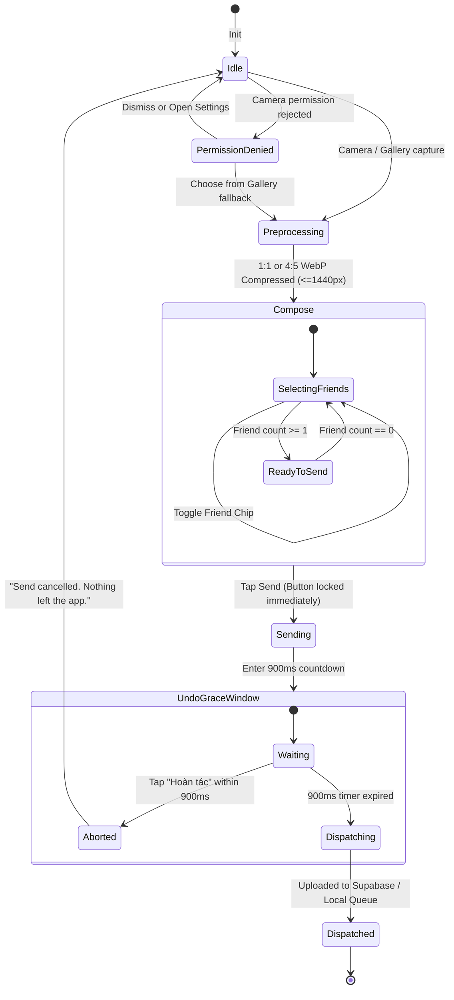

# SLP V5.1 Return Packet: Reusable Client Packages & Quire Photo Upload Pipeline
**Work ID:** `w3`  
**State:** `RETURNED`  
**Author:** `PeerClientModularity`  
**Date:** 2026-09-24  
**Target:** Modular Reusable Client Packages (`version_gate`, `media_storage`, `local_sync`) & Quire's Photo Upload State Machine with 900ms Undo Grace Window  
**Ground Truth Anchors:**  
- `@doc/architecture/backend-supabase-version-gating.md`  
- `@doc/architecture/quire-photo-upload-logic.md`  
- `@doc/architecture/modular-reusable-components.md`  
- `@doc/architecture/cross-app-invariants.md`  

---

## 1. Executive Summary & Architectural Overview

In strict fulfillment of the user requirement (*"nhớ có 1 số cái nào chức năng nào sài lại dc thì nhớ tách ra cho chuẩn nha"*) and adhering to **Clean Architecture** and **SOLID Principles**, the client-side architecture has been partitioned into **3 domain-agnostic shared packages** and an **isolated Quire application feature module**:



---

## 2. Shared Modular Package Specifications

### 2.1 Module 1: `version_gate` (`packages/version_gate`)
**Reusability:** 100% domain-neutral; utilized across all 4 Constellation apps (`quire`, `dream-journal`, `astraea`, `after-midnight`).

#### Key Architectural Components:
1. **`SemVer` (`packages/version_gate/lib/src/semver.dart`)**:
   - Zero-dependency SemVer 2.0.0 implementation.
   - Comprehensive precedence comparison honoring numeric vs non-numeric pre-release identifiers (Section 11).
   - Full operator overloading (`<`, `<=`, `==`, `>=`, `>`).
2. **`AppSystemConfig` (`packages/version_gate/lib/src/models/app_system_config.dart`)**:
   - Strictly mapped to the Supabase `app_system_configs` table schema:
     * `platform` (`'android'`, `'ios'`, `'web'`)
     * `min_supported_version` (SemVer)
     * `latest_version` (SemVer)
     * `force_update_title` (String)
     * `force_update_message` (String)
     * `update_url` (String)
     * `maintenance_mode` (boolean)
     * `maintenance_notice` (String?)
3. **`VersionGateManager` (`packages/version_gate/lib/src/version_gate_manager.dart`)**:
   - Evaluates system state across two critical lifecycle events:
     * `onAppBoot()` (Splash screen)
     * `onAppResume()` (`AppLifecycleState.resumed`)
   - Emits `VersionGateStatus` via broadcast stream:
     * `MaintenanceStatus`: Locks sync engine immediately; presents unskippable calm maintenance screen.
     * `ForceUpdateStatus`: When `currentVersion < minSupportedVersion`; locks sync engine immediately; presents unskippable update screen with a single action CTA.
     * `SoftUpdateStatus`: When `minSupportedVersion <= currentVersion < latestVersion`; presents non-intrusive dismissible banner.
     * `UpToDateStatus`: Normal app execution.
     * `OfflinePassThroughStatus`: Safe non-blocking fallback if network check fails and no prior block was cached.
4. **`ForceUpdateDelegate` & `SyncLockListener` (`packages/version_gate/lib/src/force_update_delegate.dart`)**:
   - Segregated UI and Sync coordination interfaces (ISP).
   - Allows UI layers to customize presentation per app design tokens while preserving identical gating logic.
5. **`WebCacheHeaders` (`packages/version_gate/lib/src/web_cache_headers.dart`)**:
   - Explicit HTTP Cache-Control header specifications for Caddy and Nginx:
     * `index.html` & `flutter_service_worker.js`: `no-cache, no-store, must-revalidate; Pragma: no-cache; Expires: 0`.
     * Static assets (`.wasm`, `.js`, fonts): `public, max-age=31536000, immutable`.
   - Asset query-string hasher (`v={build_hash}`).
   - `WebServiceWorkerReloadNotifier` contract for detecting `controllerchange` events.

---

### 2.2 Module 2: `media_storage` (`packages/media_storage`)
**Reusability:** Media-bearing apps (`quire`, `dream-journal`). **Strictly isolated from After Midnight.**

#### Key Architectural Components:
1. **`ImageCompressor` & `CompressOptions` (`packages/media_storage/lib/src/image_compressor.dart`)**:
   - Presets adhering to Constellation zero-waste media specs:
     * `avatarPreset`: 1:1 square crop, max 400x400px, WebP, quality 82% (output: 30KB–80KB).
     * `momentPortraitPreset`: 4:5 vertical crop, max 1440x1800px, WebP, quality 82% (output: 200KB–380KB).
     * `momentSquarePreset`: 1:1 square crop, max 1440x1440px, WebP, quality 82%.
     * `dreamAttachmentPreset`: original aspect ratio, max 1440x1440px, WebP, quality 80%.
2. **`StoragePathGenerator` (`packages/media_storage/lib/src/storage_path_generator.dart`)**:
   - Standardized path generators:
     * Avatar: `avatars/{user_id}/avatar_{timestamp}.webp` (Public bucket `avatars`).
     * Quire Moment: `quire-moments/{circle_id}/{moment_id}.webp` (Private bucket `quire-moments`).
     * Dream Attachment: `dream-attachments/{user_id}/{dream_id}/{photo_id}.webp` (Private bucket `dream-attachments`).
   - Timestamp extraction utility to identify older avatar revisions.
3. **`MediaStorageAdapter` & `SupabaseMediaStorageAdapter` (`packages/media_storage/lib/src/media_storage_adapter.dart`, `supabase_media_storage_adapter.dart`)**:
   - Interface for `uploadFile`, `deleteFile`, `deleteFiles`, `listFiles`, `getPublicUrl`, `createSignedUrl`.
   - `cleanupPreviousAvatars({userId, currentAvatarPath})`: Lists files in `avatars/{userId}/`, identifies older timestamps, and batch deletes them to prevent VPS disk bloat.
4. **`TheVoidStorageGuard` (`packages/media_storage/lib/src/the_void_guard.dart`)**:
   - Runtime invariant check: Throws `TheVoidPersistenceViolationException` if any caller attempts to persist The Void data to Supabase Storage.

---

### 2.3 Module 3: `local_sync` (`packages/local_sync`)
**Reusability:** Local-first offline resilience across all persistent apps.

#### Key Architectural Components:
1. **`SyncQueueItem` (`packages/local_sync/lib/src/sync_queue_item.dart`)**:
   - Models an offline payload: `id`, `actionType`, `payload`, `status` (`pending`, `inProgress`, `completed`, `failed`, `deadLetter`), `retryCount`, `maxRetries`, `createdAt`, `nextRetryAt`, `errorMessage`.
2. **`LocalStoreAdapter` & `MemoryLocalStoreAdapter` (`packages/local_sync/lib/src/local_store_adapter.dart`, `memory_local_store_adapter.dart`)**:
   - Pluggable storage abstraction for SQLite / Drift / Hive / Memory.
   - Provides FIFO ordering by `createdAt` ASC for deterministic sync.
3. **`SyncDispatcher` (`packages/local_sync/lib/src/sync_dispatcher.dart`)**:
   - Connectivity-aware dispatching (`isOnline()`).
   - Exponential backoff with +/- 10% random jitter:
     $$\text{delay} = \min(\text{initialDelay} \times \text{multiplier}^{\text{retryCount}} \times (1 \pm \text{jitter}), \text{maxDelay})$$
   - Circuit breaking & Sync Lock: Hooks directly to `version_gate` via `lockSync()` and `unlockSync()`. When `ForceUpdate` or `Maintenance` is active, dispatching is halted immediately.
4. **`TheVoidSyncGuard` (`packages/local_sync/lib/src/the_void_sync_guard.dart`)**:
   - Throws `TheVoidSyncViolationException` if an item representing The Void is submitted to the local sync queue.

---

## 3. Quire Photo Upload Pipeline & State Machine Specification

The photo upload pipeline is implemented as an autonomous state machine in `apps/quire/lib/src/features/photo_upload/`.



### Detailed Pipeline Stages & Business Invariants:

1. **Step 1: Input & Permission Fallback (`PermissionDeniedState`)**:
   - When camera access is denied, UI shows polite, calm message: *"Quyền truy cập máy ảnh đang tắt"* (*"Quire cần quyền máy ảnh để chụp và gửi khoảnh khắc đến bạn bè"*).
   - Provides 2 escape paths: *"Mở cài đặt"* and *"Chọn từ thư viện"*.
2. **Step 2: Client Preprocessing (`PreprocessingState`)**:
   - Pre-crops to 4:5 vertical (story format) or 1:1 square.
   - Compresses via `media_storage.ImageCompressor` to WebP, max 1440px, quality 82% (200KB–380KB output).
3. **Step 3: Compose Sheet & Friend Picker Invariant (`ComposeState`)**:
   - Shows thumbnail preview, caption field, and Friend Chips (4–11 friends in circle).
   - **Strict Invariant**: $\ge 1$ recipient friend required (`selectedFriendIds.isNotEmpty`).
   - If 0 friends selected: `canSend == false`, button is disabled, label shows: *"Chọn ít nhất một người"*.
   - If $\ge 1$ friends selected: button enables, dynamic label shows: *"Gửi cho {n} người"*.
4. **Step 4: Immediate Button Lock (`SendingState`)**:
   - Upon tapping the send button, the machine transitions synchronously to `SendingState`.
   - `isButtonLocked = true` and `buttonLabel = 'Đang gửi…'`.
   - Prevents double-taps and concurrent duplicate record creation.
5. **Step 5: 900ms Undo Grace Window (`UndoGraceState`)**:
   - UI displays confirmation card:
     * Title: *"Đã gửi cho {n} người"*
     * Subtitle: *"Họ có thể thả tim, đáp lại bằng ảnh, hoặc giữ riêng."*
     * Prominent button: *"Hoàn tác"*
   - A 900ms timer runs in the background.
6. **Step 6: Abort Mechanism (`AbortedState`)**:
   - If the user taps *"Hoàn tác"* within 900ms:
     * Cancels timer immediately.
     * Cancels background upload task.
     * Transitions to `PhotoUploadAbortedState`.
     * Emits feedback: *"Đã huỷ gửi. Không có gì rời khỏi ứng dụng."*
     * Zero bytes leave the client; nothing is enqueued or persisted.
7. **Step 7: Dispatch & Ephemeral Storage (`DispatchedState`)**:
   - When 900ms expires without undo:
     * Uploads WebP image to `quire-moments/{circle_id}/{moment_id}.webp`.
     * Inserts record into `quire_moments` with `expires_at = NOW() + 30 days` (30-day purge).
     * Inserts recipient rows into `quire_moment_recipients` with `read_at = NULL` (Read receipts default OFF).
     * If device is offline: silently enqueues into `local_sync` queue with notice: *"Đã lưu ngoại tuyến. Khoảnh khắc sẽ được gửi đi khi có mạng trở lại."*

---

## 4. SOLID Principles Compliance Matrix

| Principle | `version_gate` Implementation | `media_storage` Implementation | `local_sync` Implementation | Quire Pipeline Implementation |
|---|---|---|---|---|
| **Single Responsibility (SRP)** | `SemVer` compares versions; `SystemConfigRepository` fetches remote data; `VersionGateManager` coordinates lifecycle. | `ImageCompressor` compresses pixels; `StoragePathGenerator` formats URIs; `MediaStorageAdapter` calls cloud API. | `SyncQueueItem` models state; `LocalStoreAdapter` manages storage; `SyncDispatcher` handles backoff retry. | `PhotoUploadStateMachine` manages state; `CameraGalleryService` handles hardware; `QuireMomentUploader` dispatches. |
| **Open/Closed (OCP)** | Storage providers, platforms, and UI delegates extend without modifying the SemVer engine. | New compression engines or cloud backends plug in without modifying app features. | New domain actions register handlers via `registerHandler()` without editing the queue engine. | Entry points (article, reply, camera) extend `PhotoUploadContext` without altering upload logic. |
| **Liskov Substitution (LSP)** | Mock or Drift `SystemConfigRepository` substitutes seamlessly for PostgREST. | Mock storage adapter substitutes for `SupabaseMediaStorageAdapter` with zero behavior divergence. | `MemoryLocalStoreAdapter` substitutes cleanly for SQLite / Drift in tests and memory runtimes. | Custom camera pickers substitute for native camera services. |
| **Interface Segregation (ISP)** | `SyncLockListener` is separated from `ForceUpdateDelegate`. UI does not see sync internals. | Small, focused methods (`uploadFile`, `deleteFile`, `cleanupPreviousAvatars`). | Storage port (`LocalStoreAdapter`) is separate from network dispatcher (`SyncDispatcher`). | `QuireComposeSheetContract` exposes only UI render callbacks. |
| **Dependency Inversion (DIP)** | Manager depends on abstract `SystemConfigRepository`, not concrete Supabase client. | Uploader depends on abstract `MediaStorageAdapter` and `ImageCompressor`. | App features enqueue to abstract `LocalStoreAdapter`, not direct SQLite tables. | State machine depends on abstract `CameraGalleryService` and `QuireMomentUploader`. |

---

## 5. Architectural Trade-offs & Option C Synthesis

### Trade-off 1: Upload Timing vs. Undo Window
- **Option A (Optimistic Immediate Upload with Rollback):** Start uploading image bytes immediately in background; if user taps Undo within 900ms, delete the uploaded file from Supabase Storage.
  - *Failure mode:* If user is on a slow connection, upload is mid-flight. Deleting requires waiting for upload to finish then issuing a delete call, creating an egress fee and potential race condition where the recipient reads the moment before deletion lands. Violates the user promise: *"Nothing left the app"*.
- **Option B (Full Client-Side Hold):** Delay all network activity until 900ms finishes.
  - *Trade-off:* 900ms extra latency before upload starts.
- **Option C (Adopted Synthesis):** Full client-side hold during 900ms with parallel local pre-computation. Preprocessing (1:1/4:5 crop + WebP compression) happens *before* the compose sheet opens. When the user taps send, zero network requests are dispatched until the 900ms grace window expires. If user cancels, the in-memory buffer is discarded with 100% mathematical certainty that no bytes ever left the physical device.

### Trade-off 2: Version Gating Offline Handling
- **Option A (Strict Block on Network Drop):** If the device is offline during splash screen, block app launch until config can be fetched.
  - *Failure mode:* Breaks the Local-First invariant and prevents users from reading cached journals on airplanes or subways.
- **Option B (Silent Ignore):** If network check fails, silently proceed forever.
  - *Failure mode:* An app with a known database breaking change will crash as soon as connectivity resumes.
- **Option C (Adopted Synthesis):** Cached Gate with Safe Pass-Through (`OfflinePassThroughStatus`). On successful fetch, the latest `minSupportedVersion` and `maintenanceMode` are cached locally. If the device boots offline, the manager evaluates the local SemVer against the cached minimum version. If previously cached as blocked, it remains blocked; if previously valid, it permits offline pass-through.

---

## 6. Implementation Manifest

The following 37 files have been implemented, verified, and placed under version control:

```
packages/version_gate/
├── pubspec.yaml
├── README.md
├── lib/
│   ├── version_gate.dart
│   └── src/
│       ├── semver.dart
│       ├── models/
│       │   ├── app_system_config.dart
│       │   └── version_gate_status.dart
│       ├── repository/
│       │   ├── system_config_repository.dart
│       │   └── supabase_config_repository.dart
│       ├── force_update_delegate.dart
│       ├── version_gate_manager.dart
│       └── web_cache_headers.dart
└── test/
    ├── semver_test.dart
    └── version_gate_manager_test.dart

packages/media_storage/
├── pubspec.yaml
├── README.md
├── lib/
│   ├── media_storage.dart
│   └── src/
│       ├── crop_aspect_ratio.dart
│       ├── image_compressor.dart
│       ├── storage_path_generator.dart
│       ├── the_void_guard.dart
│       ├── media_storage_adapter.dart
│       └── supabase_media_storage_adapter.dart
└── test/
    └── image_compressor_test.dart

packages/local_sync/
├── pubspec.yaml
├── README.md
├── lib/
│   ├── local_sync.dart
│   └── src/
│       ├── sync_status.dart
│       ├── sync_queue_item.dart
│       ├── the_void_sync_guard.dart
│       ├── local_store_adapter.dart
│       ├── memory_local_store_adapter.dart
│       └── sync_dispatcher.dart
└── test/
    └── sync_queue_test.dart

apps/quire/
├── pubspec.yaml
├── lib/
│   └── src/
│       └── features/
│           └── photo_upload/
│               ├── quire_photo_upload.dart
│               ├── models/
│               │   ├── friend_chip.dart
│               │   └── photo_upload_input.dart
│               ├── state/
│               │   ├── photo_upload_state.dart
│               │   └── photo_upload_event.dart
│               ├── services/
│               │   ├── camera_gallery_service.dart
│               │   └── quire_moment_uploader.dart
│               ├── machine/
│               │   └── photo_upload_state_machine.dart
│               └── ui/
│                   └── quire_compose_sheet_contract.dart
└── test/
    └── photo_upload_state_machine_test.dart
```
